# 1.什么是大数据？
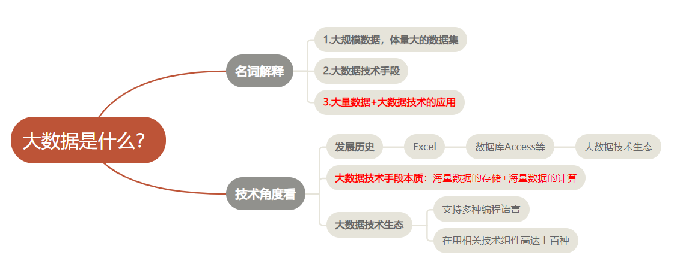
大数据本质是技术手段，是工具，是对海量数据进行存储和计算分析的一种技术实现方案。

那么企业这些技术是怎么用的呢？还有哪些框架需要学习呢？
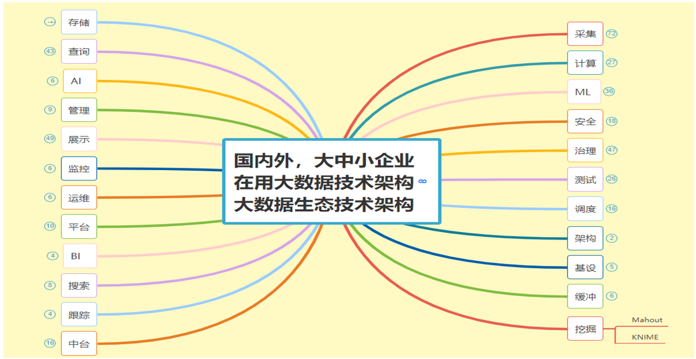
https://www.processon.com/view/link/623ed6b2e0b34d0730db53d3 访问密码：M4FI

# 2.什么是数据仓库？
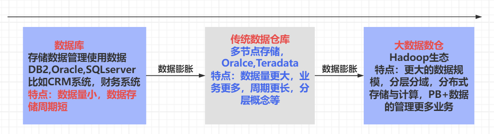
## 2.1.数据仓库的发展历程

### 1. 初始阶段（20世纪80年代末至90年代初）

数据仓库定义和概念化：

数据仓库概念由IBM的Bill Inmon首次提出，他被称为“数据仓库之父”。Inmon定义数据仓库为“面向主题的、集成的、非易失的、随时间变化的数据集合，用于支持管理决策”。最初的数据仓库系统是为了解决企业在不同数据库系统中存储的大量结构化数据的整合问题。这个阶段的重点是从操作数据库中提取数据，以支持业务分析和决策。

技术手段：

- 关系数据库管理系统（RDBMS）：数据仓库最早是基于关系数据库构建的，使用SQL进行数据存储和查询。
- ETL工具：用于从多个操作系统中提取数据，进行转换和清洗，然后加载到数据仓库。

### 2. 发展阶段（90年代中期至2000年代初）

技术手段：

- OLAP（Online Analytical Processing）：支持多维数据分析，帮助用户快速进行数据切片和聚合。
- <mark>商业智能（BI）工具</mark>：如Cognos、BusinessObjects等，提供报表和数据可视化功能。
- 数据集市（Data Mart）：为特定业务部门创建的子集数据仓库，简化了数据访问和分析。

建模方法论：

- 维度建模：由Ralph Kimball推广，强调以用户需求为导向的模型设计。
- 数据集市支持：支持特定业务功能的数据建模，以满足特定的部门需求。

### 3. 成熟阶段（2000年代中期至2010年代初）

技术手段：

- 企业数据仓库（EDW）：提供企业级的集中数据管理和分析能力。
- 列存储技术：提高查询性能，特别是在大型数据集上。
- 数据集成工具：增强ETL功能，支持更复杂的数据转换和加载任务。

### 4. 现代阶段（2010年代至今）

技术手段：

- 大数据技术（Hadoop、Spark）：支持大规模数据处理和分布式计算。
- 云数据仓库（如Amazon Redshift, Google BigQuery, Snowflake）：提供弹性计算和存储，降低基础设施成本。
- 实时数据处理（Kafka, Flink）：支持流数据的实时分析和决策。
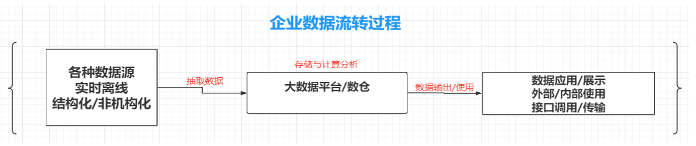
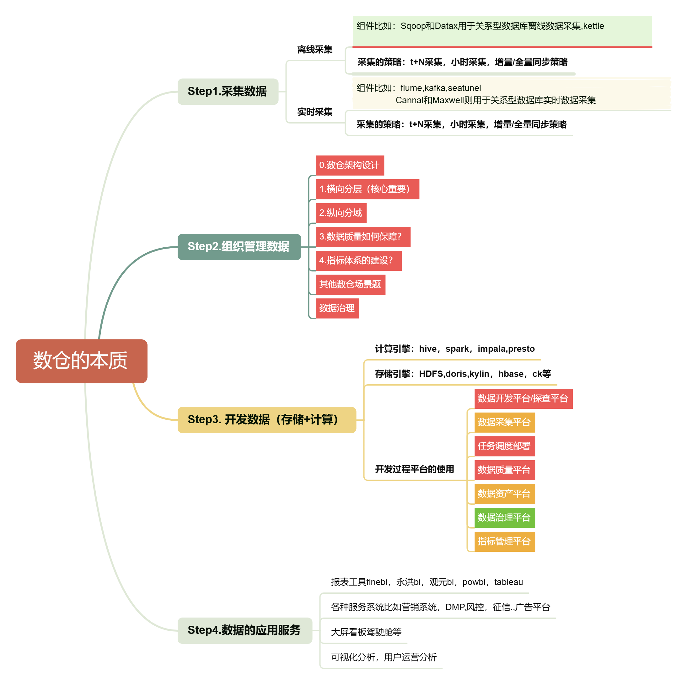
具体详细参考链接：https://www.processon.com/mindmap/687b575e5f31900ebda10f7c

# 3.大数据有哪些岗位？
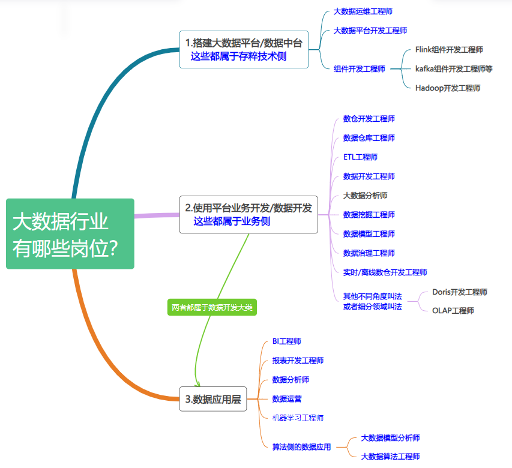
# 4.企业大数据架构分类与演变（☆☆）

## 1.小型公司的"大数据"架构

某小公司，运营了几款APP，比如销售，拼团，社区等。目前在MySQL，PG等数据库中维护其各个APP的数据。传统的数据分析方式（传统数仓）。这种使用现代数据仓库技术、线上分析处理技术、数据挖掘和数据展现技术进行数据分析以实现商业价值的行为就叫商业智能（Business Intelligence，简称：BI）。
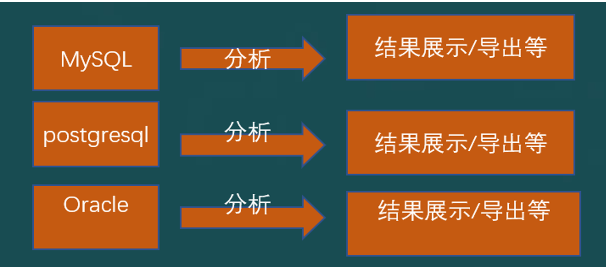
现在我想打通这些不同类型的数据，分析这些数据。以提高商业智能并获得更可靠的业务决策助力。怎么办？公司决定在整个企业中实施大数据技术战略，搭建公司的大数据平台，建设数据仓库，将公司的各个部门，各个业务数据全部汇总到数据仓库里进行统一分析处理。

公司开始招人建设了大数据平台,这个时候集群规模可能多半是几台到几十台不等，数据规模几百GB，几十TB不等。一般小公司平台建设较为简单粗放。
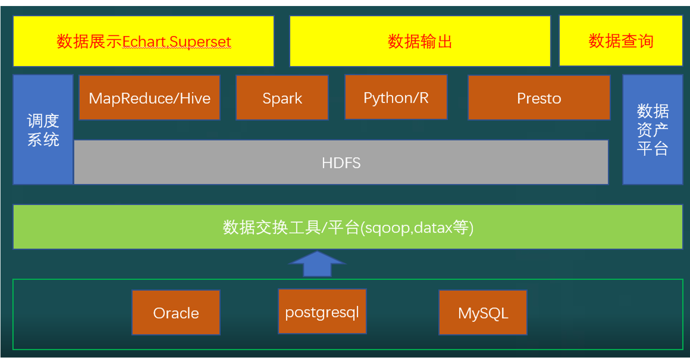
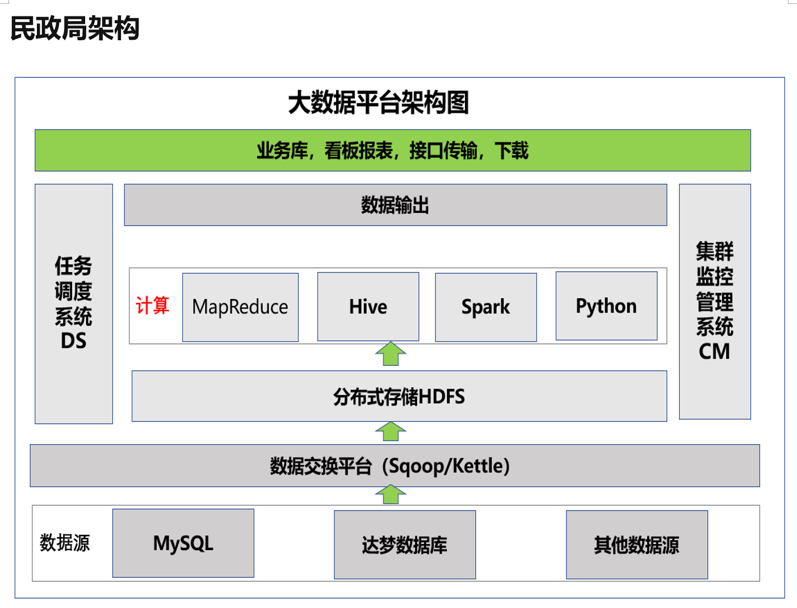
小公司完善型大数据技术架构
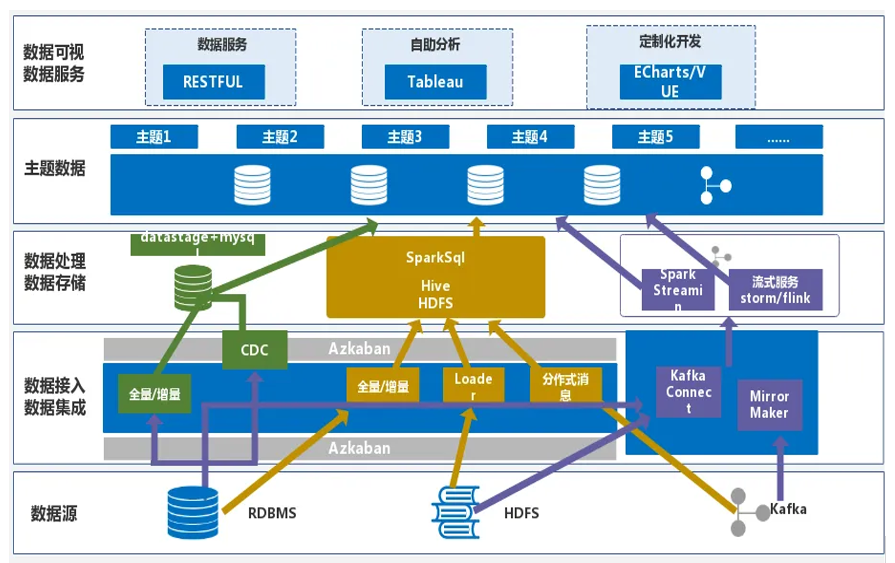
## 2.中型公司的大数据架构

一般公司特点：公司数据体量较大，业务场景复杂，业务场景多，公司规模大，部门多等，平台建设较为完善。
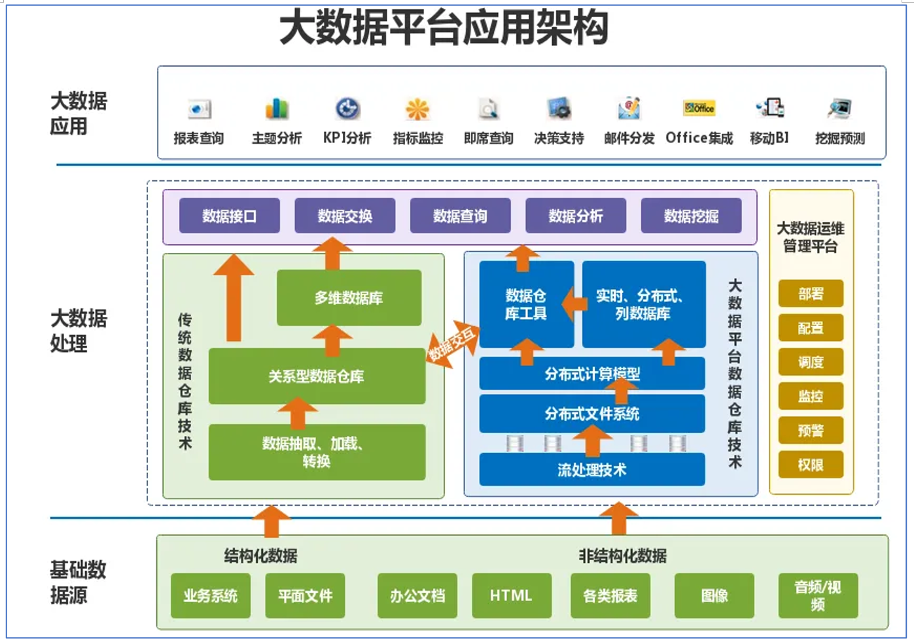
某中型公司大数据平台
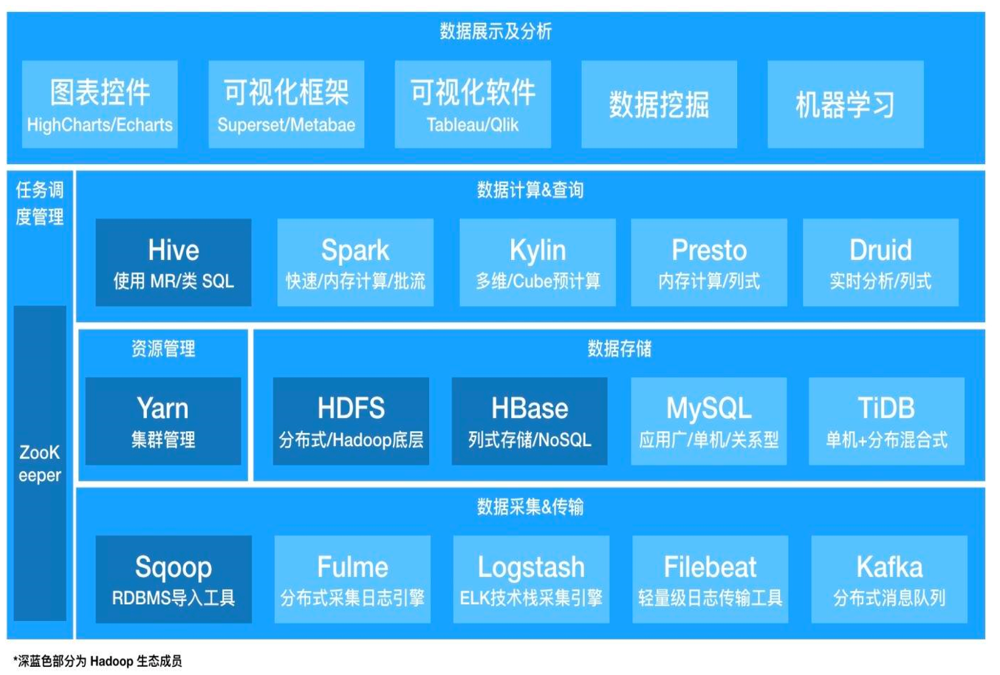
## 3.大型公司的大数据架构

中大型公司一般数据体量都是比较大的，业务场景也是比较复杂的，业务种类多，业务部分多。（比如快手，数据量超过 3EB，日入数据量超 5PB（5120TB），例行任务数超 30W）
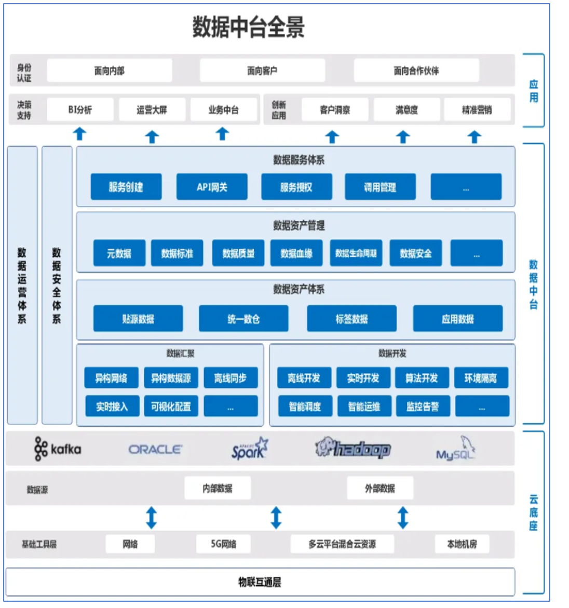
比如京东大数据平台（4EB级别数据，4w+节点，每日离线计算数据30PB+,表1000w张，日任务80w+）
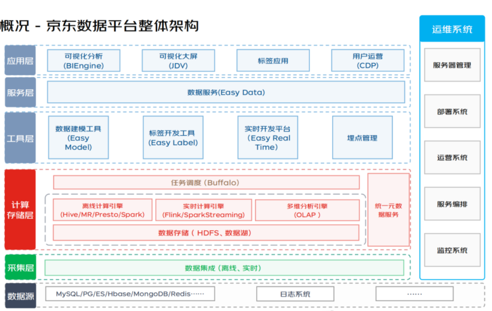
阿里巴巴大数据架构图
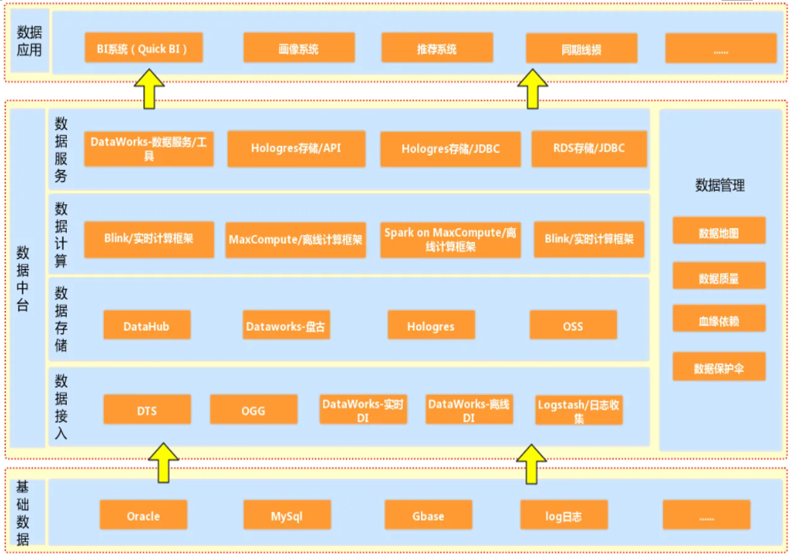
# 5.数据中台概述（☆）

数据中台被誉为大数据的下一站，由阿里兴起，2015年阿里启动中台战略，核心思想是数据共享，2017年原阿里员工钟华老师出了一本关于中台的书。2018 年因为“腾讯数据中台论”再度成为了人们谈论的焦点。

在2015年的时候，马云去访问了芬兰的一家游戏公司叫 Supercell,这家公司名字你也许不熟悉，但是他们开发的游戏你可能玩过比如《部落冲突》。

这家公司一年光是利润就有15亿美金，不过员工人数非常少，只有不到200个人，而且公司里每一个开发游戏的小团队，都只有六七个人而已。这么小规模的团队，怎么做成了这么大的业务呢？

其中一个重要的原因是他们把游戏开发过程中，要用的一些通用的游戏素材和算法整理出来，把这些作为工具提供给所有的小团队。

马云爸爸深受启发，于是中台横空出世，阿里果断组建中台团队，由中台团队支撑起核心功能的开发及维护，如淘宝、天猫的核心模块用户、支付、商品等。无论是新老业务线都需要接入中台，复用中台提供的底层能力。这样做有几个好处：

1. 对于一个新的业务来说，通过复用中台的能力，能够做到核心模块的快速搭建
2. 因为中台提供的核心功能得到复用，所以相比传统的开发模式来讲，成本是大大降低的。
3. <mark>因为上了中台，核心数据都沉淀在中台，所以可以更加方便的管理和利用公司的数据。</mark>

如今似乎人人都在提数据中台，但却不是所有人都清楚数据中台到底意味着什么。数据中台是只有大厂才需要考虑的高大上的概念吗？普通企业该不该做数据中台？数据中台的出现会给现有数据从业者们带来颠覆式的挑战吗？带着上述问题往下看

## 1.前台，中台，后台

IT项目有很多对内/对外/辅助，但无论项目内部的如何复杂，大体的结构都可以拆分为 “用户前台”和“管理后台”。

用户前台即指由各类前台系统组成的前端平台。每个前台系统就是一个用户触点，即企业的最终用户直接使用或交互的系统，是企业与最终用户的交点。
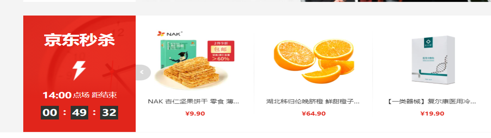
管理后台即指由后台系统组成的后端平台。每个后台系统一般管理了企业的一类核心资源（数据计算），例如财务系统，产品系统，客户管理系统，仓库物流管理系统等，这类系统构成了企业的后台
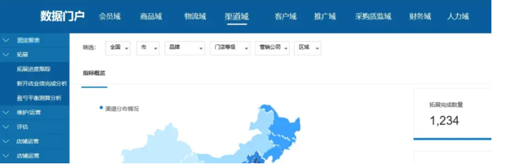
前台与后台就像是两个不同转速的齿轮，前台由于要快速响应前端用户的需求，讲究的是快速创新迭代，所以要求转速越快越好；而后台由于面对的是相对稳定的后端资源，而且系统陈旧复杂，甚至还受到法律法规等相关合规约束，所以往往是稳定至上，越稳定越好，转速也自然是越慢越好。

随着企业业务的不断发展，这种“前台后台”的齿轮速率“匹配失衡”的问题就逐步显现出来。而<mark>中台就像是在前台与后台之间添加了一组“变速齿轮”，将前台与后台的速率进行匹配，是前台与后台的桥梁，它为前台而生，易于前台使用，将后台资源顺滑流向用户，响应用户。</mark>

## 2.数据中台诞生的背景?

数据中台是在信息化深入发展的背景中诞生。那么信息化深入发展造成了哪些现象？比如企业的信息系统越来越多，新的业务模式、多云环境开始出现。当企业还在运用传统的IT建设方法时，问题就跟着出现了。

- 企业的各种信息系统无法做到数据互通
- 新平台产生的数据与传统模式下产生的数据也无法互通
- 企业IT架构变得更复杂，实现底层数据的互联互通也更加困难

简单来说，大多数企业数据分散、缺失、数据质量和数据利用率不高，企业信息化程度越来越高，经营效率却得不到提升。这时候就需要一个平台来解决这些痛点。通过平台整合分散在各个孤岛上的数据，快速形成数据服务能力，为企业的经营决策提供支撑，数据中台就此应运而生。

## 3.数据中台概念的定义与作用

数据中台是一种产品或技术吗？严格意义上来说，不是。它是一套可持续“让企业的数据用起来”的机制，一种战略选择和组织形式，是依据企业特有的业务模式和组织机构，通过成熟的产品和实施方法论支撑，构建的一套持续不断把数据变成资产并服务于业务的机制。其底层逻辑是以数字化的手段，将数据抽象成服务，响应前端业务的快速变化。

阿里巴巴认为，数据中台是集方法论、工具、组织于一体的“快”、“准”、“全”、“统”、“通”的智能大数据体系。中台其实就是中心化的能力复用平台。“中”就是中心化，通过业务中台支持起公司所有产品线的业务，通过数据中台支持起公司所有产品线的数据化运营和数据智能。“能力复用”这个比较好理解，中台应该能够支撑起N条产品线，而且随着产品线的拓展，这些通用的能力还可以用得上的。中台其实并没有什么新的技术，而是一种“中心化”的思维，核心通用能力由一个中台团队负责，再由这个中台团队支撑起公司的N条产品线核心模块的搭建。

数据中台一般会具备4个能力：<mark>数据采集整合、数据提纯加工、数据服务可视化、数据价值变现。</mark>

- 数据采集整合：创建企业数据中台第一步，打破企业内部各个业务系统的数据隔阂，形成统一的数据中心，为后续数据价值的挖掘提供基础。主要通过数据采集和数据交换实现。
- 数据提纯加工：主要是对数据统一标准、补充属性，然后根据维度汇总成数据表、最后汇总出所需要的报表，满足企业对数据的需求。
- 数据服务可视化：对数据进行计算逻辑的封装，生成API服务，上层数据应用可以对接数据服务API，让数据快速应用到业务场景中。数据服务API对接的3种常见数据应用包括数据大屏、数据报表、智能应用。
- 数据价值变现：通过打通企业数据，提供以前单个部门或者单个业务部门无法提供的数据服务能力，为赋能前端应用、数据价值变现提供基础。

## 4.阿里巴巴数据中台建设

数据中台”并不是一个专业术语，简单来说，它是指通过数据技术，对海量数据进行采集、计算、存储、加工，且进行统一标准和口径，以达到对企业的数据资产进行管理及应用为目的的平台。数据中台把数据统一后，形成标准数据，再进行存储，形成大数据资产层，进而为客户提供高效服务。各业务线的数据打通、数据共享和协同运用，则属于业务中台的范畴，是以业务目标牵头的（比如阿里的88VIP会员的前提就是用户数据打通，芝麻信用分等）。

在有些公司，数据中台只是很粗浅地把数据整合到一起，并没有解决任何问题，或者让整合产生什么价值。阿里云中间件架构总监谢纯良曾经说过，许多公司的数据中台就是把数据加工成“大屏”，搞一个展示用的“大屏”就以为实现了中台。意思就是，数据中台如果不为业务服务，或者说为业务中台服务，那就没有价值。

阿里巴巴中台战略最早从业务中台和数据中台建设开始，采用了双中台的建设模式，到后来发展出了移动中台、技术中台和研发中台等，这些中台的能力综合在一起就构成了阿里巴巴企业级数字化能力。
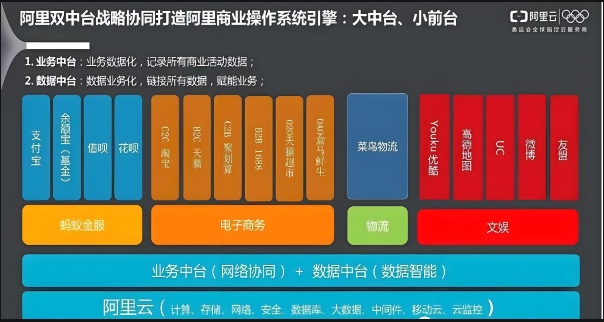
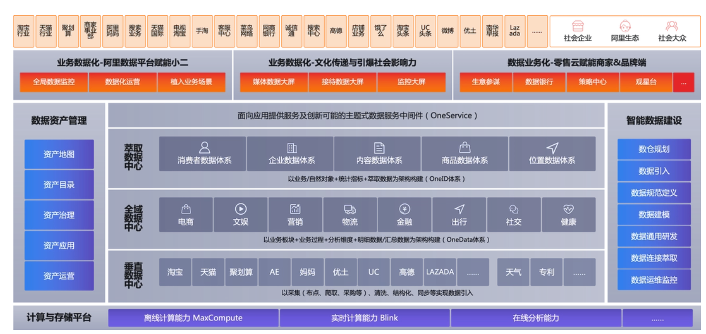
但<mark>在2020年，阿里又提出要拆中台。中台，彷佛一夜之间坠落神坛。</mark>作为中台的鼻祖，阿里真的要拆中台了吗？2021年字节跳动也开始分拆中台，将中台能力分散到各个事业部。为什么？

首先，中台的迭代速度要跟得上业务、组织的发展速度,这玩意吃力不讨好，建设消耗成本大。这种模式对于90%的公司个人觉得没必要。

有个段子：大公司搞中台，钱没了； 小公司搞中台，公司没了。

# 6.集群，大数据平台，数据仓库，数据中台关系？
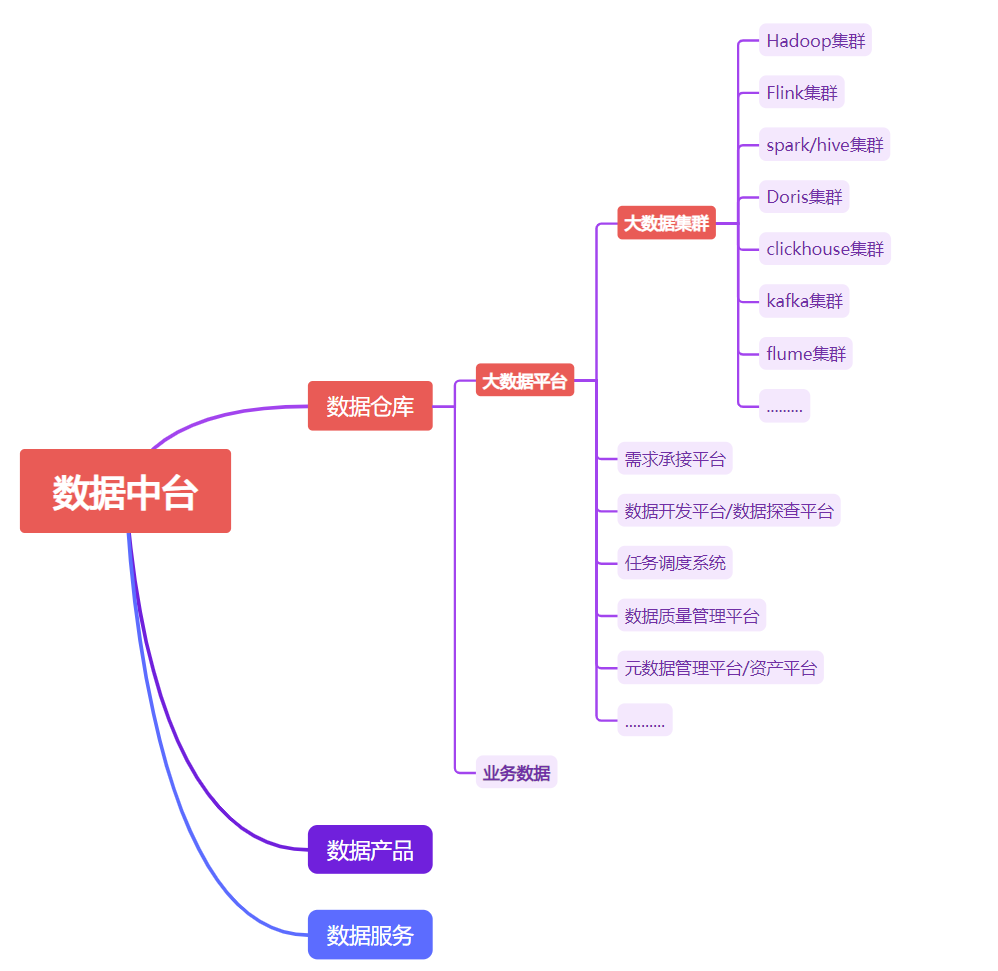