# 1.什么是ETL和ELT?（理解）

## 1.什么是ETL？

ETL，是英文 Extract-Transform-Load 的缩写，用来描述将数据从来源端经过抽取（extract）、转换（transform）、加载（load）至目的端的过程,这个过程称为ETL。

核心流程：首先从各源头系统提取（Extract）原始数据，随后在传统数仓服务器、专用 ETL 服务器等独立处理引擎中（类似kettle等组件），进行集中清洗、转换（T），这其中包括类型转换、过滤、连接、聚合等操作，最终将加工好的结构化数据加载（L）到目标数据仓库或数据湖。数据处理位置：“T”（转换）发生在加载到目标数仓仓库存储之前。

它是将 OLTP (Online Transaction Processing,在线事务处理)系统中的数据经过抽取，并将不同数据源的数据进行转换、整合，得出一致性的数据，然后加载到数据仓库中。简而言之 ETL 是完成从 OLTP 系统到 OLAP 系统的过程。

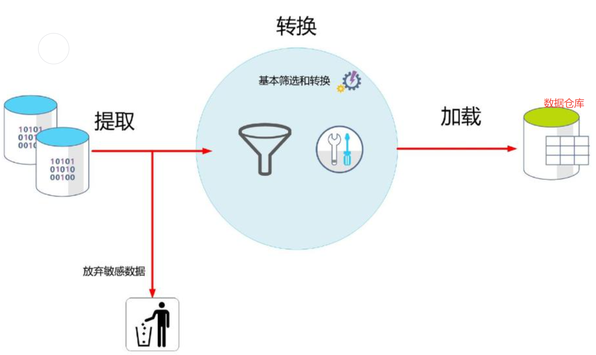
传统的数据仓库载体一般是Oracle等数据库，数据从不同的源系统抽取Extract过来，在抽取的过程中就进行了数据转换Transform（数据加工处理，比如脱敏，脏数据清洗）,前面两者是耦合的。最后在加载Load导入到数据仓库中。
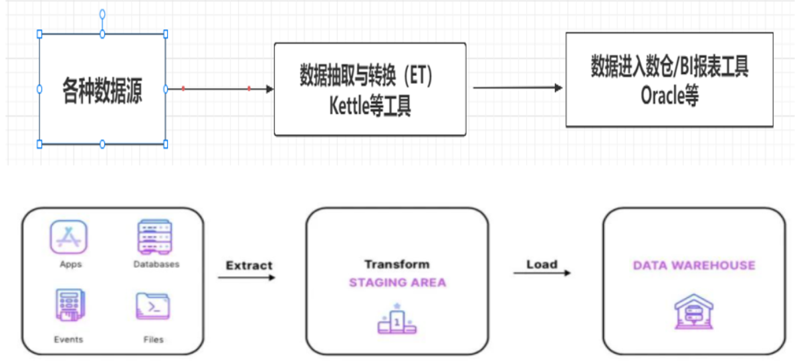
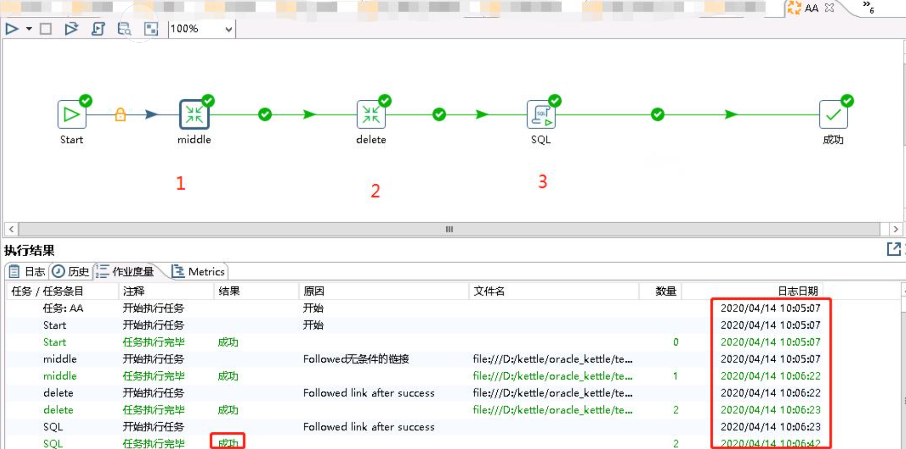
<mark>补充：Kettle,开源的ETL工具(现在已经更名为PDI, Pentaho Data Integration Pentaho数据集成)</mark>

## 2.什么是ELT？

大家工作中，有时候还会看到一个词叫ELT?

ETL虽然好用，逻辑清晰，但是 ETL 也有非常致命的缺点：数据链路流程太长、数据仓库建设起来太笨重、时间太长。ETL 之所以这么复杂，是因为 Transform （转换）和 Load （加载）两个环节耦合过紧导致的。 那什么是ELT呢?

看下流程：<mark>和ETL中的E作用一样，即从源端系统抽取数据，比如Mysql,Oracle,PG等等。该步骤的流程就和ETL不一样了，T和L进行了位置置换，这里是先加载到目标系统，大家也可以理解成是数据入了仓。当数据入了仓之后，再进行T操作，也就是进行转换。也就是说数据转换标准化操作由缓冲区转移到了仓中进行。</mark>

（1）核心流程：同样从源头提取（E）数据，但随后直接加载（L）或仅简单缓冲原始数据到目标系统，通常是具备强大计算能力的云数据仓库或分布式存储。在此目标系统内部完成核心的清洗与转换（T）工作。

（2）数据处理位置：“T”（转换）发生在加载到目标存储之后，利用目标系统的计算能力。
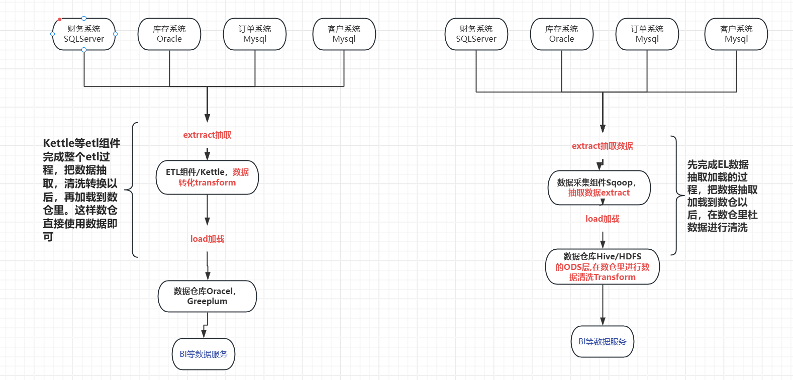
## 3.ETL和ELT的关系？

ETL（Extract, Transform, Load）和 ELT（Extract, Load, Transform）是数据集成过程中使用的两种不同方法。它们的主要区别在于数据转化（Transform）步骤发生的时机和位置。

**ETL（Extract, Transform, Load）：**

- Extract（提取）：从源系统中提取数据。
- Transform（转化）：在加载到目标系统之前，对数据进行清洗、格式化和转化。这一步通常在ETL工具的中间层或专门的转化服务器上进行。
- Load（加载）：将转化后的数据加载到目标数据仓库或数据库中。
- 适用场景：传统的数据仓库环境，尤其是在计算资源有限的情况下，ETL较为常用。它适用于需要复杂转化逻辑的数据处理。
- ETL工具：传统ETL工具包括Informatica、IBM DataStage、Microsoft SSIS、Talend等。这些工具通常提供丰富的GUI界面和复杂的转化功能，适合企业级数据集成。

**ELT（Extract, Load, Transform）：**

- Extract（提取）：从源系统中提取数据。
- Load（加载）：直接将提取的数据加载到目标系统中（通常是数据湖或现代云数据仓库）。
- Transform（转化）：利用目标系统的计算能力，在其内部对数据进行转化。
- 适用场景：现代云数据仓库或数据湖环境，因为这些平台通常具有强大的并行处理能力和弹性的计算资源。ELT适合处理大规模数据集和需要快速处理的数据场景。
- ELT工具：现代ELT工具和平台包括<mark>Apache Spark、hive</mark>,presto等；

**两者使用总结：**

| 对比项 | ETL | ELT |
|--------|-----|-----|
| 处理顺序 | 提取 → 转换 → 加载 | 提取 → 加载 → 转换 |
| 转换地点 | 中间服务器或ETL工具 | 目标数据仓库或数据湖 |
| 适用场景 | 传统数据仓库，小数据量；数据结构稳定；入仓前需要深度清洗；计算资源有限且成本敏感 | 数据量大、增长快，多样数据；数据格式复杂；业务变化频繁 |
| 优点 | 保证数据质量，目标库中数据清晰 | 利用目标系统算力，灵活高效 |
| 缺点 | 处理时间长，扩展性受限 | 目标系统资源消耗大，要求高 |

# 2.什么是批处理/流处理/流批一体?(理解)

## 1.什么是批处理？

离线数据处理也称之为“批处理”，企业上游业务数据产生之后，不会立即进行清洗，而是在固定的周期进行ETL，例如每天在凌晨24：00之后，处理前一天产生的数据。上大学的时候，有的舍友喜欢将袜子攒起来，一个星期洗一次，这就是批处理的思想。离线数据处理技术是大数据发展最早期的技术，基于Hadoop生态，核心组件是HDFS、MapReduce、Hive。以HDFS进行数据存储，Mapreduce计算，Hive进行数据仓库建设或者基于HiveSQL进行数据查询。
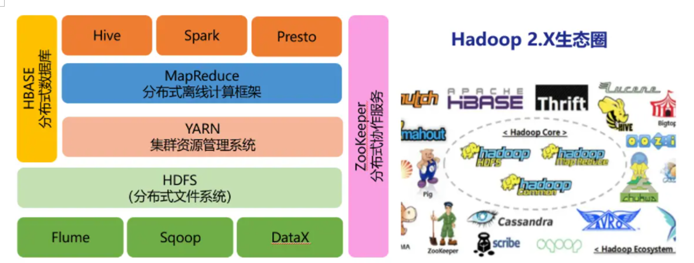
### 1.1什么是T+1/T/T-1数据?

离线数据一般是指T-1的日期，例如今天的日期T=2025-10-03，那么数据结果中，能够体现的业务数据只包括前一天的(昨日数据)。有人也称之为T+1的数据，把数据日期当作T，叫法不同，但本质都是指的今天处理的数据最新日期是截止昨天。T+1指从生成数据的角度，T+1天才能看到，即第二天才能看到。T-1指从分析数据的角度，看到的数据都是T-1天的数据，即昨天的数据。

实时数据主要是指的数据延迟小，例如毫秒、秒、分钟级的延迟。例如，你熬夜赶在双十一晚上的最后1分钟，成功付了尾款，在双十一实时统计大屏中，GMV的值又滚动了一下(秒级分钟级小时级滚动)

准实时小时级的延迟称之为“准实时数据“

**1.离线批处理的好处**

- 能够处理的数据量巨大，跨时间周期长的历史数据，都可以存储、计算处理、分析应用
- 数据更加精准，有些场景比如数据的回补，漂移。比如对于一些交易类的业务，存在订单状态流转，例如酒店，用户早上下了订单，但是下午有突发情况行程有变，取消了。在离线数据处理时，取当天订单成功状态，就不会计算在内。**但对于数据漂移，即24点前下单，24点后取消的情况，就也无法统计到了，这种情形，在数据清洗任务处理时，可以采用全量更新的方式，每日更新全部数据，取最终的订单状态。**

**2.离线批处理的坏处：**

主要体现在时效性差；

## 2.什么是流处理？

实时数据处理，也称之为“流式”数据处理，数据像水流一样每时每刻源源不断地产生后，就立即被清洗处理。这就好比，穿的袜子脏了就洗，今日事今日毕，而不是都攒着。

实时数据一般是业务端即席产生（水源），通过Kafka等消息通道（水流管道）进行传输，利用SparkStreaming或flink等实时组件进行消费处理。例如，双十一统计每秒钟的订单数。
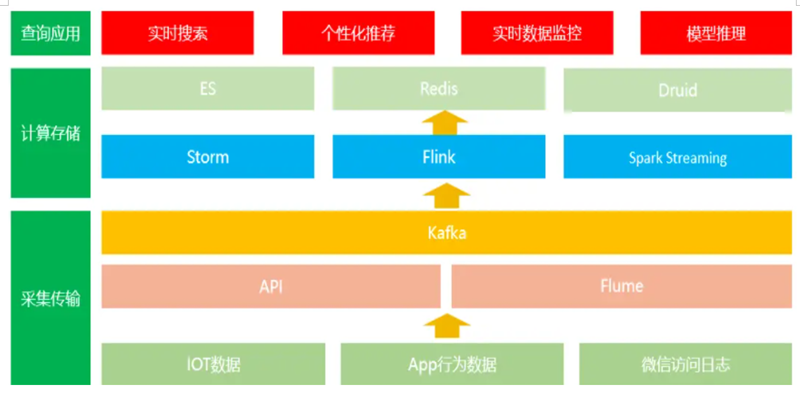
**A.实时流式处理的的好处**

数据时效性强，可以做到秒级或者毫秒级时延，“所见即所得”。

**B.实时流式处理的的弊端**

- 需要不停地进行数据计算，即每秒钟或者每分钟进行数据清洗和计算，集群资源消耗大。离线数据处理，任务一天跑一次，一次1小时，实时数据处理每分钟跑一次，一天24小时都在跑。
- 数据周期短，由于是流式处理的方式，相应的组件在实时处理方面能力强，但是没办法存储太长时间的数据，如果容器只进不出，水终究会溢出。因此，一般数据计算的周期会限定在一周内居多。

### 2.1 .实时和离线的应用场景是什么？

具体选择实时还是离线具体还需要看业务场景，有些业务场景即可以选择实时，也可以接受离线；有些业务场景则只能选择实时（比如数据应用方面，数据时效性要求高于准确性），或者只能选择离线

1. **预警监控类分析，需要追求实时性**

   比如我们做集群系统监控告警，实时采集机器运行状态，这种情况下时效性要求就很高。这种情况下如果需要隔天才能看到，肯定是不行的。

2. **实时个性化推荐，用户行为需要实时反馈**

   比如你在浏览头条的时候，对推荐的内容点击了“不感兴趣”，相关的内容很快就隐藏了。同样，你在淘宝上搜索或加购了某个产品，再看列表页时，推荐的也都是相关内容。针对个性化推荐的场景，就要做到数据的最小延迟，如果等用户都退出App了数据才计算完成更新，用户就流失掉了

3. **运营场景推送，大屏等时效性要求严格的**

   实时的场景触达，就需要实时数据了，例如，用户打开App，实时判断用户是否是新客（截至本次访问未下过单），发放新客大礼包，所以企业用户标签分可以分为实时标签和离线标签。其他比如企业日常运行大屏，618大屏，股市大屏。

4. **企业其他更多的场景都是离线**

   比如业务经营分析、财务分析准确性大于时效性，需要T+1,甚至T+N数据追补。

**尖叫总结：**

实时和离线的选择，主要牵涉到两个方面：1.数据时效性的选择，2.数据准确性的要求。具体要看具体应用场景对准确性、时效性的要求。整体来说目前企业实际状况你离线分析的需求和使用远远大于实时的开发。

如下总结离线的特点以及应用场景
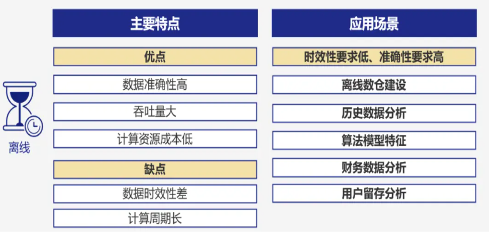
如下总结实时的特点以及应用场景
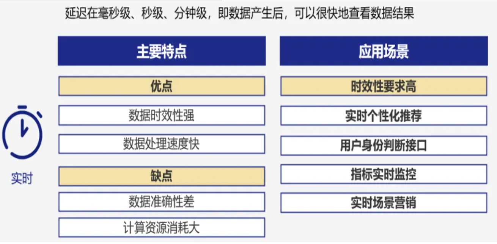
## 3.什么数仓的lambda/Kappa架构？

从上个世纪 Inmon 提出数据仓库至今，数仓架构经历了最初的传统数仓架构、离线大数据架构、Lambda 架构、Kappa 架构以及由Flink 的带出的流批一体架构，数据架构技术不断演进，本质是在往流批一体的方向发展，让用户能以最自然、最小的成本完成实时计算。

Lambda架构（Lambda Architecture）是由Twitter工程师南森·马茨（Nathan Marz）2011年提出的大数据处理架构。企业积累的数据越来越多，应用场景越来越广。传统的批处理系统无法满足实时数据处理的需求，而简单的流式处理系统又无法进行复杂的历史数据分析。这就需要一种混合架构，能够兼顾实时性和复杂分析。该架构通过引入实时计算，结合“批处理 + 流处理”的双路径模式，有效化解了“批处理延迟高”与“实时需求增长”之间的固有矛盾。

批量数据和快速的流式数据代表Lambda符号的弯曲部分，然后通过服务层(线段与曲线部分合并)合并，也就是实时+离线一体化的数仓架构Lambda架构。
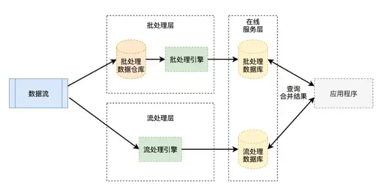
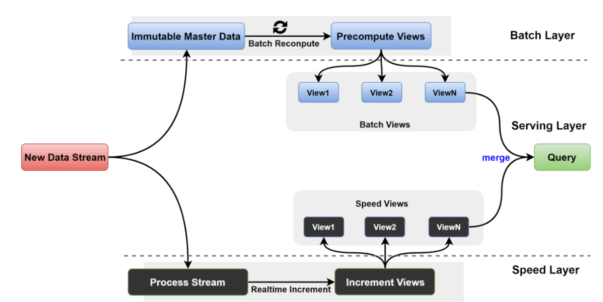
1. **批处理层（Batch Layer）** 是Lambda架构的核心组成部分，它负责处理大规模历史数据的计算。通常情况下，批处理层会定期读取海量的数据集，进行复杂的计算，并生成批量数据视图，这些数据视图将用于后续的查询和分析。批处理层的计算通常具有较高的延迟，但能够保证计算结果的准确性。与实时层不同，批处理层并不关注数据流的速度，它专注于对历史数据的深度分析。例如，常见的技术栈有Apache Hadoop、Apache Spark等，它们能够高效地处理分布式大数据集，提供强大的计算能力和容错性。

2. **实时处理层（Speed Layer）** 实时处理层负责对新到的数据进行实时处理，它能够快速响应数据的变化，及时计算出数据的近似结果。由于其处理的是流数据，实时处理层通常对数据的精确度有一定的容忍度，重点是保证低延迟和高吞吐量。实时处理层一般使用如Apache Kafka、Apache Storm、Apache Flink等流处理框架，这些框架专门用于处理大规模的实时数据流，并能够高效地计算和更新数据。实时层的结果通常是近似值，这一点与批处理层的精确结果形成对比。

3. **查询服务层（Serving Layer）** 查询服务层是Lambda架构的最后一层，负责将批处理层和实时处理层的结果进行整合，并为用户提供查询接口。服务层能够将实时处理和批处理的结果合并，提供给用户一个统一的查询接口。在这一层，用户可以对数据进行快速查询，并获得最新的计算结果。查询服务层的设计通常注重低延迟的查询响应，它需要高效地处理和展示批处理和实时数据的合并结果。常见的技术实现包括HBase、Cassandra等分布式数据库，它们能够提供高性能的存储和查询能力，支持大规模的数据读取和写入。

<mark>Kappa架构是对Lambda架构的改进和优化</mark>，Kappa 架构是由 Linkedln 的前首席工程师杰伊·克雷普斯(Jay Kreps)提出的一种架构思想。这哥们是Confluent公司的 CEO，身价几十亿的大佬，他在领英的时候负责Linkedln开源项目，包括Apache Kafka、Apache Samza、Voldemort以及Azkaban等项目。

Kappa架构得名于希腊字母κ（Kappa），这一命名源于其设计理念的核心优化目标——通过消息队列（如Kafka）实现历史数据的重放功能，从而简化数据处理流程。Kappa（κ）在希腊字母中代表"连接"或"结合"，象征着通过消息队列将实时数据与历史数据"连接"起来，形成统一的数据处理通道。这种设计理念强调在保证实时性的同时，通过简化架构降低运维成本，符合大数据处理向"实时化、流批一体化"演进的趋势。

Kappa架构的优化就是在Lambda 的基础上进行了优化，删除了 Batch Layer 批处理层的架构，将数据通道以消息队列进行替代。因此对于Kappa架构来说，依旧以流处理为主，但是数据却在数据湖层面进行了存储，当需要进行离线分析或者再次计算的时候，则将数据湖的数据再次经过消息队列重播一次或者重新消费一次数据则可。
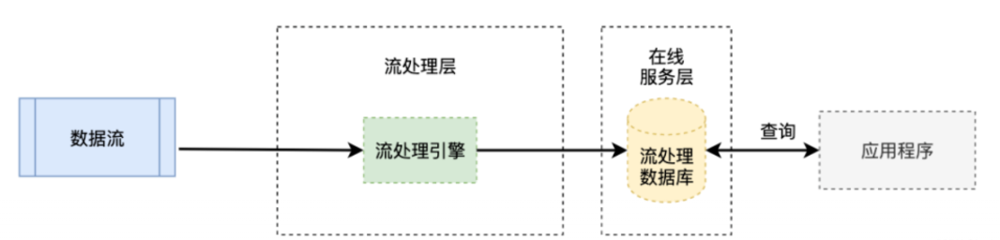
在实际应用中，<mark>Kappa架构的核心原理是利用消息队列（如Kafka）收集各类数据，并通过流处理引擎（如 Flink、SparkStreaming）对数据进行实时处理。</mark>处理后的数据存储在低延迟、高吞吐量的存储系统（如Kafka、Cassandra、HBase等）中，以便支持快速查询和分析。这种架构模式确保了数据处理的实时性和一致性，让企业能够基于最新数据做出及时决策

| 对比项 | Lambda架构 | Kappa架构 |
|--------|-----------|-----------|
| 数据路径 | 批处理层 + 流处理层双路径 | 统一流处理单路径 |
| 处理延迟 | 低延迟与高准确性通过两层结合实现 | 低延迟，准确性依赖流处理能力 |
| 代码维护 | 两套代码维护，复杂 | 单套代码，简化维护 |
| 适用场景 | 复杂计算需求，需兼顾历史与实时数据 | 实时处理为主，计算逻辑单一 |
| 架构复杂性 | 复杂，运维成本高 | 较简单，运维压力较小 |
| 适合技术栈 | Spark, Hadoop + Storm/Flink 等 | Kafka + Flink/Samza 等 |

## 4.什么是流批一体？

数仓流批一体（Unified Batch and Stream Processing）是一种数据处理架构，它将批处理和流处理相结合，以提供更灵活和高效的数据分析能力。在传统的数据处理中，批处理和流处理通常是分开的：

- 批处理：适用于处理大量历史数据的任务，通常是定时批量执行，延迟较高，如每天、每周的报告生成。
- 流处理：适用于实时数据处理，需要低延迟，能够即时反映数据变化，如监控、实时分析。

数仓流批一体架构通过整合这两种处理方式，可以在同一平台上处理批量数据和实时数据，提供一致的数据视图和更快的响应能力。流批一体，本质上是通过重构技术架构，让流处理和批处理在逻辑、存储、资源这三个层面实现统一。

**流批一体架构的核心思想：**

- 统一计算模型：使用同一套计算框架、API和运行时，既支持流数据，也支持批数据的处理。
- 简化系统架构：减少维护多个系统的复杂度，降低数据同步和一致性难题。
- 强化数据一致性：通过统一的状态管理和容错机制，保证流式计算和批量计算结果的一致性。
- 灵活调度执行：能够根据业务需求动态选择实时流式计算或离线批量计算，甚至结合两者优势进行混合处理。

数仓流批一体架构最终目的是让企业不用再纠结用流还是用批，而是根据业务场景选最合适的处理方式。这种架构通常依赖于现代的数据处理框架，如Apache Flink、Apache Kafka Streams、Apache Beam等，这些框架支持在同一代码库中实现批处理和流处理。比如doris,starrocks，druid，其他如阿里云的商业化产品 Hologres 也可以作为流批一体的数仓。
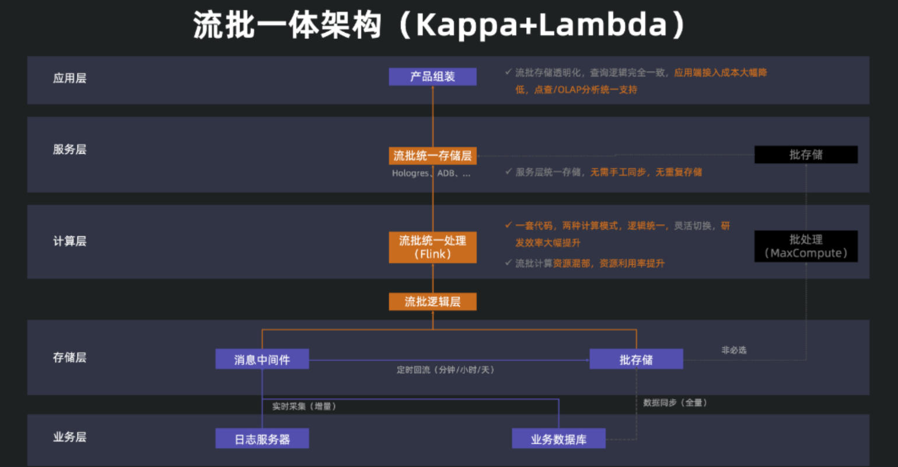
## 5.数仓仓库、数据湖、湖仓一体？

### 1.什么是数据湖？

2010年10月，在纽约的Hadoop World大会上，Pentaho公司创始人及CTO詹姆斯·迪克森（James Dixon）率先提出了数据湖的概念。

数据仓库，是把所有数据源的数据，按一开始制定的规则，进行了处理，变成了产品，缺乏灵活性。而数据湖，是利用Hadoop等大数据技术的处理能力和成本优势，将所有数据源的数据，不做预处理，全部都存起来。
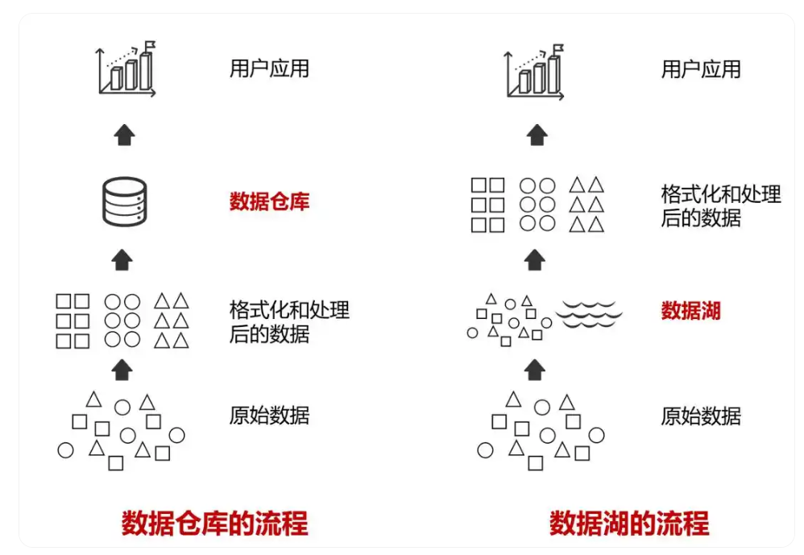
1. <mark>数据湖中的数据接近原生，内容齐全，属性完整。应用层在使用数据时，可以基于需求，进行灵活设计。</mark>
2. 数据信息未被筛选，底层细节都在，可以尽可能还原业务（也是为了更好地分析）。
3. 结构化、非结构化、半结构化，所有数据都能保存和处理，满足互联网时代发展的需要。

数据湖（Data Lake）它和数据库、数据仓库一样，是一种存储和处理数据的平台。数据湖是一个技术体系。它不是某一个具体的产品，而是一种新的数据管理架构，包括了很多的技术和组件。只是数据湖可容纳任意规模的结构化和非结构化数据。与专门为特定分析任务设计的数据仓库不同，数据湖保留数据的原始形式，直到需要进行分析时才对其进行处理，因此可以支持广泛的数据分析活动，包括机器学习、实时分析和大规模数据处理。旨在解决传统数据仓库在数据类型和存储灵活性上的局限性。数据湖的特点包括：

- **存储多种数据格式**：数据湖能够存储结构化、半结构化和非结构化数据，如关系数据库表、日志文件、图像、音频、视频等。
- **原始数据存储**：数据湖通常保持数据的原始形式，不需要预先进行结构化或处理，允许在数据分析时再进行必要的转换。
- **可扩展性和高效性**：数据湖采用分布式存储架构，可以处理海量数据，通常建立在云存储或分布式文件系统上，如Amazon S3、Hadoop HDFS。
- **灵活的数据分析**：数据湖支持多种数据分析工具和框架，如Hadoop、Spark、Presto、AWS Athena等，使用户能够进行各种类型的数据分析和机器学习。

数据湖通过提供一种灵活和可扩展的存储方式，使企业能够更容易地管理和分析大规模、多样化的数据。然而，由于数据湖的无结构化特点，数据治理和数据质量管理对于确保数据湖内数据的有效性和可靠性是非常重要的。
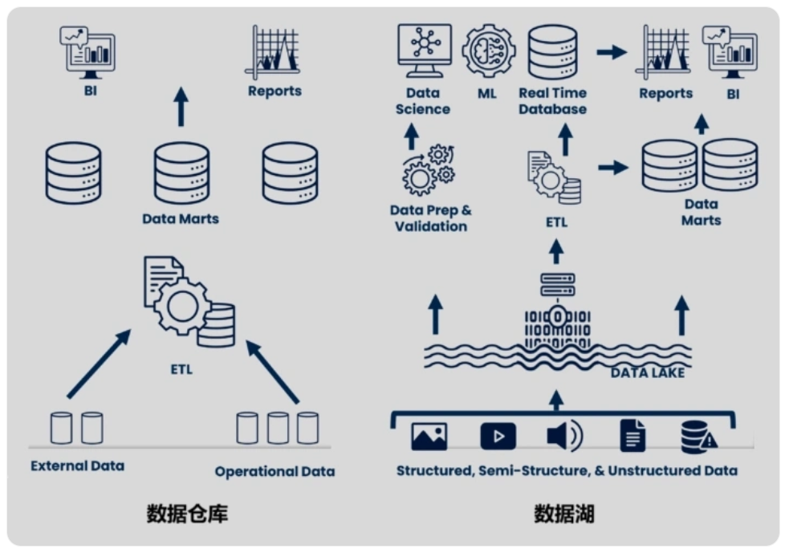
数据治理是数据湖的最核心要素（没有之一），指对企业中数据的可用性、完整性和安全性的全面管理，以提升数据的质量和可用性。

**数据湖的架构与常用的技术组件：**

- 数据摄取层（数据采集层）：负责从各种数据源收集数据，并将其传输到数据湖中。
- 数据存储层：以原始格式存储大规模的数据。
- 数据管理层：对数据进行管理和组织，包括数据的分类、编目、索引等功能。还要负责数据的安全和合规。
- 数据访问层（数据分析层）：提供各种工具和框架，支持用户对数据湖中的数据进行查询、统计分析、机器学习等操作。
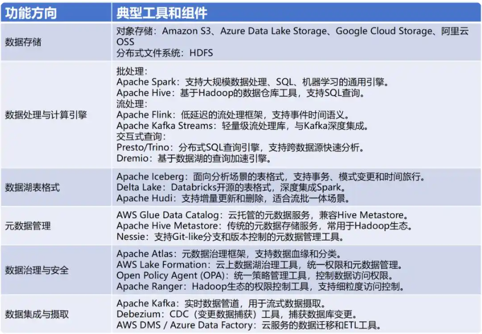
开源数据湖方案比较知名的分别是：Delta Lake（DataBricks公司）、Apache Iceberg、Apache Hudi和Apache Paimon(ApachePaimon 原名FlinkTable Store(简称FTS))。
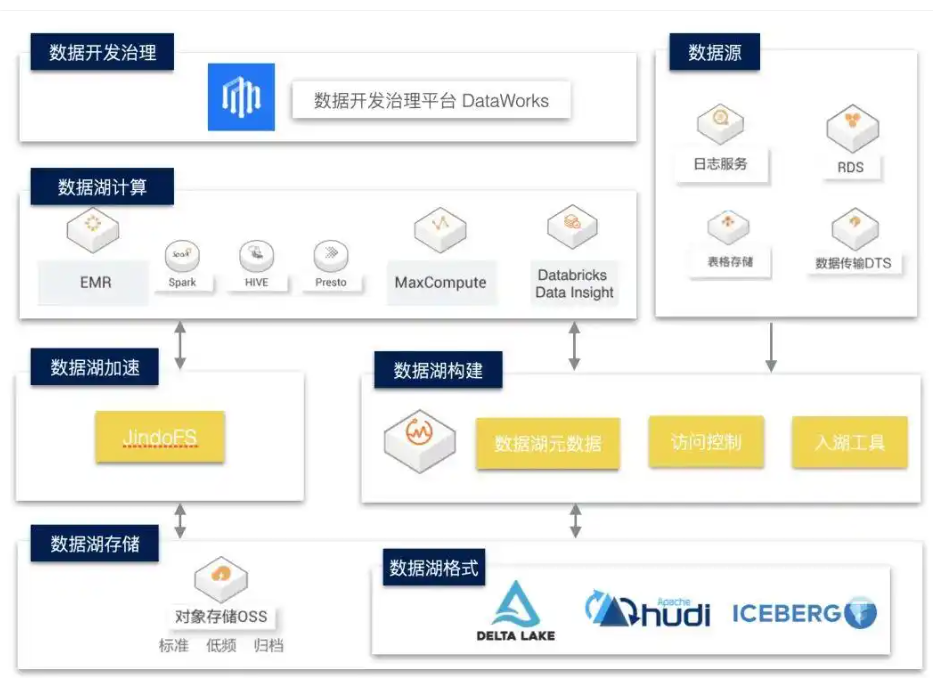
数据仓库和数据湖的优缺点对比
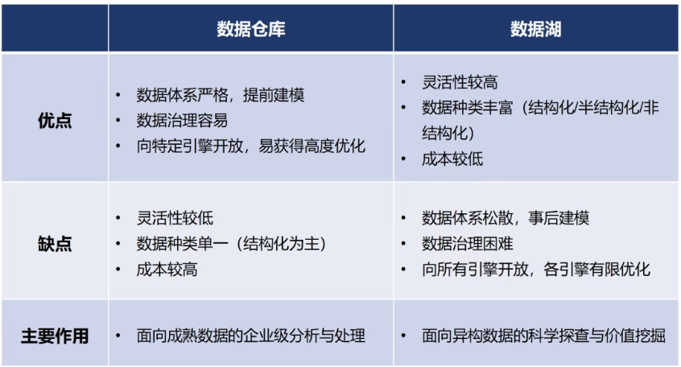
数据仓库和数据湖的综合对比：
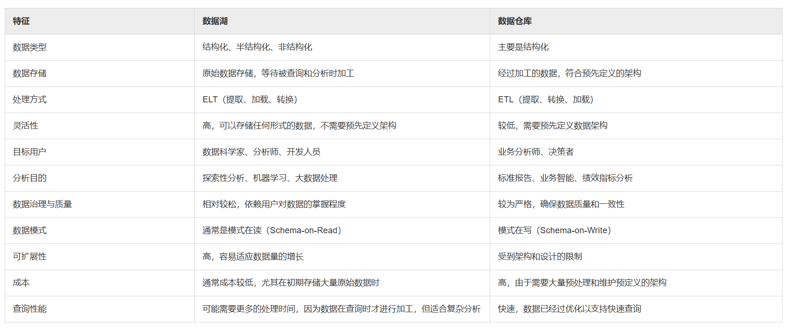
### 2.什么是数据湖仓、湖仓一体？

数据仓库和数据湖各有各的优点，是不是可以将数据仓库和数据湖进行结合，充分发挥两者的优势，弥补各自的缺陷呢？

- 一种是让数据仓库支持对数据湖的访问。
- 一种是让数据湖具备数据仓库的一些能力。

2018-2019年，Uber和Databricks相继推出了Apache Hudi和DeltaLake，推出增量文件格式，用以支持Update/Insert、事务等数据仓库功能。2020年，数据智能独角兽企业Databricks（Spark的商业化公司,也是数据湖组件Delta Lake的那个公司）正式提出数据湖仓（Data Lakehouse），也叫湖仓一体；
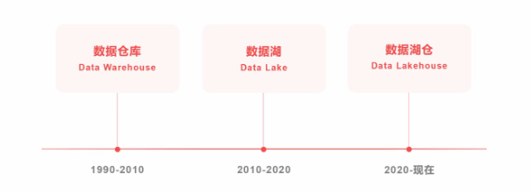
数据仓库和数据湖这两套体系相互打通之后，数据可以在两者之间自由流动。
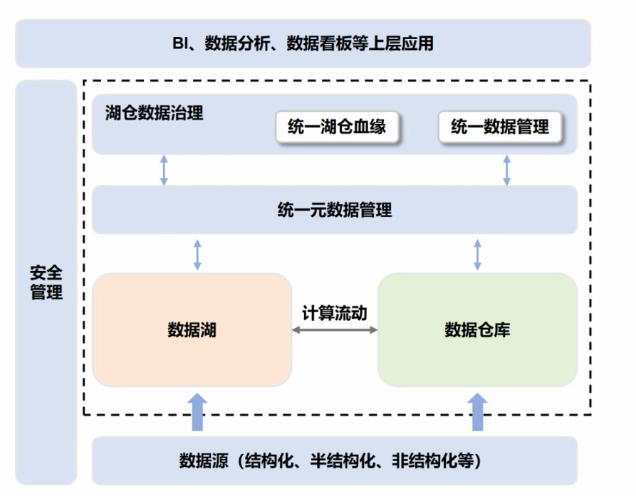
阿里云的数据湖仓一体架构图：
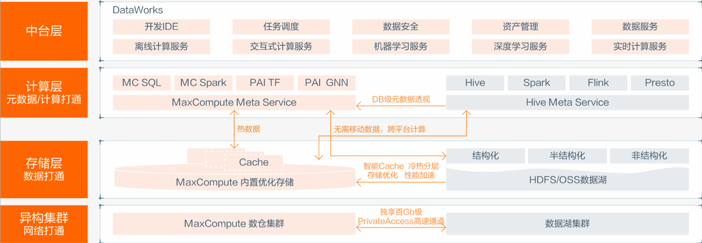
湖仓一体的两套解决路径：“湖上建仓”与“仓外挂湖”两种实践路径。在数据湖仓领域比较有代表性的服务商，包括国外的AWS（亚马逊云科技）、微软Azure 、Databricks、Snowflake，以及国内的阿里云、腾讯云、华为云、星环科技等

- <mark>湖上建仓，是指基于数据湖架构，或者以数据湖作为数据存储中间层，实现多源异构数据的统一存储。然后，以统一调用接口方式调用计算引擎，最终实现上下结构的湖仓一体架构。</mark>
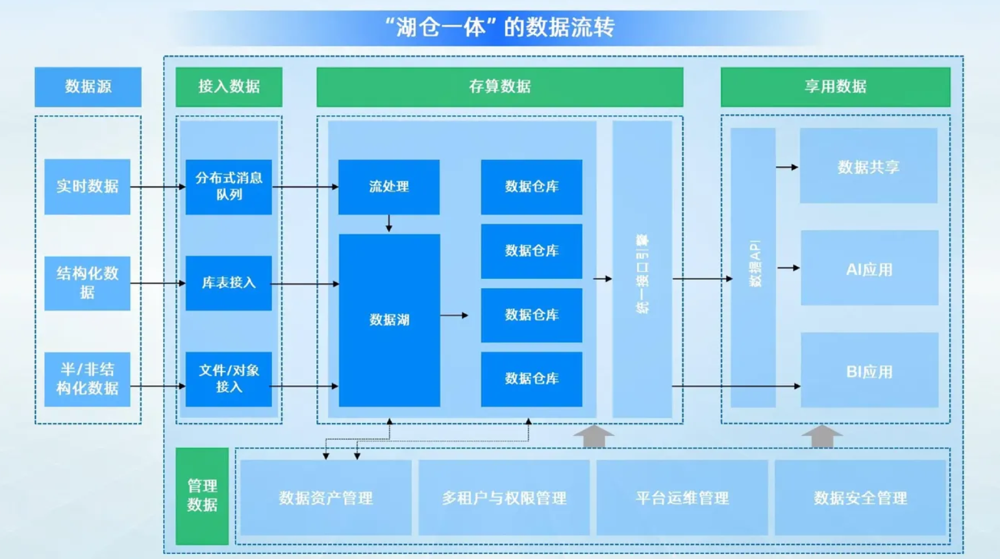
- 仓外挂湖，是指以MPP（大规模并行处理）数据库为基础，使用可插拔架构，通过开放接口对接外部存储，实现统一存储。
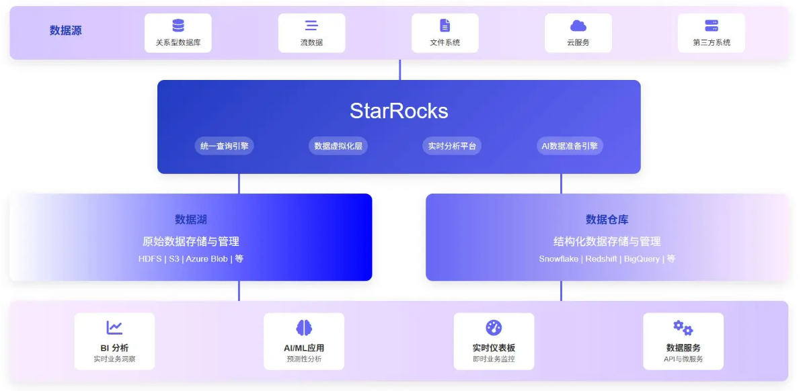
### 3.数据仓库，数据湖，湖仓一体的对比？
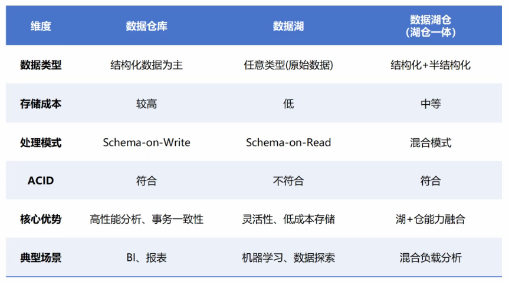

# 3.3.大数据平台与架构(开发数据的)

## 1.大数据本质是干什么的？
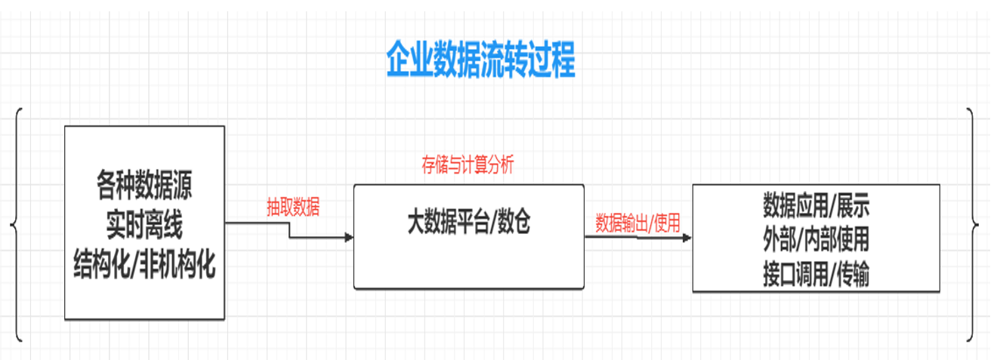
## 2.大数据平台能力图
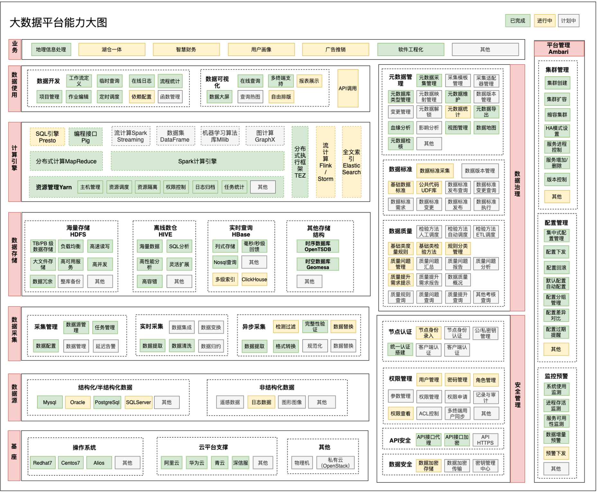
## 3.目前商用的一站式大数据平台有哪些？

### 3.1、 阿里云DataWorks

阿里云DataWorks是阿里巴巴集团旗下的一站式数据开发与管理平台，致力于提供完善的大数据处理解决方案。DataWorks的核心功能包括数据集成、开发、治理、服务和安全管理。用户可以通过DataWorks构建从数据采集、处理到数据分析的完整数据管道。其支持高效的数据接入和集成，多样的数据处理方式，包括批处理和流处理，并通过完善的数据治理措施保证数据质量。此外，DataWorks还为用户提供了方便的数据服务和安全管理工具，让用户可以高效、便捷地使用和管理数据资源。
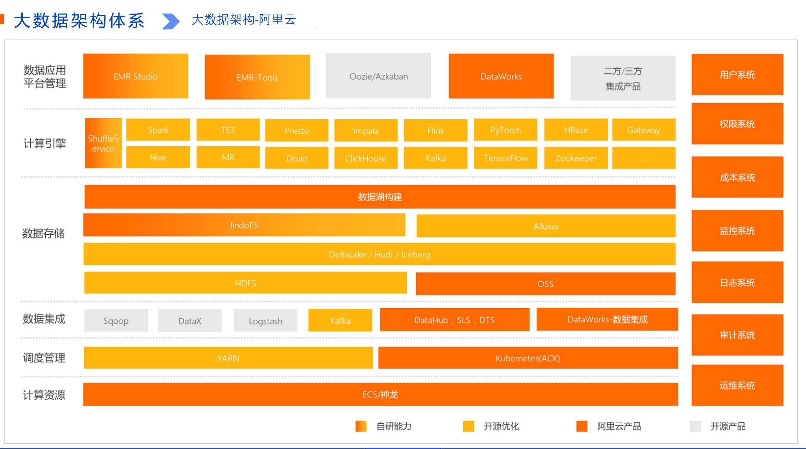
### 3.2、网易EasyData一站式大数据平台（重点）

Easydata大数据生产力平台，是网易大数据开发与数据治理实践经验的积累，是一站式大数据应用开发和数据管理平台。

大数据开发的环节众多，而平台的十余个子产品，则分别用于完成大数据开发的各个环节的工作。有数大数据平台，总结出了典型的6大使用阶段：需求输入、数据准备、模型设计、模型开发、质量控制、需求交付等；
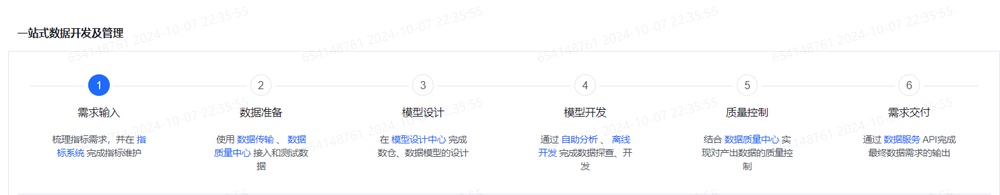
在<mark>沉淀网易大数据建设方法论的基础之上，Easydata大数据生产力平台支撑数据中台建设，同时与数万名政务、央国企、金融、零售、互联网、能源、制造、工业等行业的客户携手，不断提升数据应用效率，助力产业数字化升级。</mark>

平台从数据研发、数据治理、数据服务、数据应用等多个和大数据开发人员息息相关的环节入手，提供了丰富的产品矩阵，能让开发人员高效地完成各种开发需求。

此外，结合大数据底座的分析能力、数据管理能力、项目管理能力（包含资源管理、事件跟踪等），Easydata能更好地满足用户平台管理的需求。
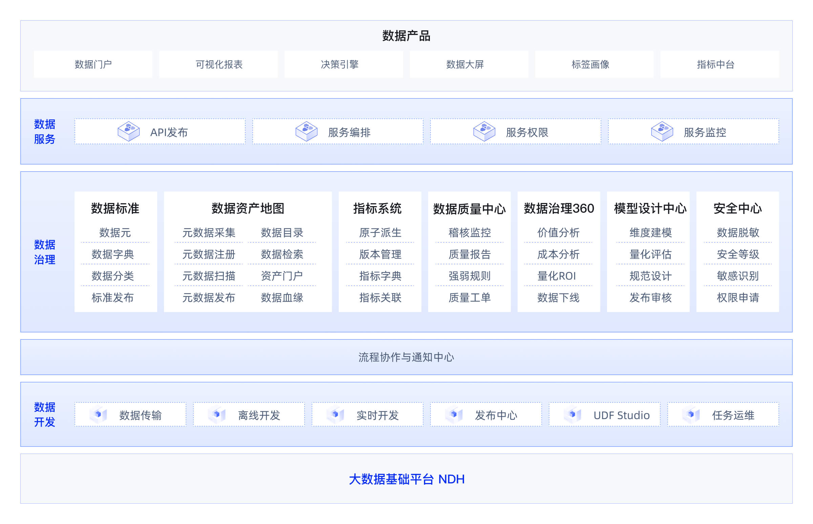
**EasyData一站式平台的功能**

| 功能模块 | 说明 |
|---------|------|
| 数据传输 | 主要用于多种异构数据源之间的数据交换，可实现各部门业务数据在应用层面的互联互通和信息共享。数据传输采用分布式的架构，可以从容应对大数据量的数据传输需求。针对实时计算场景，还提供基于FlinkCDC的实时采集和传输的能力，保证数据实时同步。 |
| 数据标准 | 是指保障数据定义和使用的一致性、准确性和完整性的规范性约束。通俗来讲，数据标准就是对数据(字段)的命名、数据类型、长度、业务含义、计算口径、归属部门等，定义一套统一的规范，保证各业务系统对数据的统一理解、对数据定义和使用的一致性。 |
| 指标系统 | 指标系统依托离线开发中心，是指标的统一入口，通过定义原子、派生和复合指标，明确指标业务口径和技术口径，解决指标定义不一致、口径不一致和数据来源不一致的问题，实现规范定义，助力数据模型规范设计。 |
| 模型设计中心 | 主要提供组织数据、刻画数据、规范约束、效果衡量等能力，用于实现数仓的规范化建模，同时指引数仓建设的方向。该产品支持主题域、表分层、字典集、设计规则、维度、度量等模块的管理，支持数仓建设数据大屏展示。 |
| 离线开发 | 离线开发中心是易数数据生产力平台的基础产品，提供大规模数据存储与计算能力。可选择搭载其它易数产品，完成数据集成、数据研发、数据治理、数据服务等功能，灵活满足客户的各类场景。 |
| 实时计算 | 实时计算是基于 Apache Flink 构建的高性能、一站式实时大数据处理平台，具备全链路覆盖、低时延的特点，广泛适用于流式数据处理场景，通过标准 SQL 服务和更高级的代码定制服务，提供低门槛，专业化的实时开发 IDE。 |
| 任务运维中心 | 任务运维中心是离线开发的必备辅助产品，使命是辅助任务运维人员进行离线任务管理和实例运维的工作，提高运维效率，及时发现问题并提供诊断建议，并为团队运维情况提供评估。 |
| 自助分析 | 是数据开发人员进行数据自助探查数据的场所，可方便快捷的执行自定义的SQL语句，操作如Hive、Doris、MySQL、Oracle、ClickHouse等数据源的表。也能够实现语句分享、代码共享等。 |
| UDF Studio | UDF Studio作为数据开发及治理平台的UDF管理服务平台，提供统一、完善、便捷的UDF管理服务，以项目组为管理单位，实现同项目组下公共函数的共建共享；通过函数的发布和申请流程，让函数的注册和使用更加规范和可控，提高函数开发效率，减少维护成本。 |
| 安全中心 | 统一的功能权限管理，控制中台子产品的使用权限。对于hive表提供库，表，列级别的权限控制。提供动态脱敏能力，对返回的结果进行脱敏处理。 |
| 数据资产地图 | 在元数据基础上提供的统一数据查询服务，涵盖全局数据检索、元数据详情查看、数据预览、数据血缘和数据管理等功能，帮助用户更好地查找、理解和使用数据。 |
| 数据治理360 | <mark>数仓界的360，可以定量评估数据资产的成本、价值、质量。帮助企业优化存储成本，节约计算资源。精细化的数据生命周期管理，帮助企业更好的管理数据从生产到销毁的整个过程。</mark> |
| 数据质量中心 | 数据质量中心通过事前定义监控规则、事中监控数据的生成过程以及事后评估和问题追溯，围绕完整性、一致性、准确性、有效性和及时性五个方面衡量数据质量，依托离线开发中心的数据质量配置，提升企业数据价值。 |
| 数据服务 | 数据服务提供快速将数据表生成数据API的能力，通过应用授权，供外部应用系统调用API获取数据，且对API进行统一管理和发布。 |
| 流程协作与通知中心 | 该产品是整个平台的工单流转中心，承接了平台的大部分工单，使得平台用户可在统一的地方查看所有与我相关的工单，包括需我处理、我处理、我申请的。 |
| 发布中心 | 发布中心是本数据平台的自助式统一资源发布平台，通过资源打包、发布、导入、应用等过程，实现在线和离线场景下的跨环境资源发布。针对有多套数据开发环境需求的客户，可以使用发布中心产品。 |
| 项目中心 | 项目中心是项目的配置中心，会展示项目信息，支持项目级别的配置，支持角色管理、成员管理、数据权限管理、目录管理、队列管理、功能权限管理，支持查看审计数据，支持管理项目下的资源等。 |
| 平台管理 | 该模块对平台管理员开放，一般用于平台部署后的初始化后，完成项目组、项目的新建等。 |
| 控制台 | 数据开发及管理平台的控制台部分，目前支持平台成员账号管理、调度日历管理、数据源管理、通知模板管理等。 |

### 3.3、腾讯云开发治理平台 WeData

数据开发治理平台 WeData（以下简称 WeData）是一站式数据开发治理平台，融合了包含数据集成、数据开发、任务运维的全链路 DataOps 数据开发能力，以及数据地图、数据质量、数据安全等一系列数据治理和运营能力，帮助企业在数据构建和应用的过程中实现降本增效，数据价值最大化。
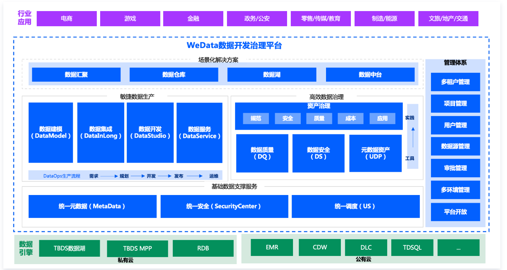
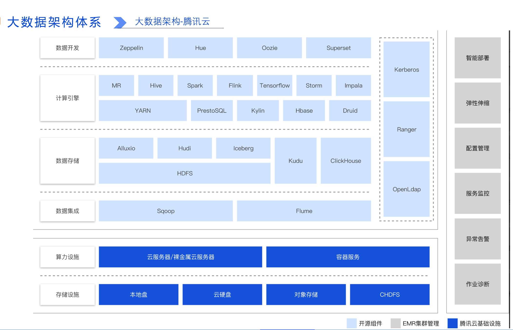
### 3.4、华为FusionInsight

华为FusionInsight是华为公司推出的大数据平台，涵盖数据采集、存储、计算、分析等多个环节。FusionInsight基于华为在电信运营商领域的丰富经验，具备强大的分布式数据处理能力。其支持多种数据处理引擎，如Hadoop、Hive、Spark及其增强版，并通过一体化管理平台实现了数据处理流程的统一管理。此外，FusionInsight还整合了机器学习和人工智能能力，帮助用户实现更智能的数据分析和决策支持。
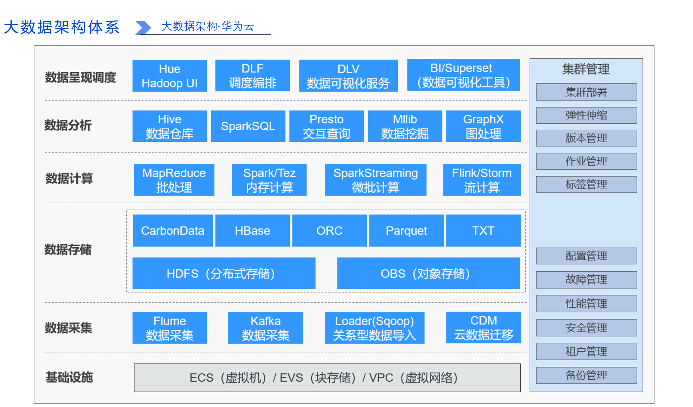
### 3.5、百度智能云

百度智能云大数据平台依托百度领先的AI技术和海量数据处理能力，为用户提供高效的大数据管理服务。其平台包括百度数据工场、数据湖和智能数据分析等模块，支持广泛的数据处理和分析需求。百度数据工场提供全流程的数据开发与管理能力，支持多源异构数据的接入与处理；数据湖则侧重于海量数据的存储和管理，提供高效的数据查询能力；智能数据分析模块借助百度AI核心技术，提供精准的数据挖掘和预测分析服务，帮助用户挖掘数据价值，提高业务决策质量。

### 3.6、京东大数据

京东大数据平台整合了京东电商业务积累的大量数据资源，为用户提供覆盖数据采集、存储、处理、挖掘等全生命周期的大数据解决方案。京东大数据平台的优势在于其电商行业的深厚积累，能够提供精准的用户画像、推荐系统和销售预测等服务。通过大数据技术，京东能够对用户行为进行深度分析，为合作伙伴提供定制化的数据服务，提升销售业绩和客户满意度。

### 3.7、金山云大数据

金山云大数据平台致力于为企业提供灵活、高效的大数据处理解决方案。其核心功能包括数据采集、实时计算、离线处理和数据可视化。金山云大数据平台基于先进的云计算架构，提供高可靠的数据存储和处理服务，支持大规模数据的快速读写和复杂计算。其数据可视化工具则能够帮助用户直观地理解数据，发现数据中的潜在价值，支持业务决策。

### 3.8、亚马逊AWS

亚马逊AWS的大数据平台是众多国际企业的首选，提供了全方位的大数据服务。其服务包括Amazon Redshift数据仓库、Amazon EMR大数据处理、Amazon Kinesis实时流数据处理等。AWS大数据平台以其高扩展性和可靠性著称，支持大规模数据分析和处理任务，满足企业复杂的数据需求。与AWS其他云服务的无缝集成，使得用户可以轻松构建高效的数据管道，实现从数据采集、处理到分析的一体化管理。

### 3.9、微软Azure

微软Azure大数据平台为用户提供了完备的大数据处理工具和服务。其主要组件包括Azure HDInsight、Azure Data Lake和Azure Databricks。Azure HDInsight是基于Hadoop的大数据处理框架，支持多种数据处理引擎如Spark、Hive、Kafka等；Azure Data Lake提供海量数据存储和分析能力，支持大规模数据的并行处理；Azure Databricks是一个高效的数据分析和机器学习平台，集成了Azure云服务的优点，为用户提供便捷的数据处理和分析环境。

### 3.10、字节大数据研发治理套件DataLeap

DataLeap一站式数据研发治理套件，搭配EMR/LAS等存储计算引擎，快速完成数据集成、开发、运维、治理、资产、安全等全套中台及湖仓一体平台建设，提升数据研发效率、降低管理成本。
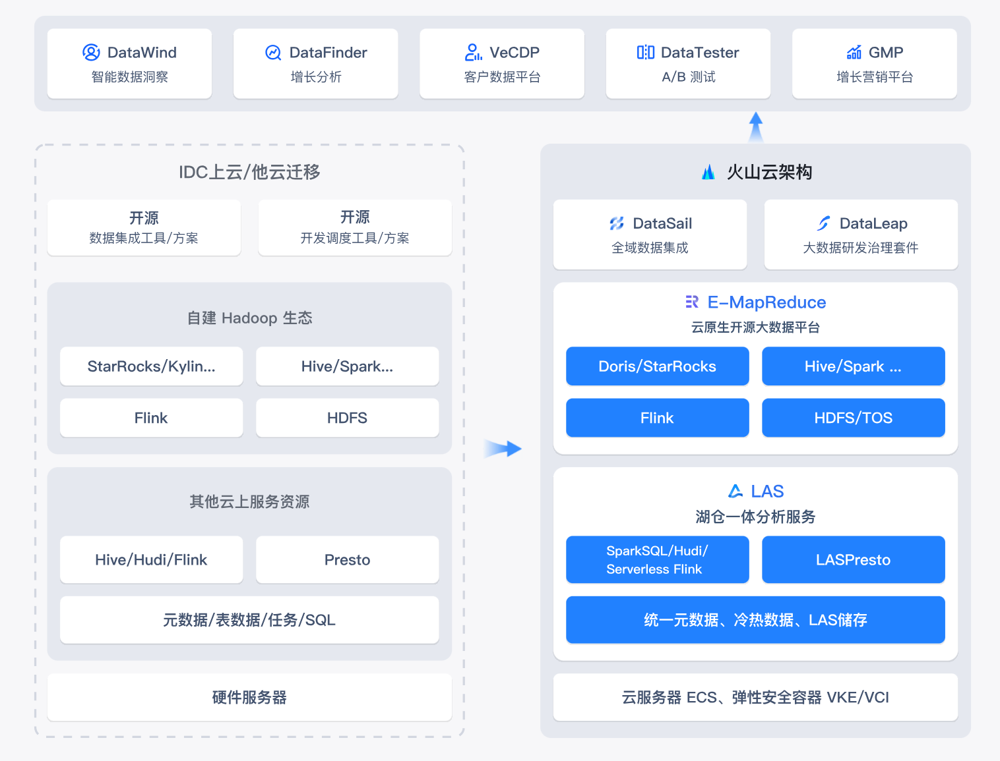
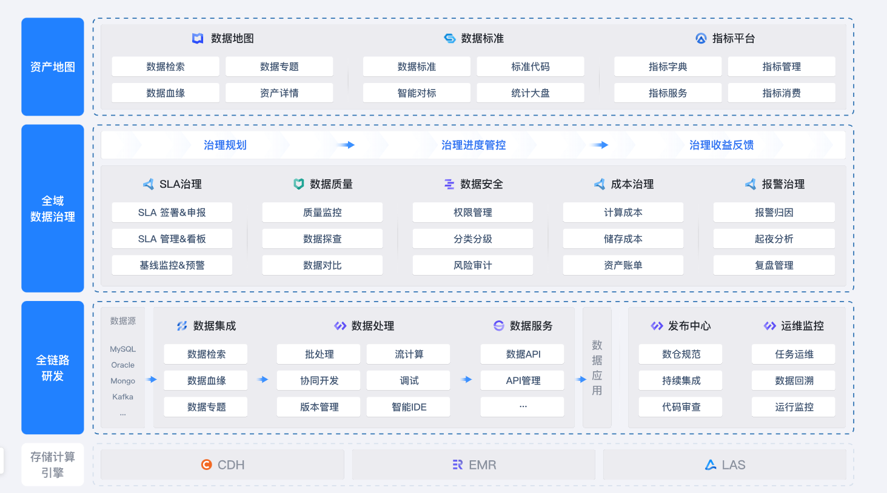
# 4.一张图快速上手数仓建模方法论

## 1.一张图快速上手数仓建模方法论
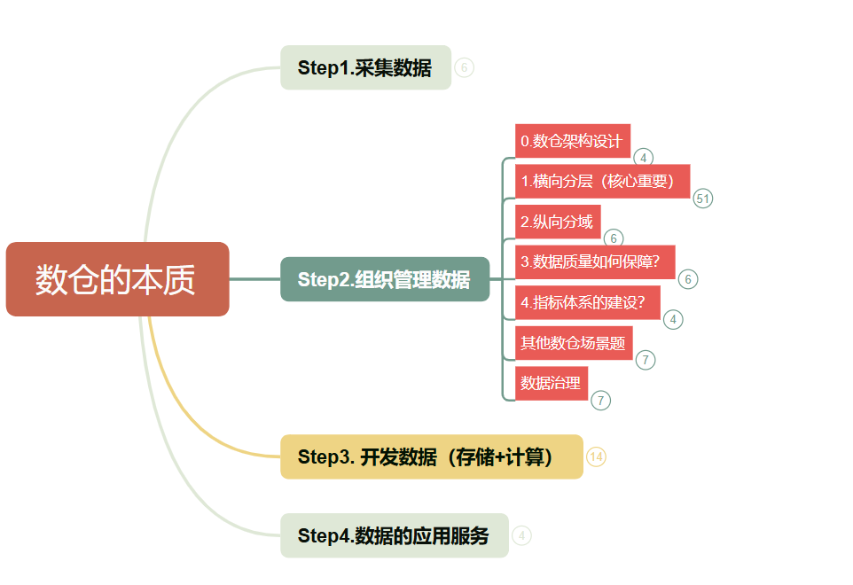
具体详细参考链接：https://www.processon.com/mindmap/687b575e5f31900ebda10f7c

阿里巴巴的电商数仓架构图，涉及到的分层划域、事实表模型、维度表模型、维度模型概览：
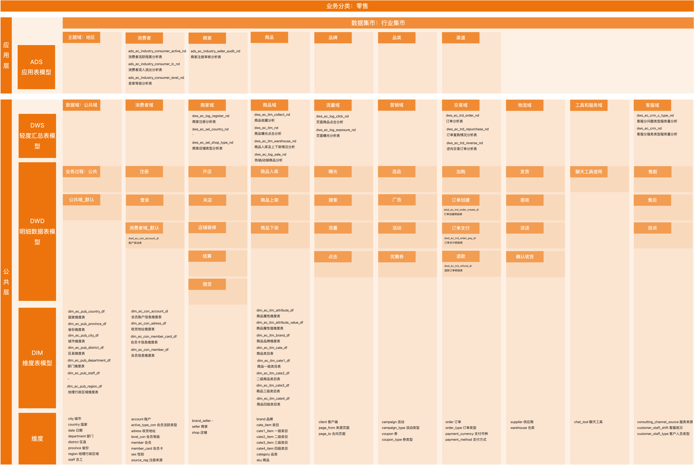