# 1.Easydata离线任务调度平台概述

## 0.官方学习手册(非常详细)

**网易easyData官方手册**：http://easydemo-prod.163yun.com/media/doc/index.html
教程视频地址：（需要账号）https://easydemo-prod.163yun.com/

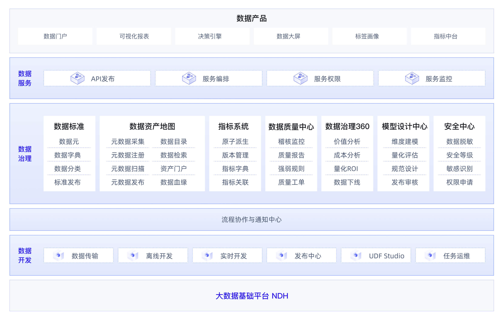

## 1.一站式集成的任务调度平台

离线开发是大数据平台的基础模块，提供大规模数据存储与计算能力。可选择搭载其它有数产品，完成数据集成、数据研发、数据治理、数据服务等功能，灵活满足客户的各类场景。
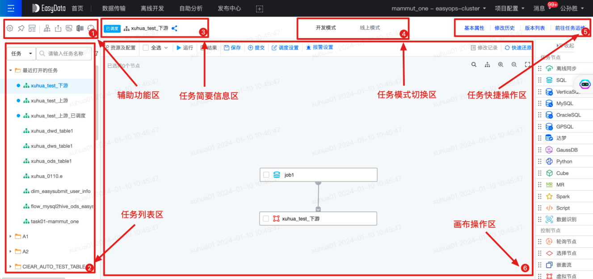

### 1.辅助功能区

辅助功能区在页面左上角，提供了离线开发配置、产出数据订阅、公共资源等模块的入口，支持新建文件夹、新建任务、新建离线表、离线表新增字段、表克隆、上传资源包、上传任务包、代码搜索、批量移动、任务定位等功能。
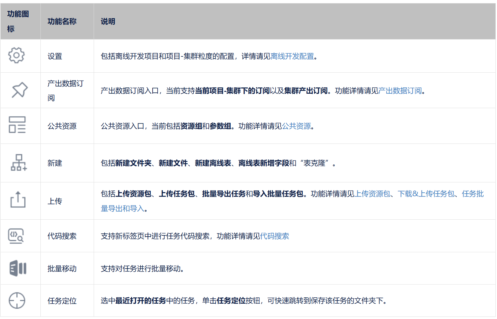

### 2.任务列表区

该区块会显示所有离线开发的任务，可通过文件夹来组织任务。

- 对于文件夹，支持新建文件夹、新建任务、重命名、删除和移动目录操作。
- 对于文件，支持上传任务包、上传资源包、重命名、删除、复制、下载任务包（开发模式）、下载任务包（线上模式）、依赖授权、锁定、查看标识等。

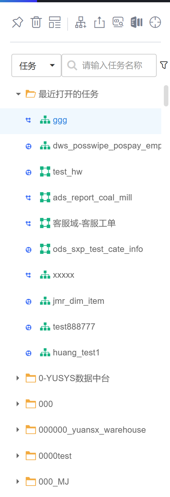
在该列表区，系统预置了一个默认文件夹，该文件夹不做权限控制。此外，也隐藏了一个文件夹，命名通过项目名称-集群名称表示，比如easyai-hz10，这个称为AI任务文件夹。该文件夹为平台的关联产品机器学习平台预留，供其推送AI实验。AI文件夹下的任务不支持任何编辑操作，仅接收推送方式更新。

### 3.任务简要信息区

此处会显示任务状态、锁定状态、任务名称等信息。
| 类型 | 状态名称 | 说明 |
| :--- | :--- | :--- |
| 任务状态 | 未上线 | 任务新建后，状态为未上线。 |
| | 未调度 | 任务在开发模式“调度设置”中“调度开启”为关，则提交上线后，状态为未调度。 |
| | 已调度 | 任务在开发模式“调度设置”中“调度开启”为开，则提交上线后，状态为已调度。 |
| 锁定状态 | 锁定 | 锁定会有2种场景，一种是任务新建后，在任务列表中，对任务右键可执行锁定操作，另一种是任务提交上线后，系统会自动锁定。 |
| |  | 锁定后会显示任务锁定图标。 |
| |  | 对于非锁定者、项目负责人和管理员不可编辑，仅可查看。 |

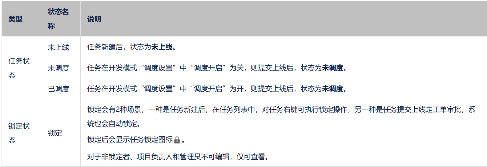

### 4.任务模式切换区

该区域包括开发模式和线上模式两个按钮，主要用来进行两个模式页面的切换。关于开发模式与线上模式的功能详情请见开发模式与线上模式。
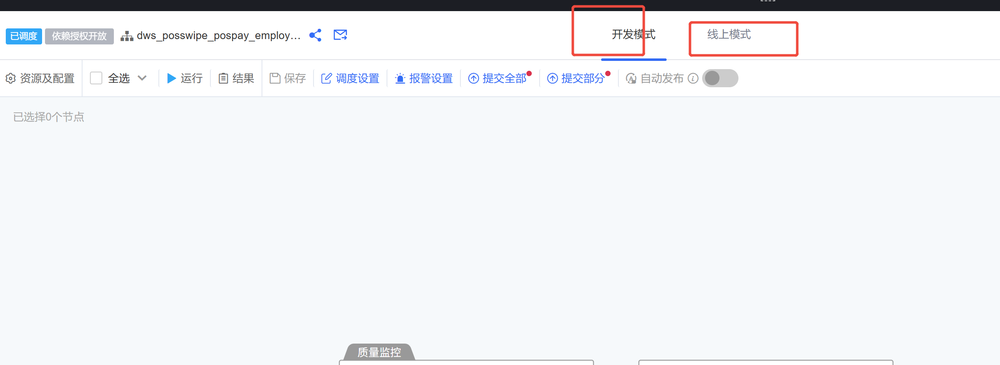

### 5.任务快捷操作区

任务快捷操作区，包括三个功能：基本属性、修改历史、版本列表以及前往任务管理。
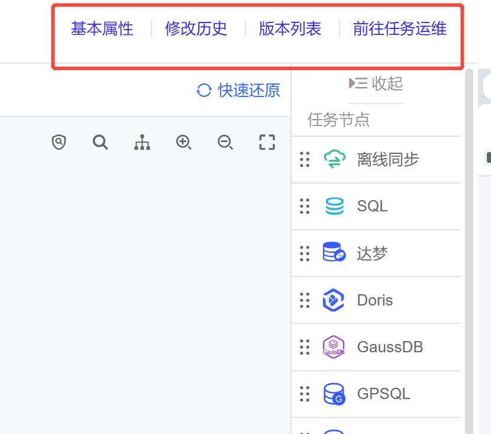
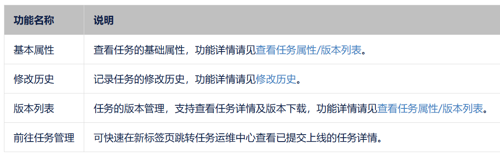

### 6.画布操作区

画布操作区包括任务的开发模式画布和线上模式画布。
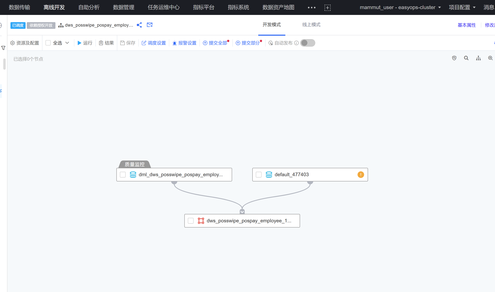

对于离线开发的任务，支持开发模式和线上模式，实现任务代码、调度配置的隔离。开发模式的任务可通过提交上线操作，将任务代码提交到线上模式。

<mark>开发模式</mark>，对于多节点任务，可将右侧多种类型的节点拖拽入画布中，双击节点，可进入节点弹框，进行相应开发。具体可查看不同节点的开发说明，节点类型介绍。在开发模式下，支持对任务配置“资源及配置”、选中运行、查看结果、保存、提交、调度设置、查看修改记录、快速还原等操作。开发模式相当于任务的测试环境（有些公司叫预发布环境），用户新建任务后，就会进入任务的开发模式。在开发模式下，对任务的节点增减、节点内容修改，以及修改任务的调度配置，都不会影响线上模式的任务。在开发模式下，可执行任务，默认会使用用户的个人账号执行，但也支持平台粒度统一配置为使用项目账号执行。当前仅修改任务负责人和描述会立即生效到线上模式。

<mark>线上模式</mark>，<mark>可设置任务的报警信息、查看资源及配置、调度信息、报警信息、嵌套信息等。</mark>针对有开启跨环境发布的项目，还支持“任务发布”、“添加到发布池”、查看“发布记录”等操作。**线上模式相当于任务的稳定版本，在开发模式完成任务的修改、运行等测试工作，提交上线后，就会形成一个线上版本。线上版本的任务节点、节点内容、调度设置等均不支持修改，仅能从开发模式提交上线来完成修改。**

注意：开发模式和线上模式虽然任务隔离，但是代码相同。所以操作任务时可能会读写相同的数据。本平台支持数据测试功能（数据沙箱），可支持SQL节点一份代码在开发模式和线上模式分别操作离线库和测试库表的功能，详情请见数据测试功能（数据沙箱）。

| 配置项 | 说明 |
|--------|------|
| 任务名称 | 请输入任务名称，最大长度120个字符 |
| 任务类型 | 1. 多节点任务，表示一个任务中支持拖入多个节点；2. 单节点任务，表示一个任务中仅存在一个特定类型的节点；3. 任务组，在商业化中，不对外开放。 |
| 保存位置 | 保存任务至某一文件夹下。 |
| 引用资源组 | 在公共资源模块中，有权限的人员可配置项目组内的资源组，比如一些通用的Jar包等，此处可进行引用。 |
| 引用参数组 | 在公共资源模块中，有权限的人员可配置项目组内的参数组，比如一些常用的常量，此处可进行引用。 |
| 默认外部数据源 | 离线开发支持配置开启VerticaSQL、MySQL、OracleSQL、GPSQL、达梦、GaussDB等节点（需要运维人员开启），支持直接连接对应数据源执行。每类节点可以选择平台所登记的具体数据源，并基于该数据源进行sql操作。多任务节点支持一个任务中添加多个不同类型的节点。因此，在新建任务时，可对这些数据源设置默认数据源，进而在任务中新引入节点时，会默认配置上对应的数据源。对于已有任务，也支持在任务的“资源及配置”中修改默认数据源 |

# 2.EasyData任务调度开发案例

## 1.新建文件夹（任务管理）

在离线开发模式下进行任务开发，项目管理人员需要预先进行顶层文件夹的组织划分，比如一级按照表分层（比如不同层不同文件夹管理任务）、二级按照主题域（不同主题域数据域不同文件夹管理），或者增加一些个人目录等。普通用户，也需要在管理员的建议下，合理地构建文件夹。

- 单击辅助功能区的图标选择新建文件夹；
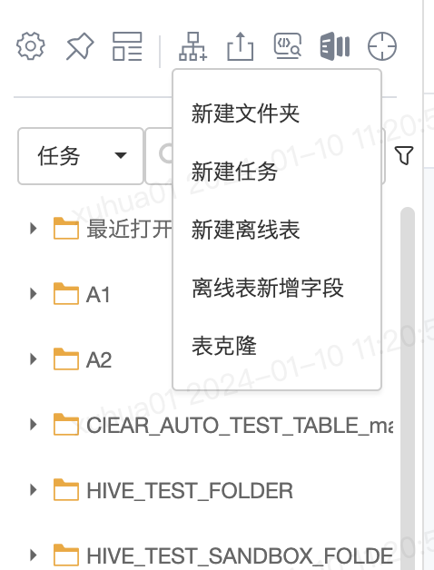
- 在弹出的对话框中，填写文件夹名称以及保存位置。
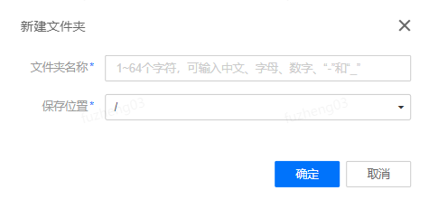

针对已有文件夹的场景，也可以在文件夹上右键，选择新建文件夹，此时会自动填充保存的位置。

## 2.新建任务-不同的任务类型

在辅助功能区，找到新建任务图标，或者在左侧树状任务列表的文件夹上右键，找到新建任务，即可进行任务的新建。
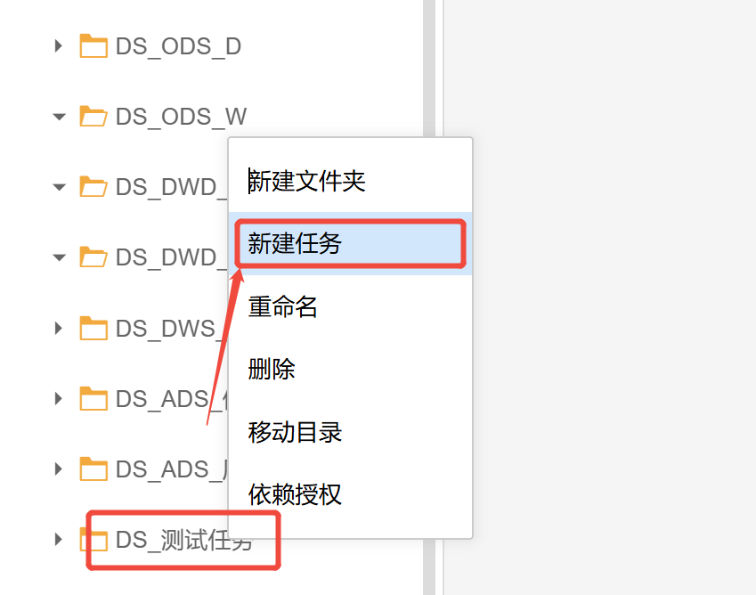

任务新建完成后，默认会进入任务的开发模式：
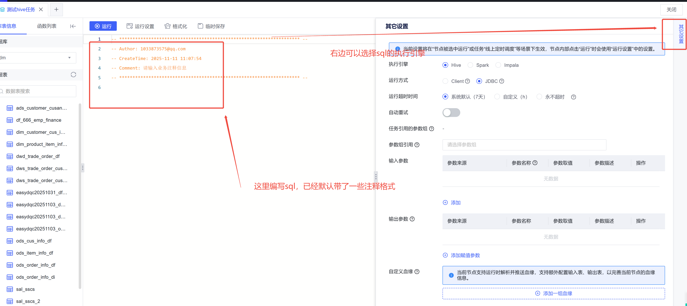

同一段sql可以用不同的执行引擎调度

## 3.任务开发模型→线上模式提交

调度配置，给开发模式的任务进行调度配置：
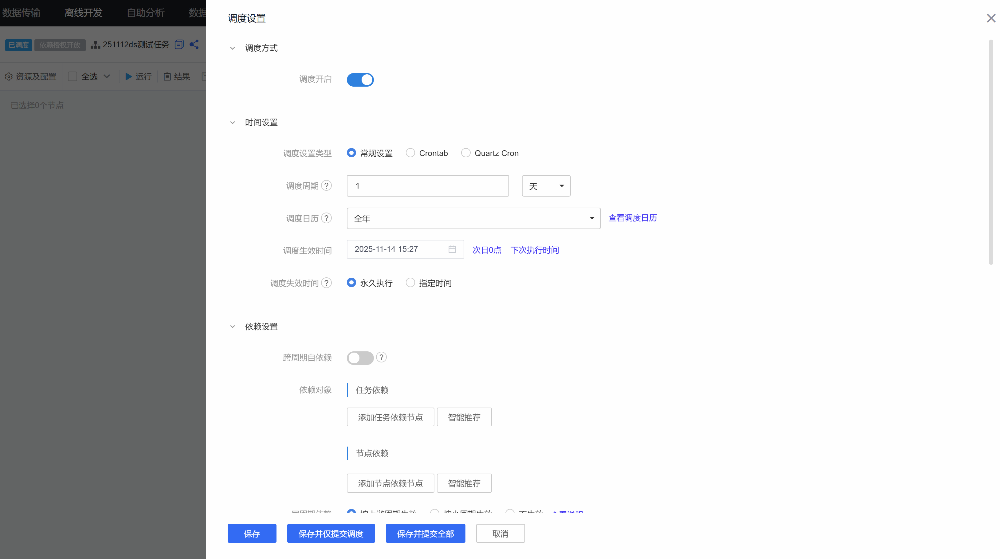

调度配置完提交到线上模式，上线，上线前程序会做系列的校验
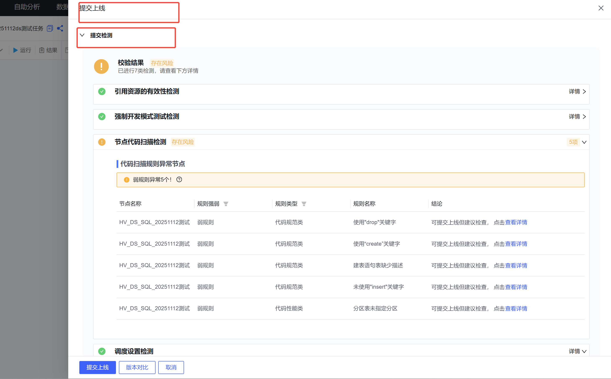

管理人员可以对不同任务流的任务配置提交上线审批，这样任务修改上线都需要审批的；

# 3.EasyData任务运维实战

具体详细参考：（后期数据治理课程会详细讲解），这里主要以视频讲解为主；

http://easydemo-prod.163yun.com/media/doc/easytaskops/easytaskops_overview.html

任务运维中心能够辅助任务运维人员进行离线任务管理和实例运维的工作，帮助运维人员提高运维效率，及时发现问题并提供诊断建议。

当前，任务运维中心页面主要包括运维大盘、实例运维、任务列表以及报警模块四部分。运维配置页面提供了值班组和基线的管理。
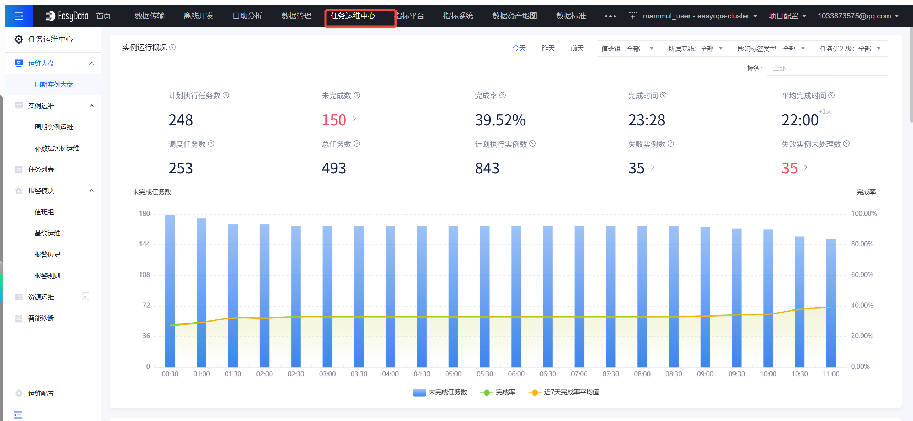

## 1.运维大盘-实例运维大盘

通过实例运行概况、值班运维概况、基线完成时间等模块，展示实例的运维大盘数据。
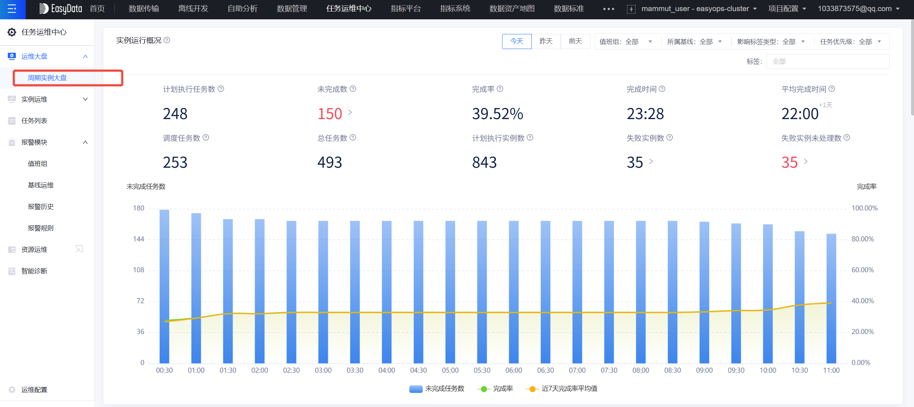
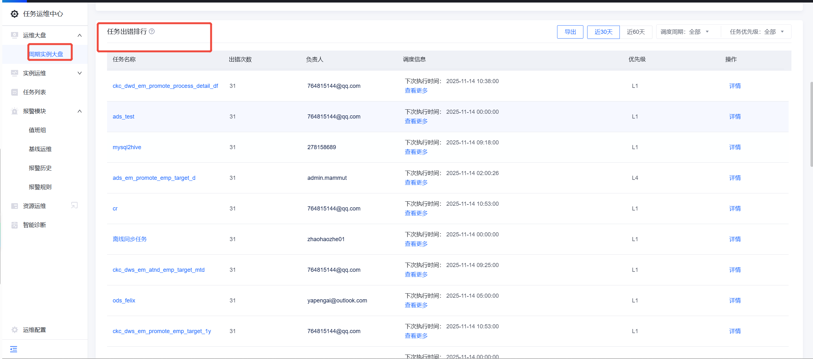
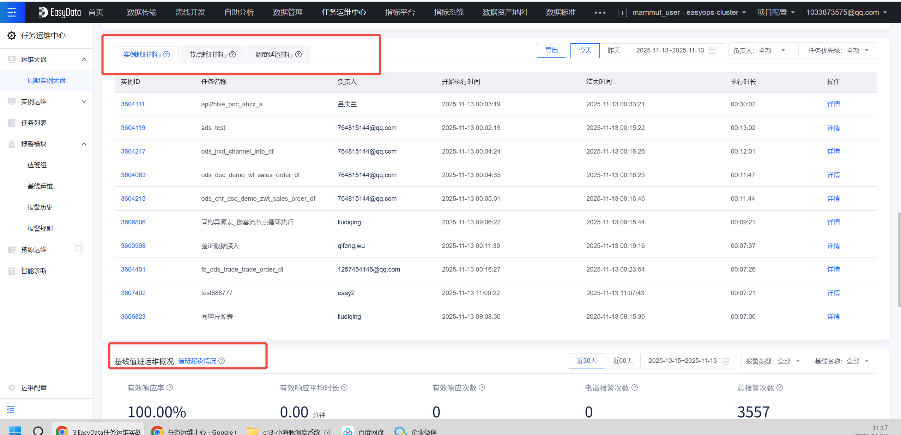

## 2.实例运维：周期实例列表及实例详情

周期实例列表用来展示周期实例的运行列表，支持实例重跑、终止等功能。

实例详情可展示实例的基本运行信息、节点信息、关键路径、产出影响等，支持查看日志、前往编辑等快捷操作。
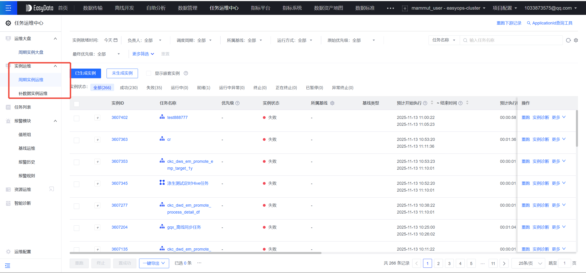

## 3.任务列表

任务列表支持查看已提交上线的所有任务列表，以及任务的内部节点清单，支持对任务设置基线、负责人和任务优先级，支持筛选和搜索操作。其中任务优先级功能支持基于任务血缘依赖，分钟级进行优先级传递，目前主要用于加速器功能中任务的筛选。
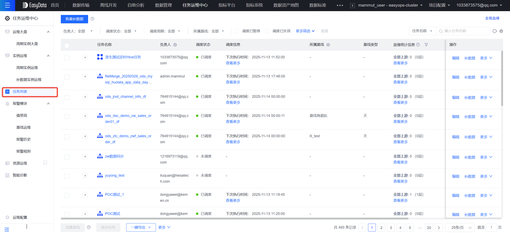

## 4.报警模块：值班组，基线运维，报警历史，报警规则

任务运维中心中支持对值班组和基线的管理，在一个项目-集群下，可配置多个值班组，每个值班组中可添加组员，并设置每日值班人员。项目-集群下的基线也可以设置多条，并将基线归属到值班组中。当基线上挂载的任务实例或上游任务实例执行超时或者执行失败，导致基线上的任务无法在设置的时间前全部完成时，系统会通知相关的值班人员。
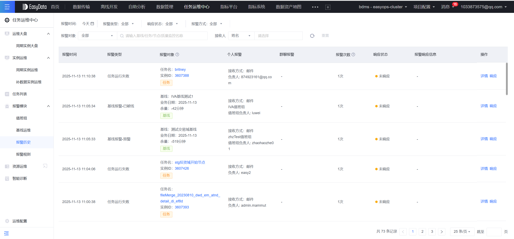

基线运维功能是通过设定几条时间线（即基线）和线上任务进行关联。当这些任务的实例或者上游实例运行失败、或者实例预计产出时间超过对应的时间线时，系统会触发报警并通知给值班人员。值班人员负责统一处理和跟进所有异常，从而确保所有问题得到解决。

<mark>基线的概念</mark>:保障大批量调度任务能够每日正常按时产出，数据出现异常能够提前预警处理，需要一套体系化、智能化的运维管理机制。通常将多个同等重要、同一业务领域、同一产出时间要求的任务圈定在同一条“保障线”上

**基线的作用：**

- 高效运维:设置时间线，智能化管理大批量、复杂依赖的任务，不用单任务一个个运维
- 提前预警:降低业务资损，提前规避风险
- 分级管理:任务分级管理和告警通知，特殊场景一键处理
- 智能诊断:对常见报错原因进行问题定位并提供修复建议
- 效果评估:全局视角对任务整体运行情况进行评估

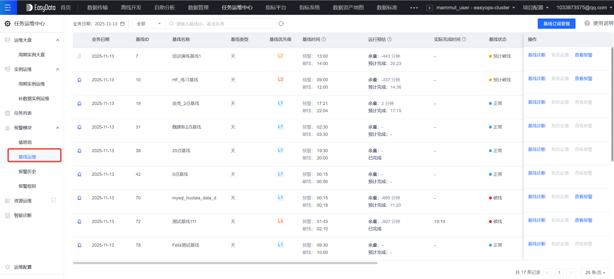

## 5.实例执行状态说明

实例的状态包括未就绪、就绪、运行中、成功、终止、失败等，具体流转顺序如下：
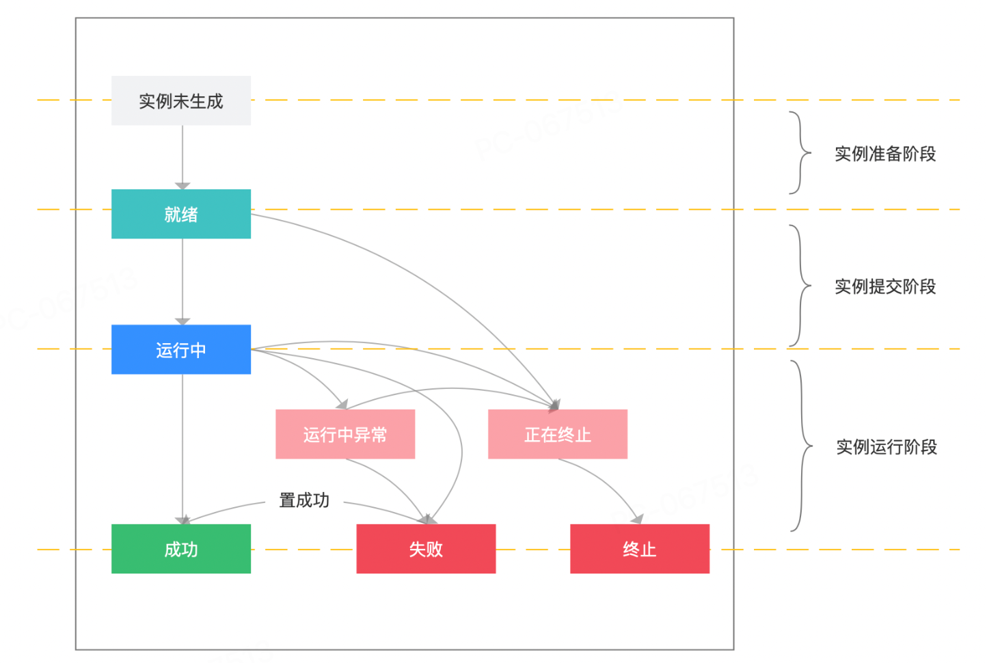

任务运维中心将实例的完整生命周期分为实例准备、实例提交和实例运行三个阶段，在不同阶段针对实例的不同状态提供诊断说明和建议；
