# 1. 什么是数据同步/数据采集？

一般，<span style="color:red">把业务系统数据库如MySQL、Oracle、MongoDB的库表数据、日志如埋点等数据以及第三方等其他数据同步至数据仓库之中，称为数据同步</span>，一般同步过来的数据直接原封不动的存放在ODS（Operational Data Store）贴源层。数据接入是数据入仓的第一关，数据接入后一般可以开发一些数据对账任务（对账系统就是要及时发现哪些数据表缺失，然后系统或者业务人员根据这些缺失数据表及时进行干预处理，确保同步前后保证数据的一致性），或者配置一些数据质量监控规则，在数据入仓后就做好第一道数据质量防线。

数据接入后，数据表要做好生命周期管理，防止数据存储成本膨胀增长。数据接入要定好规范，防止影响到线上服务，比如大批量同步数据的话要避免业务高峰期再执行。

**同步至数据仓库前的数据源有哪些？**

- <mark>关系型数据库的结构化数据</mark>：例如mysql/oracle/sqlserver 等
- <mark>非关系型数据库的非结构化数据</mark>：例如hbase/mongodb/OceanBase 等
- <mark>文件系统的结构化和非结构化数据</mark>：例如阿里云对象存储OSS/文件存储NAS 等
- <mark>第三方接口、Excel文件等其他形式的数据源</mark>

**数据源数据同步会有哪些问题？**

- <span style="color:red">数据源类型多样</span>：主流企业数据源包括关系型数据库（如Oracle、SQL Server）、大数据平台（如Hadoop）、云服务（如AWS、Azure）、本地Excel/CSV文件，甚至API接口
- <span style="color:red">配置参数繁杂</span>：每种数据源都有自己的连接方式、认证机制、驱动要求、字符集、同步方式等细节
- <span style="color:red">权限与安全</span>：不同系统的用户权限、加密机制、访问控制迥异，稍有疏忽就可能造成数据泄漏
- <span style="color:red">数据时效性</span>：不同数据同步到数仓的时效性要求不同，有些是T+1，小时级，分钟级，实时

# 2. 数据同步在数仓中的位置？

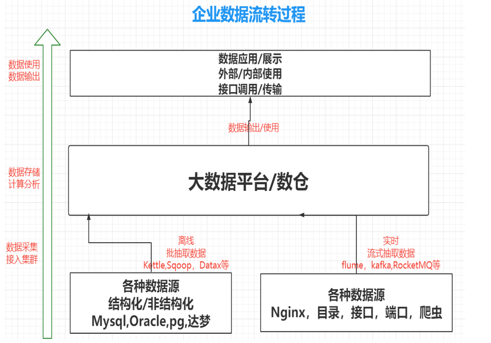
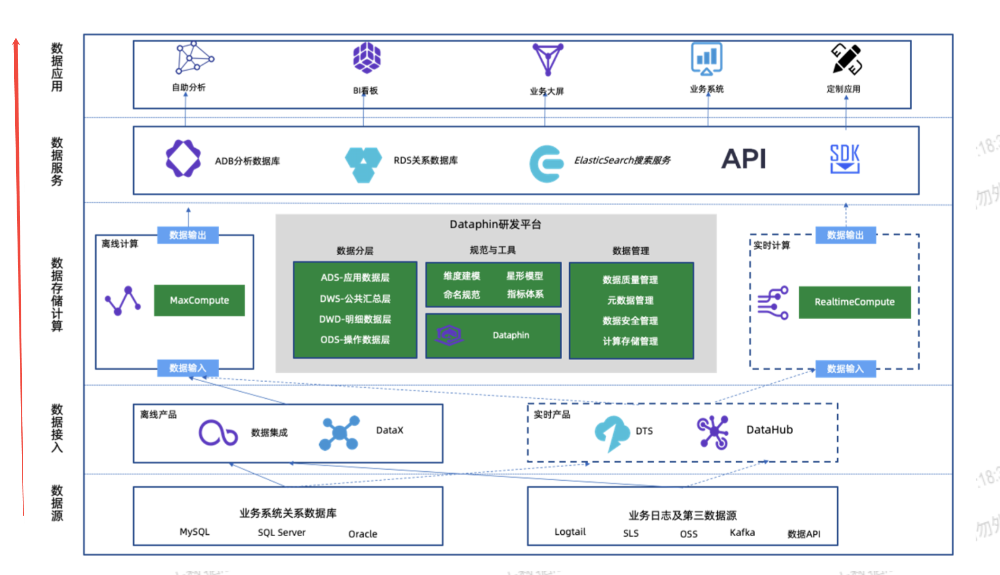

以上是基于阿里云数据中台整体解决方案，对数据中台技术实现进行选型及设计，典型的数据中台技术架构如图所示，**整个技术架构选型包含五个层次：业务数据源存储技术、数据源接入技术、数据中台数据存储与计算技术、数据服务及数据应用技术。**

而该架构也是目前市面上应用比较多的数据流转的五层架构，而在本次课程中我们更加关心的是数据接入层。从上层我们可以看到，因为是阿里系的架构，所有一整套数据接入层用的全是阿里系的产品，包括离线和实时。因为以上很多产品大多是云产品，是付费产品，而我们在课程的讲解过程中主要是以开源产品为主。

# 3. 数据同步方案

## 3.1 数据库直连同步☆☆

<span style="color:red">数据库直连同步是指通过定义好的规范接口API和基于动态链接库的方式直接连接业务库</span>，如 ODBC/JDBC等规定了统一规范的标准接口，不同的数据库基于这套标准接口提供规范的驱动，支持完全相同的函数调用和SQL实现。

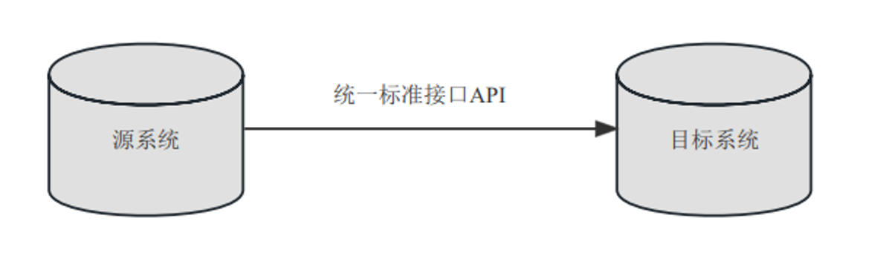

目前企业中，一般的直连同步均是通过jdbc的方式连接业务数据库。

```scala
object MysqlToHive {
  def main(args: Array[String]): Unit = {
    val spark = SparkSession.builder()
      .master("local")
      .appName("mysql to hive")
      .enableHiveSupport()
      .getOrCreate()

    // 隐式转换
    import spark.implicits._

    // 配置mysql数据源
    val df = spark.read
          .format("jdbc")
          .option("url", "jdbc:mysql://ds-bigdata-001:3306/ds_test?useSSl=false")
          .option("driver", "com.mysql.jdbc.Driver")
          .option("user", "ds_read")
          .option("password", "ds#readA0906")
           .option("dbtable", "stud")
          .load()
    // 创建一个临时视图
    df.createTempView("stud")

    // hive先创建动态分区表
    spark.sql("create table ds_spark.stud1(name string, age int)")

    // 动态分区表建好之后就要往里面导入数据
    spark.sql("insert overwrite table ds_spark.stud1 select name,age from stud")
  }
}
```

## 3.2 大数据采集组件完成数据采集

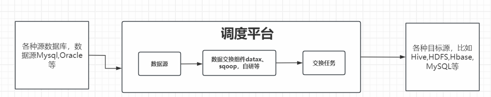

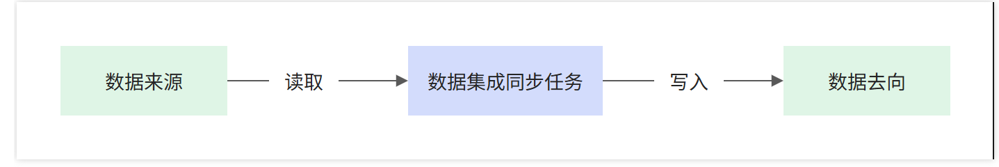

在数据集成任务中，数据源扮演着数据流动两端的"端点"角色：

- <span style="color:red">数据来源（Reader）</span>：数据集成任务从"来源"数据源读取数据
- <span style="color:red">数据去向（Writer）</span>：数据集成任务将处理后的数据写入"去向"数据源

无论是单表或整库同步，还是离线或实时同步，都需要预先配置好来源和去向数据源。一个配置完整、网络通畅的数据源，是任务能够成功执行的前提。

# 4. 企业常用数据采集（批处理）组件（了解）

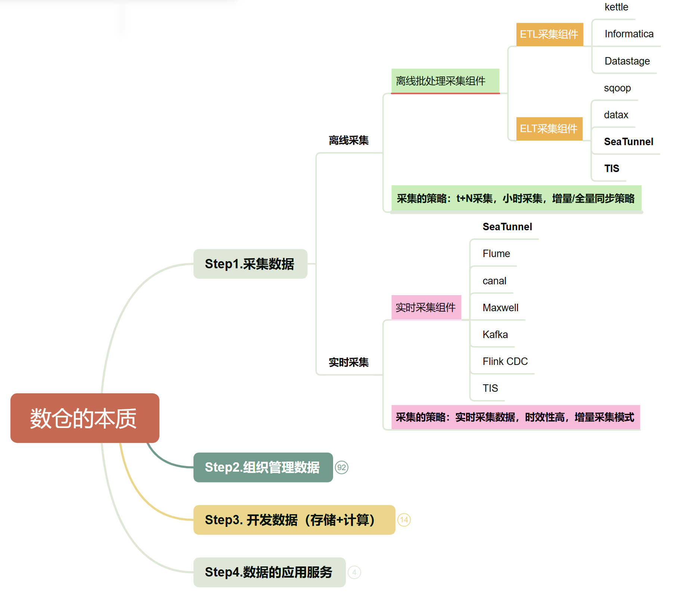

## 4.1 元老级Kettle组件（免费ETL）

Kettle最早是一个国外开源的ETL工具，全称为KDE Extraction, Transportation, Transformation and Loading Environment。分为商业版与开源版。可以在 Windows、Linux、Unix 上运行，绿色无需安装，数据抽取高效稳定。Kettle 中文名称叫水壶。它允许管理来自不同数据库的数据，把各种数据放到一个壶里，然后以一种指定的格式流出。

Kettle几乎支持市面上所有的数据库系统，对于传统数仓来说这是镇海神针，传统数仓分析必备神器。通过提供一个图形化的用户环境来描述你想做什么，而不是你想怎么做。

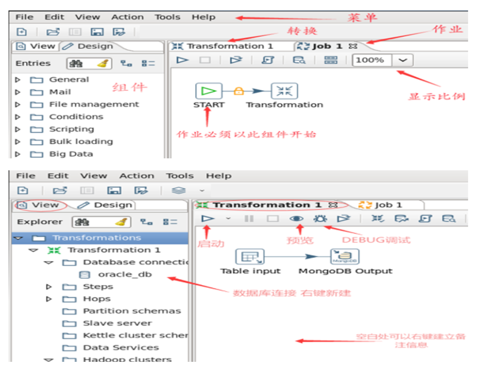

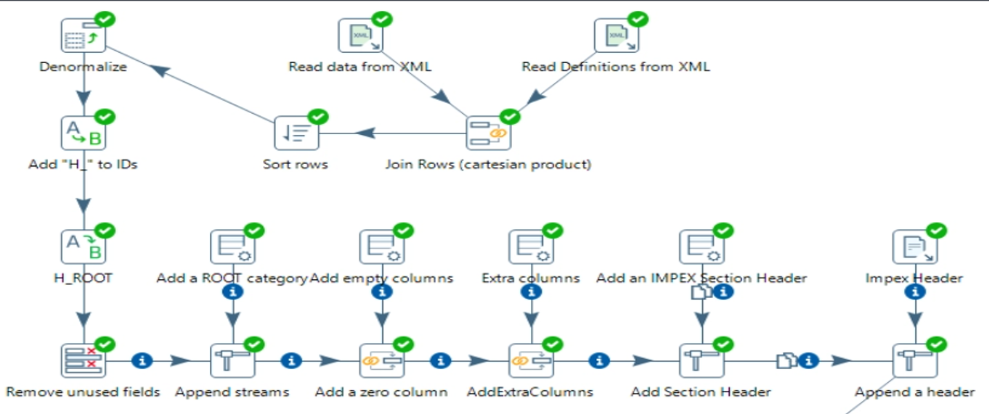

Kettle 是纯 Java 编程的开源软件，需要安装 JDK，并配置环境变量，解压后直接使用无需安装。

github地址：https://github.com/pentaho/pentaho-kettle/

## 4.2 Informatica组件（商业ETL）

Informatica是一款商业版数据集成工具，广泛应用于金融、政府、电信等行业。它由Informatica公司开发，提供智能管理数据资产的解决方案。在ETL（Extract, Transform, Load）工具领域，Informatica是行业领先的代表之一，与微软、IBM等公司的工具齐名。

Informatica它提供了一个可视化的开发环境，让用户能够方便地创建、调试和维护数据集成解决方案。数据集成和ETL（提取、转换和加载）：Informatica 可以用于将数据从多个源系统提取，对数据进行转换和清洗，并将数据加载到目标系统中。例如，一个企业可能需要从多个数据库中提取数据，然后将数据转换为统一的格式，并将数据加载到数据仓库中以进行分析和报告。数据整合和合并：Informatica PowerCenter可以用于将多个数据源中的数据整合和合并成一个统一的数据集。例如，一个公司可能从多个渠道收集到销售数据，包括在线销售、实体店销售和电话销售。使用Informatica PowerCenter，可以将这些数据源的数据整合和合并，以便进行全面的销售分析。

**优点：**
- 易于配置：Informatica提供了一个直观的用户界面和强大的向导功能，使得用户可以快速地配置和管理ETL任务
- 快速实现ETL任务：Informatica拥有高效的数据加载能力，能够快速地抽取、转换和加载大量数据。支持多种数据源和目标，包括关系型数据库、文件系统、大数据平台等，可以处理复杂的数据转换逻辑，并提供优化的数据集成性能

**缺点：**
- 高成本和资源占用：Informatica是一个功能丰富的商业软件，但价格远高于市面大多数ETL工具。另外，Informatica需要较高的系统资源和硬盘空间来运行，这对资源有限的企业来说是一个考虑因素

## 4.3 Datastage（商业ETL）

IBM开发的Datastage是一款具有良好跨平台性和数据集成能力的ETL工具。

DataStage具有图形化的用户界面，使用户可以通过拖放和链接数据集成的各个组件来构建数据流程。它支持多种数据转换操作，包括数据清洗、数据合并、数据分割和数据过滤等。DataStage还提供了强大的数据集成和数据质量功能，可以将数据从不同的数据源集成到一个统一的视图中，并进行数据质量分析和校验。DataStage还具有高度可扩展的架构和并行处理功能，可以处理大量的数据量和复杂的数据转换操作。它支持在分布式环境中运行，可以实现分布式的数据集成和处理。此外，DataStage还提供了丰富的监控和调度功能，可自动化和管理数据集成任务的执行。

**特点：**
- **高性能**：DataStage设计用于大规模数据处理，采用了并行处理技术，可以充分利用多核处理器和分布式计算资源，提高数据处理速度和吞吐量
- **可扩展性**：DataStage可以水平扩展以适应不断增长的数据量和处理需求
- **高数据质量管理**：DataStage提供了一套完整的数据质量管理工具，支持数据校验、数据清洗、数据映射和数据监控等功能，帮助企业确保数据的准确性、一致性和完整性

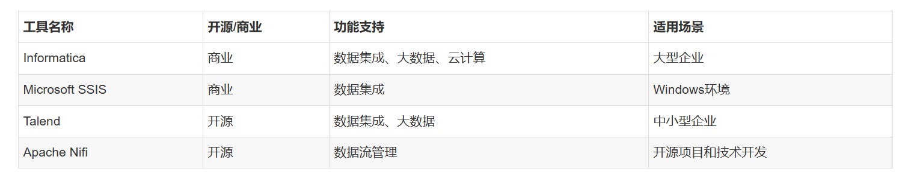

## 4.4 开源Apache Sqoop（免费ELT）

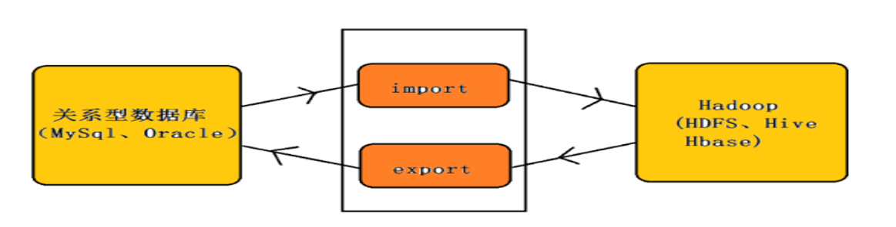

Apache Sqoop（SQL-to-Hadoop）项目旨在协助RDBMS与Hadoop/Hbase等大数据平台之间进行高效的大数据交流迁移工具（sqoop只支持官方提供的指定几种关系型数据库和hadoop组件之间的数据交换，比如hive和hbase之间就无法使用）。用户可以在 Sqoop 的帮助下，轻松地把主流关系型数据库（MySQL，PG，达梦，Oracle等）的数据导入到 Hadoop 与其相关的系统（如HBase和Hive）中；同时也可以把数据从 Hadoop 系统里抽取并导出到关系型数据库里。

Sqoop底层用MapReduce程序实现抽取、转换、加载，MapReduce天生的特性保证了并行化和高容错率，而且相比Kettle等传统ETL工具，任务跑在Hadoop集群上，减少了ETL服务器资源的使用情况。在特定场景下，抽取过程会有很大的性能提升。

如果要用Sqoop，必须正确安装并配置Hadoop，因依赖于本地的Hadoop环境启动MR程序；MySQL、Oracle等数据库的JDBC驱动也要放到Sqoop的lib目录下。

<mark>2021年05月06日，Apache Sqoop PMC宣布 Sqoop 已经被移到 Apache Attic</mark>，但是其实并不影响用户的使用，只不过以后就不会有官方来发布新的版本或者 bugfix，所以大家还是可以放心使用的。后面如果真的遇到 bug，可以自己维护个分支进行修复。

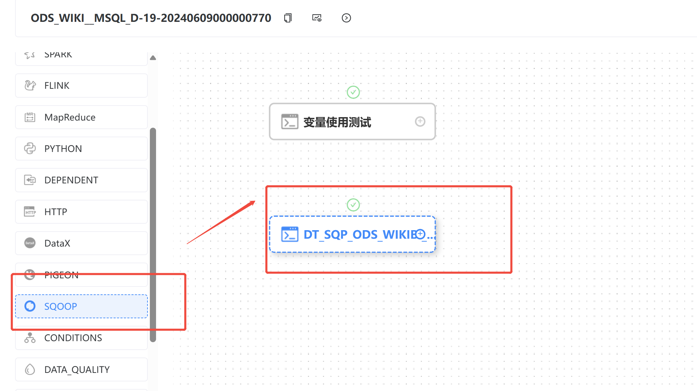

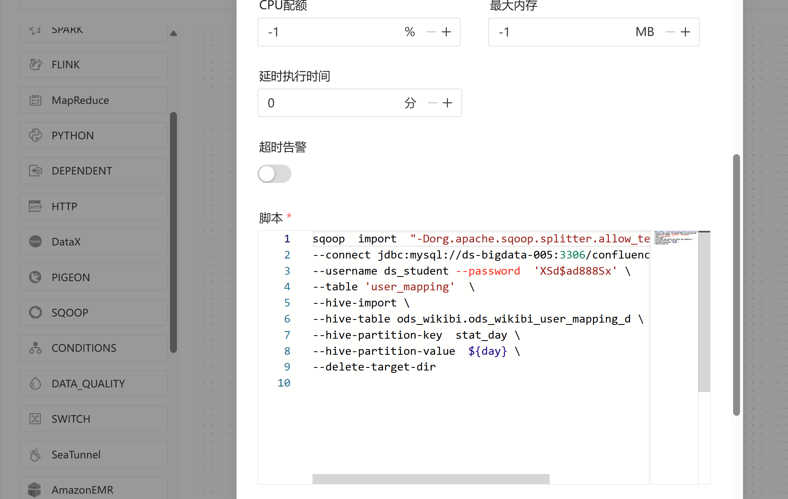

```bash
sqoop  import  "-Dorg.apache.sqoop.splitter.allow_text_splitter=true" \
--connect jdbc:mysql://ds-bigdata-005:3306/confluencedb  \
--username ds_student --password  'XSd$ads88Sx' \
--table 'user_mapping'  \
--hive-import \
--hive-table ods_wikibi.ods_wikibi_user_mapping_d \
--hive-partition-key  stat_day \
--hive-partition-value  ${day} \
--delete-target-dir
```

## 4.5 国产阿里的DataX（免费ELT）

DataX 是阿里云 DataWorks数据集成的开源版本，在阿里巴巴集团内被广泛使用的离线数据同步工具/平台。DataX 实现了包括 MySQL、Oracle、OceanBase、SqlServer、Postgre、HDFS、Hive、ADS、HBase、TableStore(OTS)、MaxCompute(ODPS)、Hologres、DRDS 等各种异构数据源之间高效的数据同步功能。

DataX本身作为数据同步框架，将不同数据源的同步抽象为从源头数据源读取数据的Reader插件，以及向目标端写入数据的Writer插件，理论上DataX框架可以支持任意数据源类型的数据同步工作。同时DataX插件体系作为一套生态系统，每接入一套新数据源该新加入的数据源即可实现和现有的数据源互通。

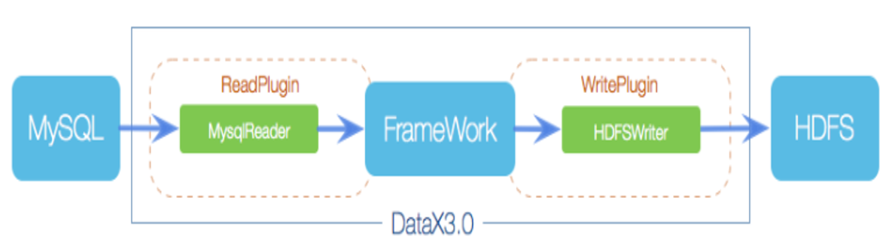

- **Reader**：数据采集模块，负责从源采集数据
- **Writer**：数据写入模块，负责写入目标库
- **Framework**：数据传输通道，负责处理数据缓冲等

以上只需要重写Reader与Writer插件，即可实现新数据源支持。

DataX本身作为数据同步框架，将不同数据源的同步抽象为从源头数据源读取数据的Reader插件，以及向目标端写入数据的Writer插件，理论上DataX框架可以支持任意数据源类型的数据同步工作。同时DataX插件体系作为一套生态系统，每接入一套新数据源该新加入的数据源即可实现和现有的数据源互通。

DataX的数据的设计架构：数据交换通过DataX进行中转，任何数据源只要和DataX连接上即可以和已实现的任意数据源同步

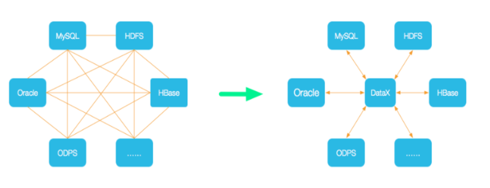

github地址：https://github.com/alibaba/DataX

DataX支持的数据源与目的源（支持的插件）

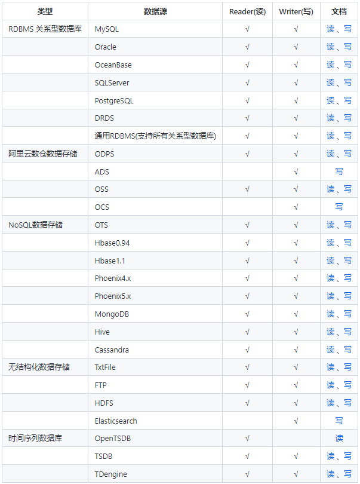

DataX的使用：按要求配置json文件

```json
{
    "job": {
        "content": [
            {
                "reader": {
                    "name": "mysqlreader",
                    "parameter": {
                        "column": [
                            "Host",
                            "User"
                        ],
                        "connection": [
                            {
                                "jdbcUrl": [
                                    "jdbc:mysql://172.21.208.131:3306/mysql"
                                ],
                                "table": [
                                    "user"
                                ]
                            }
                        ],
                        "password": "T3sv@XXXXXXXZXXt7L^nLjM",
                        "username": "root",
                        "where": ""
                    }
                },
                "writer": {
                    "name": "hdfswriter",
                    "parameter": {
                        "column": [
                            {
                                "name": "HOST",
                                "type": "STRING"
                            },
                            {
                                "name": "name",
                                "type": "STRING"
                            }
                        ],
                        "compress": "gzip",
                        "defaultFS": "hdfs://172.21.208.131:8020",
                        "fieldDelimiter": ",",
                        "fileName": "datax_demo1",
                        "fileType": "text",
                        "path": "/user/hive/warehouse/yg_spark.db/datax_demo1",
                        "writeMode": "append"
                    }
                }
            }
        ],
        "setting": {
            "speed": {
                "channel": "1"
            }
        }
    }
}
```

**Sqoop和DataX对比：**

首先两者在原理上有些相似，两者都是为了解决异构环境中的数据交换问题，都支持oracle，mysql，hdfs，hive相互Exchange，对不同数据库的支持是插件，对于新的数据源类型，只要开发了新的插件即可。

DataX 直接在运行DataX的单台机器上进行数据的抽取及加载。而Sqoop充分利用了map-reduce的计算框架。Sqoop根据输入条件，生成一个map-reduce的作业，在Hadoop的框架中运行。整体datax速度比sqoop慢了许多。

Sqoop使用命令行进行任务配置执行，比较容易和现有的调度和监视程序结合。DataX使用xml(json)配置文件，在开发和操作上仍然有些不便。

## 4.6 SeaTunnel流批一体采集组件（免费ELT）

SeaTunnel 的前身是 Waterdrop（中文名：水滴），由乐视在 2017 年创建并开源的，当时名为 Waterdrop。自 2021 年 10 月 12 日更名为 SeaTunnel。2021 年 12 月 9 日，SeaTunnel 正式通过 Apache 软件基金会的投票决议，以全票通过的优秀表现正式成为 Apache 孵化器项目。2022 年 3 月 18 日社区正式发布了首个 Apache 版本 v2.1.0。Apache SeaTunnel 是新一代高性能、分布式、海量数据集成工具，支持上百种数据源（Database/Cloud/SaaS），支持海量数据的实时 CDC 和批量同步，可以稳定高效地同步万亿级数据。https://seatunnel.apache.org/zh-CN/docs/2.3.10/seatunnel-engine/about

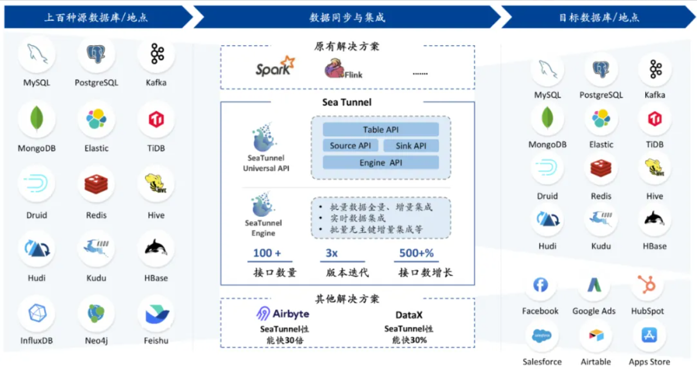

**SeaTunnel 工作流图**

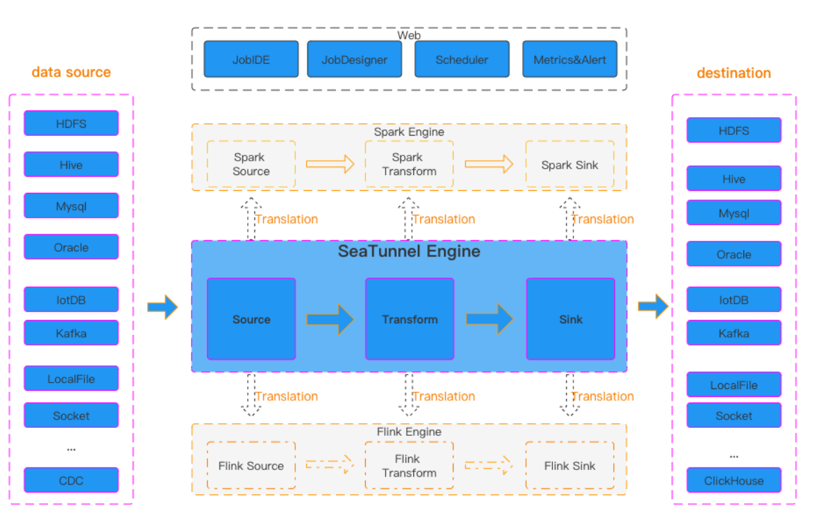

SeaTunnel的运行流程如上图所示：

- 用户配置作业信息并选择提交作业的执行引擎
- Source Connector负责并行读取数据并将数据发送到下游Transform或直接发送到Sink，Sink将数据写入目的地。值得注意的是，Source、Transform 和 Sink 可以很容易地自行开发和扩展
- SeaTunnel 是一个 EL(T) 数据集成平台。因此，在SeaTunnel中，Transform只能用于对数据进行一些简单的转换，例如将一列的数据转换为大写或小写，更改列名，或者将一列拆分为多列
- SeaTunnel 使用的默认引擎是 SeaTunnel Engine。如果您选择使用Flink或Spark引擎，SeaTunnel会将Connector打包成Flink或Spark程序并提交给Flink或Spark运行

SeaTunnel Engine 是一个由社区开发的用于数据同步场景的引擎，作为 SeaTunnel 的默认引擎，它支持高吞吐量、低延迟和强一致性的数据同步作业操作，更快、更稳定、更节省资源且易于使用。

SeaTunnel Engine 的整体设计遵循以下路径：

- **更快**：SeaTunnel Engine 的执行计划优化器旨在减少数据网络传输，从而减少由于数据序列化和反序列化造成的整体同步性能损失，使用户能够更快地完成数据同步操作。同时，支持速度限制，以合理速度同步数据
- **更稳定**：SeaTunnel Engine 使用 Pipeline 作为数据同步任务的最小粒度的检查点和容错。任务的失败只会影响其上游和下游任务，避免了任务失败导致整个作业失败或回滚的情况。同时，SeaTunnel Engine 还支持数据缓存，用于源数据有存储时间限制的场景。当启用缓存时，从源读取的数据将自动缓存，然后由下游任务读取并写入目标。在这种情况下，即使由于目标失败而无法写入数据，也不会影响源的常规读取，防止源数据过期被删除
- **节省空间**：SeaTunnel Engine 内部使用动态线程共享技术。在实时同步场景中，对于每个表数据量很大但每个表数据量很小的表，SeaTunnel Engine 将在共享线程中运行这些同步任务，以减少不必要的线程创建并节省系统空间。在读取和写入数据方面，SeaTunnel Engine 的设计目标是最小化 JDBC 连接的数量；在 CDC 场景中，SeaTunnel Engine 将重用日志读取和解析资源
- **简单易用**：SeaTunnel Engine 减少了对第三方服务的依赖，并且可以独立于如 Zookeeper 和 HDFS 等大数据组件实现集群管理、快照存储和集群 HA 功能。这对于目前缺乏大数据平台的用户，或者不愿意依赖大数据平台进行数据同步的用户来说非常有用

# 5. 企业常用数据采集（实时）组件（了解）


## 5.1 Flume采集组件

Flume是由Cloudera软件公司提供的一个高可用的，高可靠的，分布式的海量日志采集、聚合和传输的系统，受到了业界的认可与广泛应用。Flume 初始的发行版本目前被统称为 Flume OG（original generation），属于 Cloudera。但随着 Flume 功能的扩展，Flume OG 代码工程臃肿、核心组件设计不合理、核心配置不标准等缺点暴露出来，尤其是在 Flume OG 的最后一个发行版本 0.9.4 中，日志传输不稳定的现象尤为严重，为了解决这些问题，2011 年 10 月 22 号，cloudera 完成了 Flume-728，对 Flume 进行了里程碑式的改动：重构核心组件、核心配置以及代码架构，重构后的版本统称为 Flume NG（next generation）；其实早在2009年Flume就被捐赠了apache软件基金会，为hadoop相关组件之一。

Flume是一个分布式、可靠、和高可用的海量日志采集、聚合和传输的系统。支持在日志系统中定制各类数据发送方，用于收集数据；同时，Flume提供对数据进行简单处理，并写到各种数据接受方（比如文本、HDFS、Hbase等）的能力。

官网地址：https://flume.apache.org/

### 5.1.1 Flume的架构组成与原理

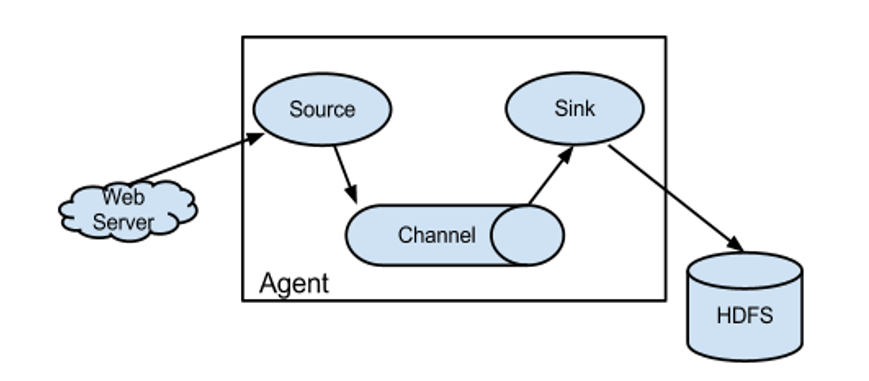
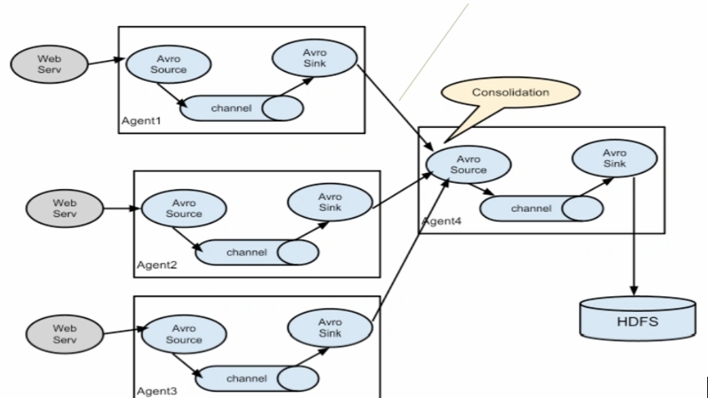

Flume 运行的核心是 Agent。Flume以agent为最小的独立运行单位。一个agent就是一个JVM。它是一个完整的数据收集工具，含有三个核心组件，分别是 source、channel、sink。

- **Source**：是数据的收集端，负责将数据捕获后进行特殊的格式化，将数据封装到事件（event）里，然后将事件推入Channel中。Flume提供了各种source的实现，包括Avro Source、Exec Source、Spooling Directory Source、NetCat Source、Syslog Source、Syslog TCP Source、Syslog UDP Source、HTTP Source、HDFS Source。如果内置的Source无法满足需要，Flume还支持自定义Source
  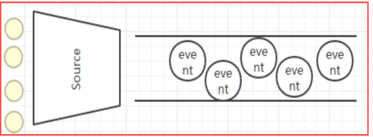
- **Channel**：是连接Source和Sink的组件，大家可以将它看做一个数据的缓冲区（数据队列），它可以将事件暂存到内存中也可以持久化到本地磁盘上，直到Sink处理完该事件。Flume对于Channel，则提供了Memory Channel、JDBC Channel、File Channel等
- **Flume Sink**：取出Channel中的数据，进行相应的存储文件系统，数据库，或者提交到远程服务器。Flume也提供了各种sink的实现，包括HDFS sink、Logger sink、Avro sink、File Roll sink、Null sink、HBase sink等

企业中flume配置使用展示，在 `vi ./flume/conf/ds_kafka_2_hdfs.conf`

```properties
agent-sharesdk.sources = source_sdk_sharesdk_log
agent-sharesdk.channels = channel_sdk_sharesdk_log
agent-sharesdk.sinks = sink_sdk_sharesdk_log

#source_sdk_log
agent-sharesdk.sources.source_sdk_sharesdk_log.type = org.apache.flume.source.kafka.KafkaSource
agent-sharesdk.sources.source_sdk_sharesdk_log.channels = channel_sdk_sharesdk_log

#agent-sharesdk.sources.source_sdk_sharesdk_log.zookeeperConnect = 10.21.33.117:2181,10.21.33.118:2181,10.21.33.
119:2181,10.21.33.120:2181,10.21.33.121:2181
agent-sharesdk.sources.source_sdk_sharesdk_log.kafka.bootstrap.servers=10.90.45.2:9092,10.90.45.3:9092,10.90.45.
4:9092,10.90.45.5:9092,10.90.45.6:9092,10.90.45.7:9092,10.90.45.8:9092
agent-sharesdk.sources.source_sdk_sharesdk_log.topic = phone-device
agent-sharesdk.sources.source_sdk_sharesdk_log.groupId = flume-sdk-2
agent-sharesdk.sources.source_sdk_sharesdk_log.kafka.consumer.timeout.ms = 30000
agent-sharesdk.sources.source_sdk_sharesdk_log.thread = 100
agent-sharesdk.sources.source_sdk_sharesdk_log.kafka.consumer.max.partition.fetch.bytes=20480000
agent-sharesdk.sources.source_sdk_sharesdk_log.kafka.consumer.auto.offset.reset=earliest

#channel_sdk_log
agent-sharesdk.channels.channel_sdk_sharesdk_log.capacity=8000000
agent-sharesdk.channels.channel_sdk_sharesdk_log.transactionCapacity=2000000
agent-sharesdk.channels.channel_sdk_sharesdk_log.keep-alive = 180
agent-sharesdk.channels.channel_sdk_sharesdk_log.type=memory

##hdfs sink
agent-sharesdk.sinks.sink_sdk_sharesdk_log.type = hdfs
agent-sharesdk.sinks.sink_sdk_sharesdk_log.hdfs.path =hdfs://DS_Service /hiveDW/raw_sdk_log/%{topic}/day=%Y%m
%d
agent-sharesdk.sinks.sink_sdk_sharesdk_log.hdfs.filePrefix = %{topic}_117
agent-sharesdk.sinks.sink_sdk_sharesdk_log.hdfs.fileSuffix =.lzo
agent-sharesdk.sinks.sink_sdk_sharesdk_log.hdfs.writeFormat = Text
agent-sharesdk.sinks.sink_sdk_sharesdk_log.hdfs.fileType = CompressedStream
agent-sharesdk.sinks.sink_sdk_sharesdk_log.hdfs.rollCount = 0
agent-sharesdk.sinks.sink_sdk_sharesdk_log.hdfs.rollSize = 0
agent-sharesdk.sinks.sink_sdk_sharesdk_log.hdfs.rollInterval = 300
agent-sharesdk.sinks.sink_sdk_sharesdk_log.hdfs.codeC = com.hadoop.compression.lzo.LzopCodec
agent-sharesdk.sinks.sink_sdk_sharesdk_log.hdfs.batchSize = 500000
agent-sharesdk.sinks.sink_sdk_sharesdk_log.hdfs.threadsPoolSize = 25
agent-sharesdk.sinks.sink_sdk_sharesdk_log.hdfs.rollTimerPoolSize=10
agent-sharesdk.sinks.sink_sdk_sharesdk_log.hdfs.idleTimeout = 0
agent-sharesdk.sinks.sink_sdk_sharesdk_log.hdfs.minBlockReplicas = 1
agent-sharesdk.sinks.sink_sdk_sharesdk_log.hdfs.callTimeout=7200000
agent-sharesdk.sinks.sink_sdk_sharesdk_log.hdfs.inUsePrefix=.
agent-sharesdk.sinks.sink_sdk_sharesdk_log.batchSize = 500000
agent-sharesdk.sinks.sink_sdk_sharesdk_log.channel = channel_sdk_sharesdk_log
```

## 5.2 消息队列Kafka组件

消息队列（Message Queue），简称为MQ。从字面看分为消息（Message）和队列（Queue）两块。这个概念最早源于应用服务。

- **消息**：指在应用之间需要传输的数据。一般只包含字符串信息，也可以定义复杂的格式
- **队列**：队列是一种先进先出的数据结构，队列中的元素都遵循"先进先出（FIFO）"的原则

### 5.2.1 为什么需要消息队列？

淘宝买东西，用创建订单的业务举例，用户发起在创建订单时，系统会先创建订单，然后会做一些其他相关的操作，例如扣除库存、扣除优惠券、增加积分等等操作。（不同系统之间的操作）

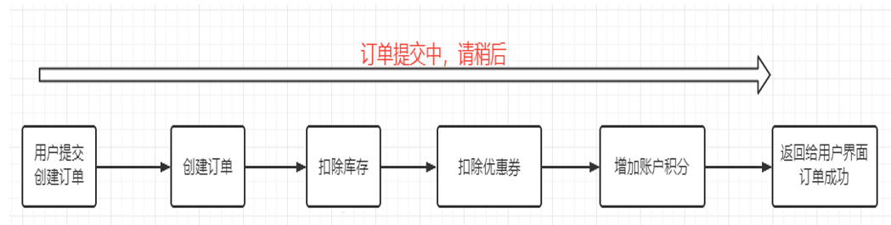

这里有个问题就是假如在遇到执行扣除库存失败时，会影响到整个创建订单的业务，导致用户的订单创建失败。还存在问题就是订单的创建逻辑和库存、优惠券、积分这些业务过度地耦合，导致其中一个有改动都会牵扯到其他的业务逻辑。

怎么来解决上述的问题呢？可以使用到消息中间件来处理。

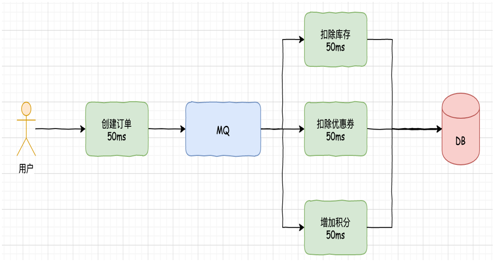

改造后：用户在发起创建订单请求时，系统先创建用户的订单信息，创建成功后，发送扣除库存、优惠券、增加积分也消息到队列中，然后返回创建的订单信息给用户。库存系统从消息队列中拉取消息来扣除库存。这里在创建订单的逻辑中，就不再去关心库存是否扣除成功、优惠券是否扣除等业务的执行情况。

### 5.2.2 消息中间件的应用场景

1. **异步消息**：当一次请求在处理复杂的业务逻辑，多个业务逻辑都在同步执行会导致业务处理耗时太长。使用消息中间件将一部分不需要及时同步处理的业务放到消息队列中来处理，从而提高了业务的处理速度（如上案例）
2. **流量削峰**：在高并发请求的时候，所有的请求都直接打到数据库中，容易造成数据库的压力。如果使用到消息中间件，所有的请求过来都是先发到消息队列中，然后业务系统再慢慢从消息队列中消费消息。请求高并发的时候允许消息的积压处理，以便造成业务系统的负载。比如：秒杀系统中，在传统模式中并发量大的时候，所有的请求都一下子打到数据库中容易造成数据库的异常。使用消息中间件来处理，将所有的秒杀请求都先发送到MQ中，由各个消费系统按照数据库能处理的并发量，从消息队列中慢慢地拉取消息进行处理，保证系统的稳定性
   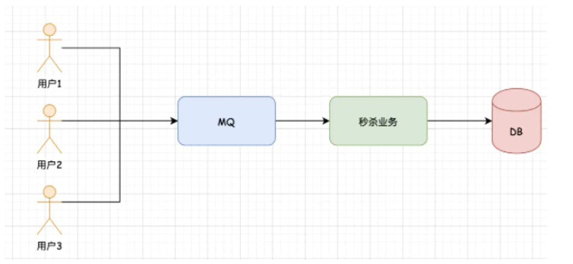

今天我们要解决的一个实际工作中的业务需求场景问题：如何将M条的消息或者任务，尽可能的保证平均分发给N个消费者进行处理。业务上要求保证尽可能的消息的平均分布，同时消息队列中的同一条消息，必须保证只能给一个消费者进行消费处理，即不允许被重复进行消费。通俗一点就是我们要解决鸡蛋与篮子的存放数学问题：如何将10（M）个鸡蛋放在5（N）个篮子中呢？

## 5.3 消息队列Kafka组件（缓冲）

提起消息中间件，老司机的你也许脑海里会不自觉地蹦出好多概念：JMS、Kafka、RocketMQ、AMQP、RabbitMQ、ActiveMQ、Pulsar、Redis Stream...

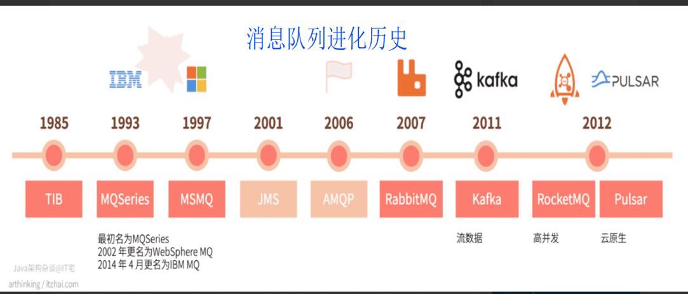

目前主流的 MQ（Message Queue）消息队列主要是 RocketMQ、kafka、RabbitMQ，ActiveMQ，其中ActiveMQ是Apache出品，号称"最流行的，最强大"的开源消息集成模式服务器。

Kafka是最初由Linkedin公司开发，是一个分布式、支持分区的（partition）、多副本的（replica），基于zookeeper协调的分布式消息系统。通俗地说就是一个基于发布和订阅的消息队列（缓存系统）。

**Kafka诞生与应用场景：**

Kafka的诞生，是为了解决linkedin的数据管道问题，起初linkedin采用了ActiveMQ来进行数据交换，大约是在2010年前后，那时的ActiveMQ还远远无法满足linkedin对数据传递系统的要求，经常由于各种缺陷而导致消息阻塞或者服务无法正常访问，为了能够解决这个问题，linkedin决定研发自己的消息传递系统，当时linkedin的首席架构师Jay Kreps便开始组织团队进行消息传递系统的研发。

其实一开始设计的时候主要是Jay Kreps觉得Linkedin里面数据源，消费者之间关系太复杂，如果是N个数据源，M个消费者，需要拉N*M个线，并且接口和协议不同，所以使用了一种消息中间件来解耦数据源和消费者。但Kafka本身也不算消息中间件，中间件一般会有Queue和Topic两种模型，Kafka主要是Topic类的模型。

Kafka使用scala和Java语言编写，Linkedin于2010年贡献给了Apache基金会并成为顶级开源项目。

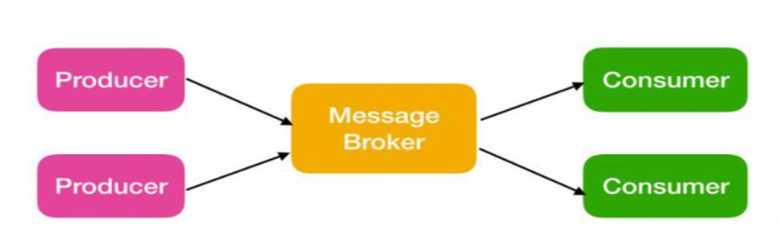
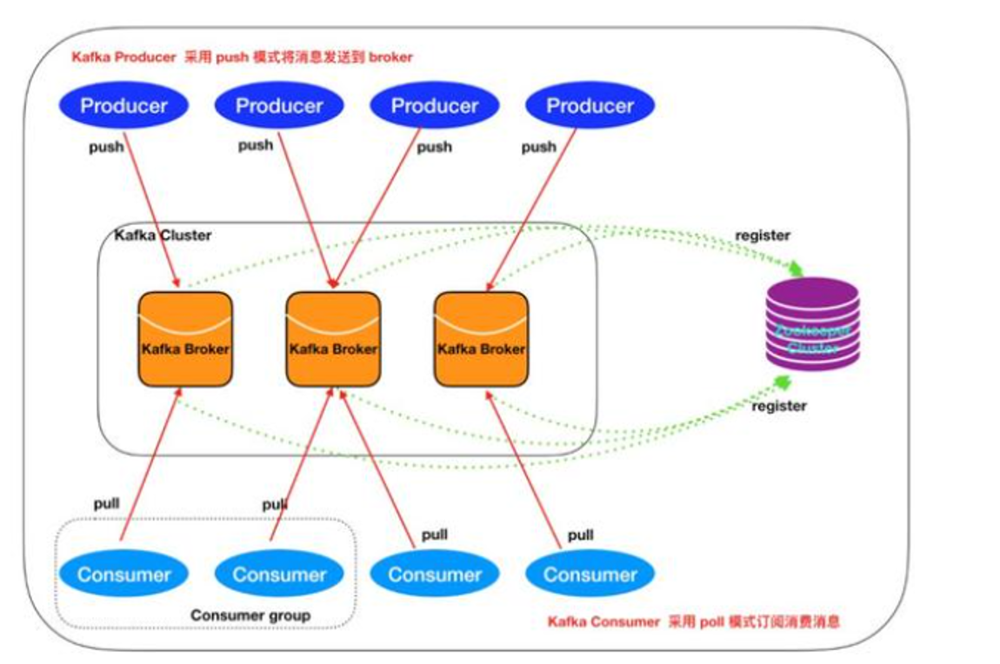

- **Producer**：发布消息的客户端
- **Broker**：一个从生产者接收并存储消息的客户端
- **Consumer**：消费者从 Broker 中读取消息

一个典型的 Kafka 集群中包含若干Producer（可以是web前端产生的Page View，或者是服务器日志，系统CPU、Memory等），若干broker（Kafka支持水平扩展，一般broker数量越多，集群吞吐率越高），若干Consumer Group，以及一个Zookeeper集群。Kafka通过Zookeeper管理集群配置，选举leader，以及在Consumer Group发生变化时进行rebalance。Producer使用push模式将消息发布到broker，Consumer使用pull模式从broker订阅并消费消息。

## 5.4 消息队列阿里RocketMQ组件

RocketMQ 是一个来自阿里巴巴的分布式消息中间件，于 2012 年开源，并在 2017 年正式成为 Apache 顶级项目。2017 年 2 月 20 日，RocketMQ 正式发布 4.0 版本。差不多 5 年之后，我们终于等来了 5.0 版本。RocketMQ 5.0 专注于消息基础架构的云原生化演进，聚焦在消息领域的后处理场景，支持消息的流式处理和轻计算，帮助用户实现消息的就近计算和分析，并将全面拥抱 Serverless 和 EDA。

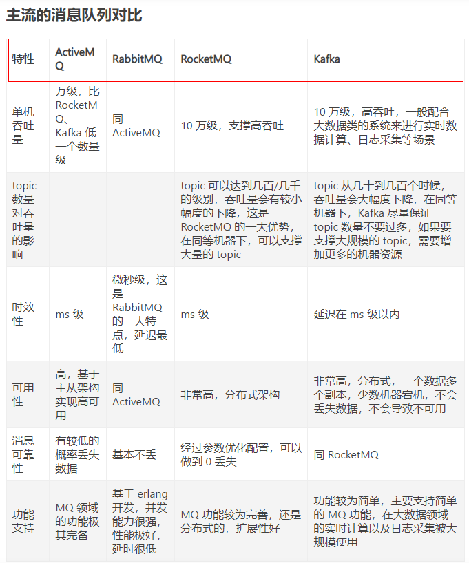

## 5.5 Canal数据库实时同步采集组件

Canal [kə'næl]，译意为水道/管道/沟渠，主要用途是基于 MySQL 数据库增量日志解析，提供增量数据订阅和消费。canal是阿里巴巴旗下的一款开源项目，纯Java开发。

早期阿里巴巴因为杭州和美国双机房部署，存在跨机房同步的业务需求，实现方式主要是基于业务 trigger 获取增量变更。从 2010 年开始，业务逐步尝试数据库日志解析获取增量变更进行同步，由此衍生出了大量的数据库增量订阅和消费业务。

**基于日志增量订阅和消费的业务包括：**

- 数据库镜像
- 数据库实时备份
- 索引构建和实时维护（拆分异构索引、倒排索引等）
- 业务 cache 刷新
- 带业务逻辑的增量数据处理

当前的 canal 支持源端 MySQL 版本包括 5.1.x，5.5.x，5.6.x，5.7.x，8.0.x

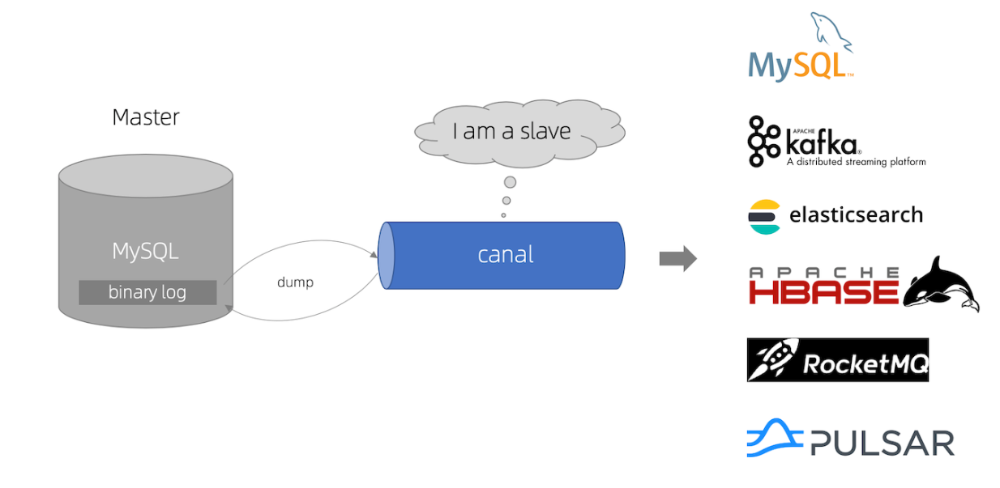

**MySQL主备复制原理：**

- MySQL master 将数据变更写入二进制日志（binary log，其中记录叫做二进制日志事件binary log events，可以通过 `show binlog events` 进行查看）
- MySQL slave 将 master 的 binary log events 拷贝到它的中继日志（relay log）
- MySQL slave 重放 relay log 中事件，将数据变更反映它自己的数据

**canal 工作原理：**

- canal 模拟 MySQL slave 的交互协议，伪装自己为 MySQL slave，向 MySQL master 发送dump 协议
- MySQL master 收到 dump 请求，开始推送 binary log 给 slave（即 canal）
- canal 解析 binary log 对象（原始为 byte 流）

github地址：https://github.com/alibaba/canal

## 5.6 Maxwell数据库实时采集组件

Maxwell 是由美国Zendesk开源，用Java编写的MySQL实时抓取工具。实时读取MySQL二进制日志Binlog，并生成JSON 格式的消息，作为生产者发送给Kafka，Kinesis、RabbitMQ、Redis、Google Cloud Pub/Sub、文件或其它平台的应用程序。

官网地址：http://maxwells-daemon.io/

Maxwell的工作原理很简单，就是把自己伪装成MySQL的一个slave，然后以slave的身份假装从MySQL(master)复制数据。

MySQL的二进制日志可以说MySQL最重要的日志了，它记录了所有的DDL和DML（除了数据查询语句）语句，以事件形式记录，还包含语句所执行的消耗的时间，MySQL的二进制日志是事务安全型的。

一般来说开启二进制日志大概会有1%的性能损耗。二进制有两个最重要的使用场景：

- **其一**：MySQL Replication在Master端开启binlog，Master把它的二进制日志传递给slaves来达到master-slave数据一致的目的
- **其二**：自然就是数据恢复了，通过使用mysqlbinlog工具来使恢复数据

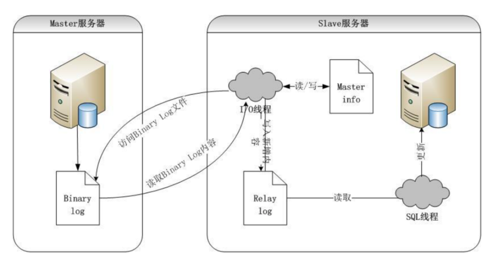

二进制日志包括两类文件：二进制日志索引文件（文件名后缀为.index）用于记录所有的二进制文件，二进制日志文件（文件名后缀为.00000*）记录数据库所有的DDL和DML（除了数据查询语句）语句事件

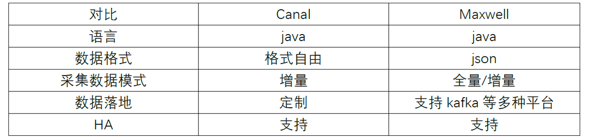

## 5.7 Flink CDC（实时数据库采集）

CDC是Change Data Capture（变更数据获取）的简称。核心思想是，监测并捕获数据库的变动（包括数据或数据表的插入、更新以及删除等），将这些变更按发生的顺序完整记录下来（binlog），写入到消息中间件中以供其他服务进行订阅及消费。Flink 提供了内置的 CDC 功能。可以直接连接到各种数据源，捕获数据变化，并将其作为数据流进行处理。这消除了我们自行开发或集成 CDC 解决方案的需要，使得实现 CDC 变得更加简单和高效，开箱即用。Flink CDC 支持与各种数据源进行集成，如关系型数据库（如MySQL、PostgreSQL）、消息队列（如Kafka、RabbitMQ）、文件系统等。这意味着无论你的数据存储在哪里，Flink 都能够轻松地捕获其中的数据变化，并进行进一步的实时处理和分析。

传统上，数据源的变化通常通过周期性地轮询整个数据集进行检查来实现。但是，这种轮询的方式效率低下且不能实时反应变化。而 CDC 技术则通过在数据源上设置一种机制，使得变化的数据可以被实时捕获并传递给下游处理系统，从而实现了实时的数据变动监控。

CDC主要分为基于查询和基于Binlog两种方式，先主要了解一下这两种之间的区别：

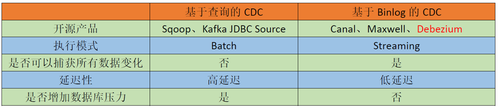

Flink社区开发了flink-cdc-connectors 组件，这是一个可以直接从MySQL、PostgreSQL 等数据库直接读取全量数据和增量变更数据的source 组件。目前也已开源，开源地址：https://github.com/ververica/flink-cdc-connectors。

使用 Flink CDC，我们可以轻松地构建实时数据管道，对数据变动进行实时响应和处理，为实时分析、实时报表和实时决策等场景提供强大的支持。

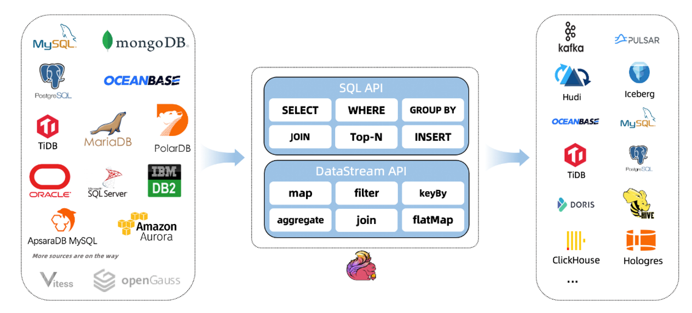

# 6. 网易平台离线同步任务开发（熟悉）

数据传输主要用于多种异构数据源之间的数据交换，可实现各部门业务数据在应用层面的互联互通和信息共享。数据传输采用分布式的架构，可以从容应对大数据量的数据传输需求。

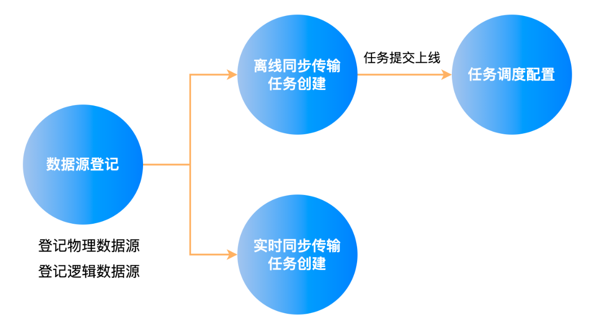

- **数据源登记**：支持物理数据源、逻辑数据源的登记。逻辑数据源是物理数据源的集合，通常用在跨库跨表场景下
- **同步任务创建**：同步任务包括离线同步传输任务和实时同步传输任务。离线同步传输任务支持单个任务和批量任务的创建，创建完成后需要在离线开发模块进行调度配置才能进行周期性的数据同步。实时同步传输任务配置完成后，直接启动便可开启同步
- **任务调度配置**：离线同步传输任务创建完成后需提交到线上进行任务调度的配置

## 6.1 网易EasyData支持的数据源

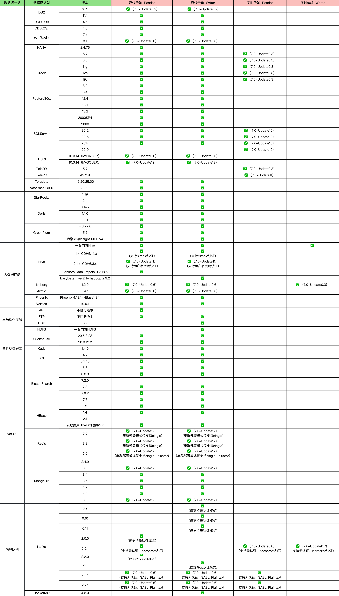

## 6.2 EasyData任务新建流程

### 6.2.1 单个新建任务的全流程

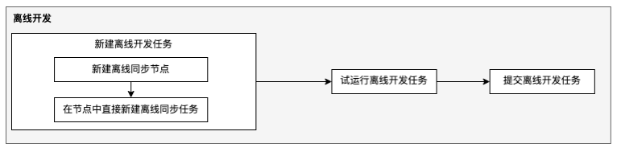

**第一步：新建离线开发任务**

1、新建离线开发任务，并拖入离线同步节点

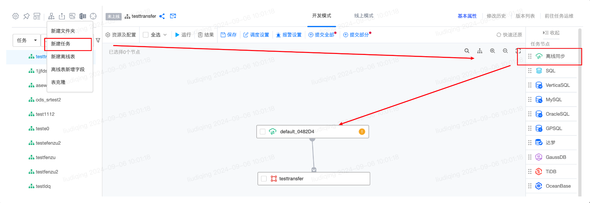

2、双击节点，可在节点详情页直接填写离线同步任务配置，保存离线开发任务时会同步保存引用的离线同步任务

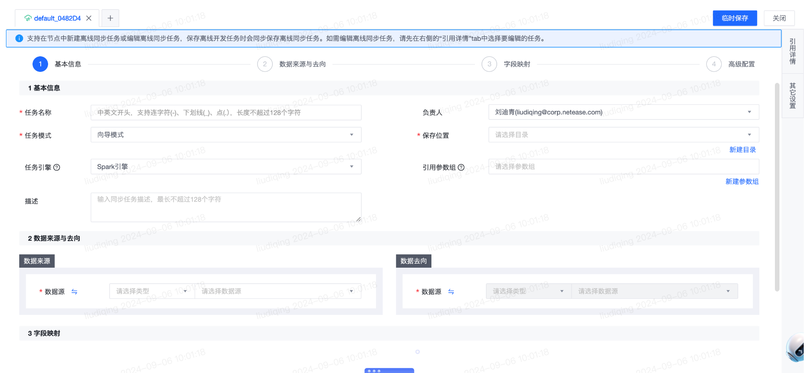

同时，如此前已创建离线同步任务，节点也支持引用已有的离线同步任务。具体操作为：点击"引用详情"tab，选择需引用的离线同步任务

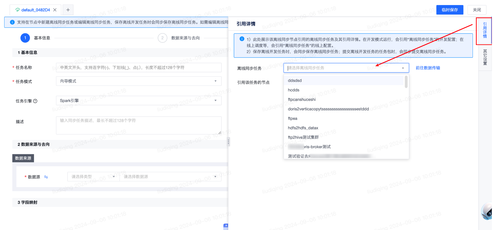

离线同步任务选择完成后，节点详情页会切换为该离线同步任务的任务配置，也支持在此页面修改离线同步任务的任务配置。保存离线开发任务时，会同步保存引用的离线同步任务

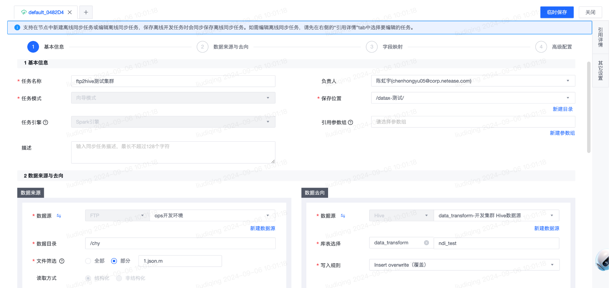

离线同步节点配置完成后，在节点详情页点击"临时保存"按钮临时保存节点配置，并在任务画布页点击"保存"按钮保存离线开发任务。保存离线开发任务时，会同步保存引用的离线同步任务

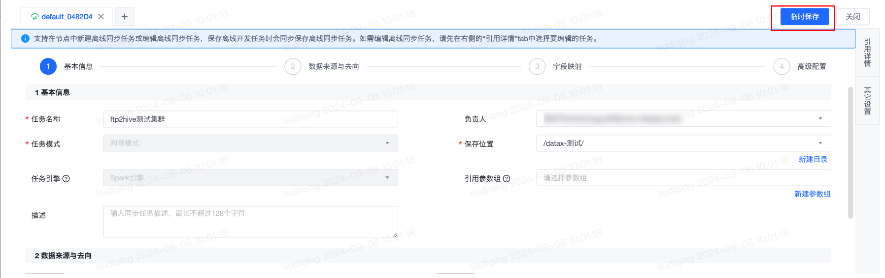

**第二步：试运行离线开发任务**

选择节点，并点击"运行"按钮，即可试运行离线开发任务。

<mark>注意：如传输任务状态为审批中或审批不通过，不可运行离线同步节点。</mark>

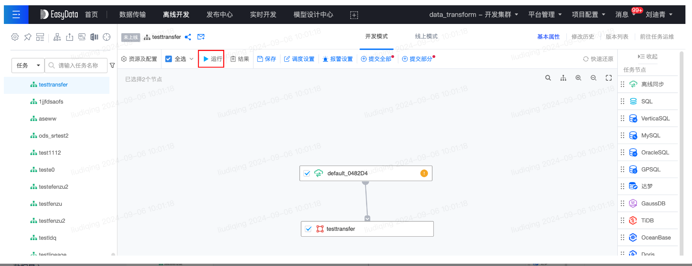

**第三步：提交离线开发任务**

试运行成功且验证数据无误后，可配置调度、报警，并点击"提交全部"去提交离线开发任务的任务包、调度配置、报警配置

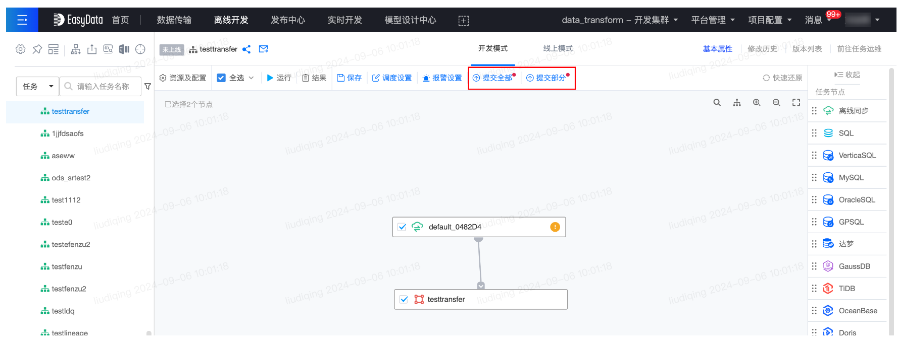

任务包提交上线时，会同步将离线同步节点引用的离线同步任务也提交上线

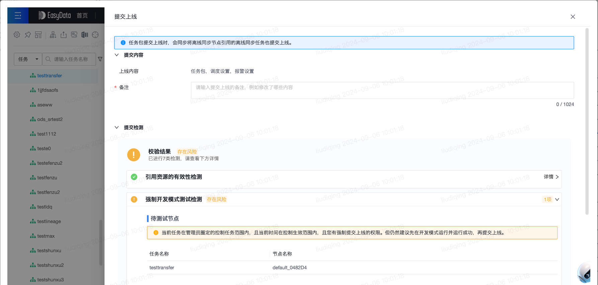

<mark>注意：</mark>

1. 如离线同步任务同时被多个离线开发任务引用，任一离线开发任务提交上线时即触发提交离线同步任务。提交成功后，会给其余离线开发任务的负责人发送通知，提醒任务线上模式发生变更
2. 如传输任务状态为审批中或审批不通过，提交检测会不通过，不可提交离线开发任务

### 6.2.2 批量新建任务的全流程

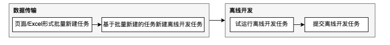

**第一步：批量新建离线开发任务**

1、点击"页面形式新建"或"Excel形式新建"，开始批量新建任务

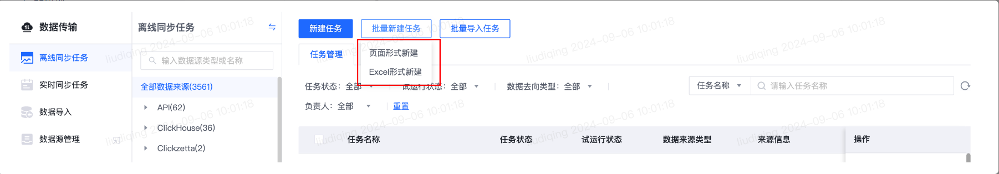

任务批量新建成功后，可全选任务，并点击"创建离线开发任务"完成离线开发任务创建的配置，即可基于批量新建的离线同步任务新建离线开发任务。创建模式上，支持将所有离线同步任务合并为一个离线开发任务和分别新建离线开发任务两种模式

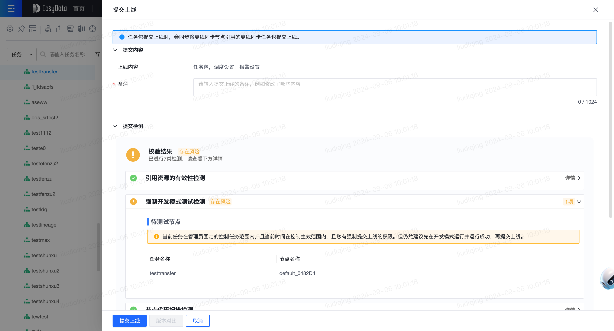

**第二步：试运行离线开发任务**

选择节点，并点击"运行"按钮，即可试运行离线开发任务。

<mark>注意：如传输任务状态为审批中或审批不通过，不可运行离线同步节点。</mark>

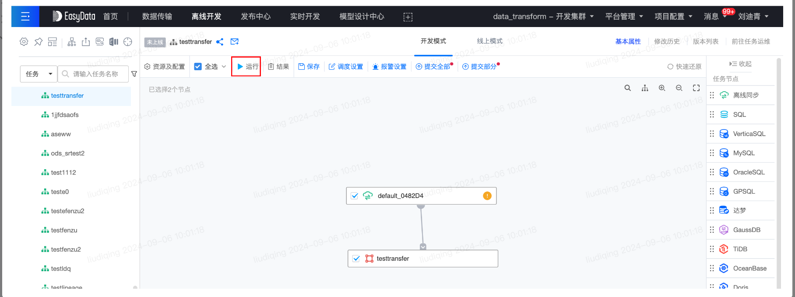

**第三步：提交离线开发任务**

试运行成功且验证数据无误后，可配置调度、报警，并点击"提交全部"去提交离线开发任务的任务包、调度配置、报警配置

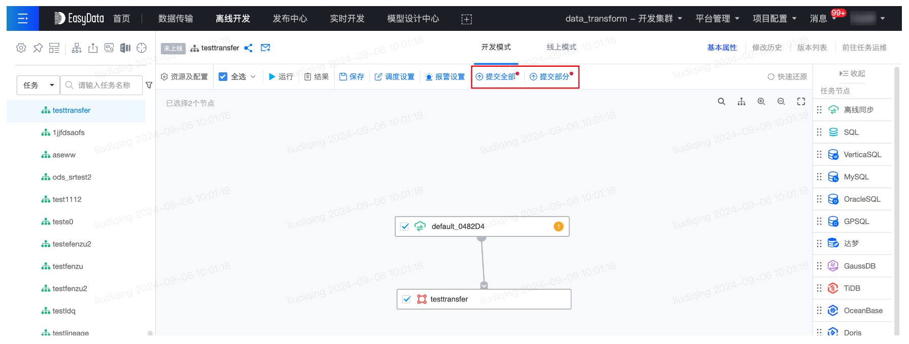

任务包提交上线时，会同步将离线同步节点引用的离线同步任务也提交上线


<mark>注意：</mark>

1. 如离线同步任务同时被多个离线开发任务引用，任一离线开发任务提交上线时即触发提交离线同步任务。提交成功后，会给其余离线开发任务的负责人发送通知，提醒任务线上模式发生变更
2. 如传输任务状态为审批中或审批不通过，提交检测会不通过，不可提交离线开发任务

## 6.3 EasyData任务修改维护流程

### 6.3.1 修改任务的全流程

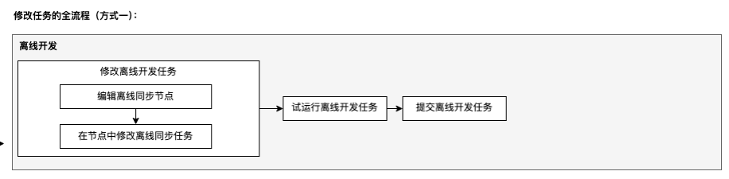
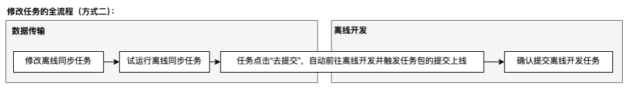

**核心说明：**

1. **新建/编辑任务**：
   - 支持在离线同步节点新建和编辑离线同步任务，保存离线开发任务时触发保存离线同步任务。同时，仍保留数据传输侧的新建、批量新建、编辑任务的入口
   - 支持在数据传输侧批量新建任务（含页面形式新建和Excel形式新建）。批量新建完成后，支持在数据传输侧基于批量新建成功的任务快捷地新建离线开发任务
2. **提交任务**：离线同步任务提交的入口由数据传输侧移至离线开发，不再需要在数据传输提交上线任务。离线开发任务提交上线任务包时，会同步将引用的离线同步任务也提交上线
3. **删除任务**：删除离线开发任务时，支持选择是否一并删除引用的离线同步任务。同时，仍保留数据传输侧的删除任务的入口

针对同一离线同步任务被多个离线开发任务引用的场景：

- **保存任务**：任一离线开发任务保存，引用的离线同步任务即会保存
- **提交任务**：任一离线开发任务提交上线，引用的离线同步任务即会提交上线。同时，会给其余离线开发任务负责人发送通知，提醒任务线上模式发生变更
- **删除任务**：删除离线开发任务时，不支持删除引用的离线同步任务。仅当离线同步任务未被离线开发任务引用时，方可删除离线同步任务

### 6.3.2 修改任务的全流程（方式一）

**第一步：修改离线开发任务**

1、打开离线开发任务，并双击节点，可在此页面修改离线同步任务的任务配置。保存离线开发任务时，会同步保存引用的离线同步任务


离线同步节点配置完成后，在节点详情页点击"临时保存"按钮临时保存节点配置，并在任务画布页点击"保存"按钮保存离线开发任务。保存离线开发任务时，会同步保存引用的离线同步任务

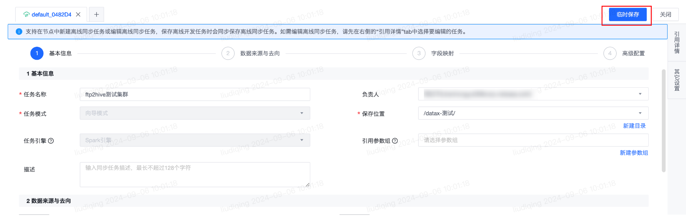

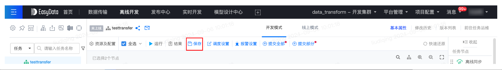

**第二步：试运行离线开发任务**

选择节点，并点击"运行"按钮，即可试运行离线开发任务。

<mark>注意：如传输任务状态为审批中或审批不通过，不可运行离线同步节点。</mark>

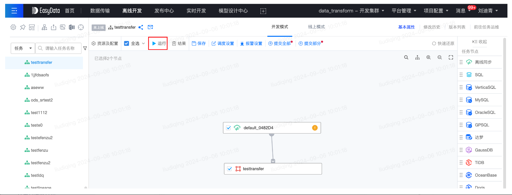

**第三步：提交离线开发任务**

试运行成功且验证数据无误后，可配置调度、报警，并点击"提交部分-提交任务包"去提交离线开发任务的任务包

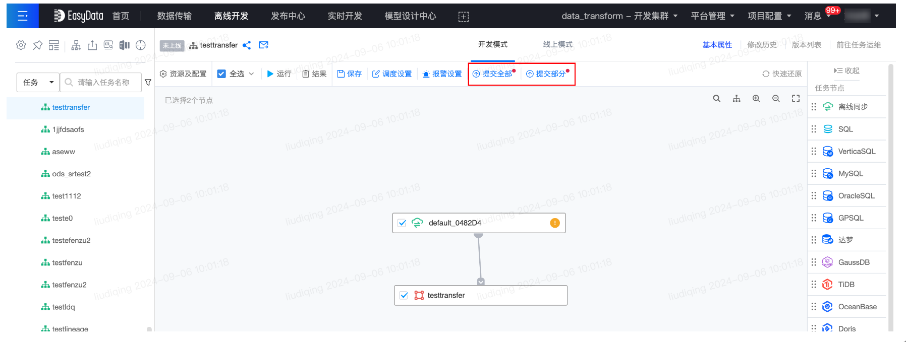

任务包提交上线时，会同步将离线同步节点引用的离线同步任务也提交上线


<mark>注意：</mark>

1. 如离线同步任务同时被多个离线开发任务引用，任一离线开发任务提交上线时即触发提交离线同步任务。提交成功后，会给其余离线开发任务的负责人发送通知，提醒任务线上模式发生变更
2. 如传输任务状态为审批中或审批不通过，提交检测会不通过，不可提交离线开发任务

### 6.3.3 修改任务的全流程（方式二）

**第一步：修改离线同步任务**

在数据传输-离线同步任务，点击"编辑"按钮在任务详情页修改任务配置，并保存离线同步任务

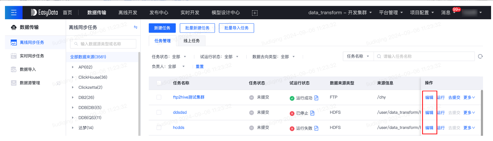

**第二步：试运行离线同步任务**

在数据传输-离线同步任务，点击"运行"按钮试运行离线同步任务

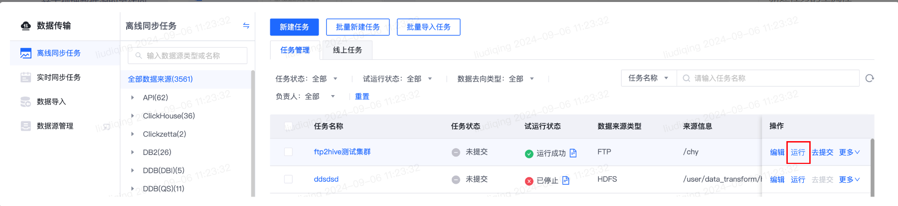

**第三步：前往离线开发提交离线开发任务**

在数据传输-离线同步任务，点击"去提交"按钮，将快捷前往引用该离线同步任务的离线开发任务页面，并自动唤起任务包提交上线

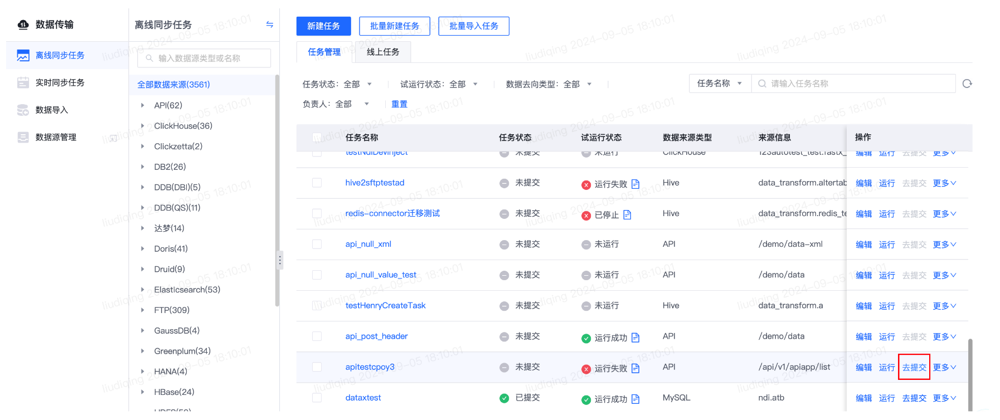
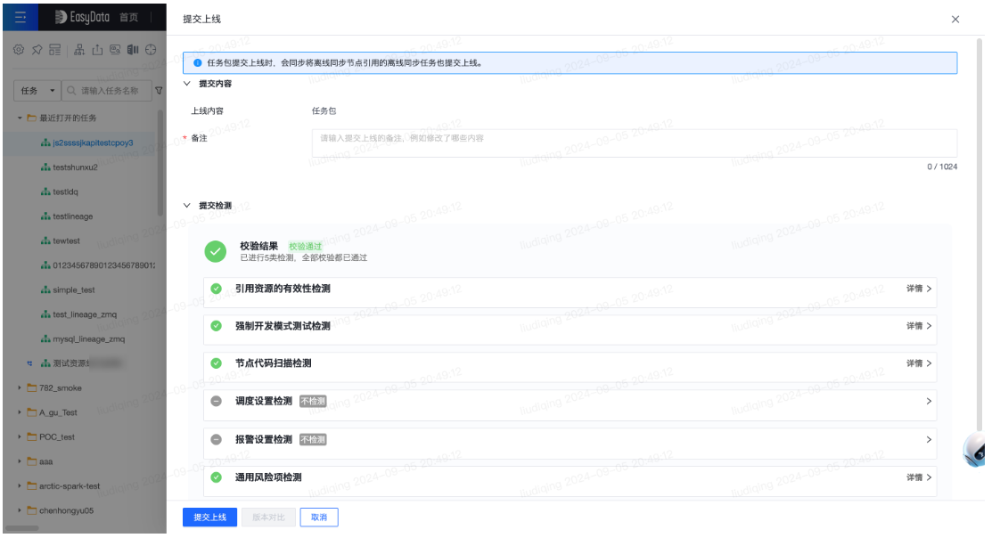

<mark>注意：</mark>如离线同步任务同时被多个离线开发任务引用，点击"去提交"按钮会出现如下弹窗，展示该离线同步任务开发模式的引用详情。离线同步任务同时被多个离线开发任务引用时，任一离线开发任务提交上线，该离线同步任务即会提交上线

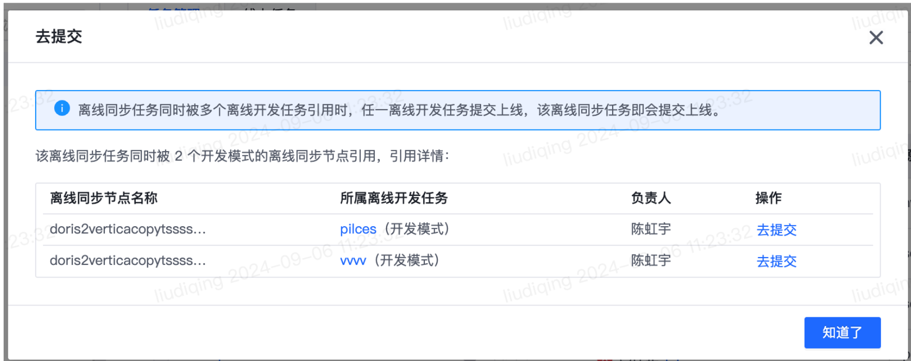

# 7. 网易平台实时数据同步任务开发

数据传输支持实时同步任务的创建、管理。

官方文档参考：http://easydemo-prod.163yun.com/media/doc/easytransfer/easytransfer_realtime_sync_oam.html

## 7.1 EasyData支持的实时数据源

当前实时同步支持的数据源类型如下所示：

| 数据源 | 读 | 写 | 说明 |
|--------|----|----|------|
| Kafka | 支持 | 支持 | 版本：2.0.1，认证方式：无认证；版本：2.0.1，认证方式：Kerberos认证；版本：2.3.1，认证方式：无认证（仅支持读）；版本：2.3.1，认证方式：SASL_Plaintext（仅支持读）；版本：2.7.1，认证方式：无认证（仅支持读）；版本：2.7.1，认证方式：SASL_Plaintext（仅支持读） |
| MySQL | 支持 | 支持 | 版本：5.7、8.0 |
| Oracle | 支持 | 支持 | 版本：11g、12g、19c |
| PostgreSQL | 支持 | 不支持 | 版本：13.2 |
| TeleDB | 支持 | 不支持 | 版本：5.7 |
| SQLServer | 支持 | 支持 | 版本：2012、2016、2017、2019 |
| TelePG | 支持 | 不支持 | 版本：42.2.9 |
| Hive | 不支持 | 支持 | 平台内置Hive集群 |
| Iceberg | 不支持 | 支持 | 平台内置Iceberg集群，版本：1.2.0 |
| Kudu | 不支持 | 支持 | 版本：1.16.0 |
| StarRocks | 不支持 | 支持 | 版本：1.19、2.4、3.2 |

## 7.2 任务配置流程

功能入口：在数据传输页面，选择左侧导航栏"实时同步任务"，点击"新建任务"进入任务创建页面。

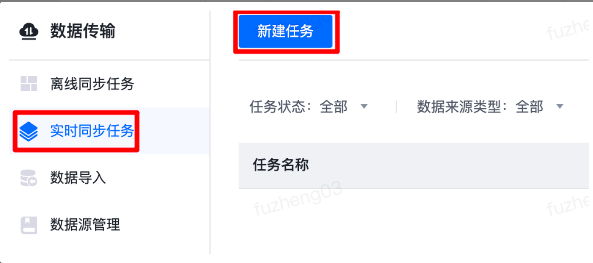

### 7.2.1 选择数据来源

首先配置数据来源，在选择数据来源环节配置任务基本信息和选择数据来源。

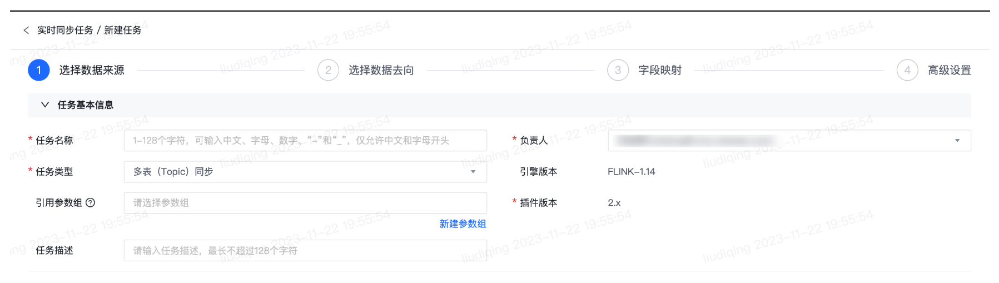

| 配置项 | 说明 |
|--------|------|
| 任务名称 | 最多128个字符，仅允许包含中文、字母、数字、"-"和"_"，仅能以中文和字母开头。注意：同一项目-集群下不允许存在同名任务 |
| 负责人 | 可选择项目下任意成员，默认为创建任务的用户 |
| 任务类型 | 在实时传输任务中，如需将表结构不一致的多张来源表分别同步至不同的去向表（Topic），任务类型请选择多表（Topic）同步；如需将表结构一致的多张分库分表同步至同一去向表（Topic），任务类型请选择分库分表同步 |
| 引擎版本 | 当前仅支持FLINK-1.14版本 |

**引用参数组：**

参数组的使用场景：

1. 任务导入导出时对库名、Topic名等进行替换
2. 任务常用的高级配置-自定义参数配置为参数组，可实现不同任务间的自定义参数复用

功能使用注意事项：

1. 同一实时同步任务内多个参数组内有相同参数项时，系统取排在前面的参数组的参数值
2. 如果字段映射支持的内置变量与参数组参数冲突时，内置变量优先级更高
3. 如果高级设置填写的参数与参数组参数冲突时，则高级设置填写的参数优先级更高
4. 如果导入引用参数组的实时同步任务时，会检测导入端是否存在同名参数组，如不存在则检测不通过，导入失败。如导入端存在同名参数组，则在导入端会将任务引用的参数组id替换为导入端同名参数组的id

功能详细使用步骤：

数据传输-实时同步任务："引用参数组"配置项选取需引用的参数组。

1. 如参数组的使用场景是：任务常用的高级配置-自定义参数配置为参数组，可实现不同任务间的自定义参数复用，则"引用参数组"配置项选取需引用的参数组即可
2. 如参数组的使用场景是：任务导入导出时对库名、Topic名等进行替换，除"引用参数组"配置项选取需引用的参数组外，请在使用变量处按照`${参数组名称}`的格式填写参数组参数

支持使用参数组参数的位置包含：

- **数据来源**：
  - 数据源类型为Kafka-【topic名称】
  - 任务类型为多表同步，数据源类型为MySQL、Oracle、TeleDB、SQLServer-【数据库名称】
  - 任务类型为多表同步或分库分表同步，数据源类型为Oracle，增量读取方式为ogg-【Topic名称】
  - 来源为Kafka、消费起始位点为时间戳
  - 来源为MySQL、消费起始位点为时间戳
  - 来源为MySQL、消费起始位点为指定binlog日志-binlog日志位置
  - 来源为Oracle、增量读取方式为logminer、消费起始位点为时间戳
  - 来源为Oracle、增量读取方式为logminer、消费起始位点为指定scn
  - 来源为Oracle、增量读取方式为ogg、消费起始位点为时间戳
  - 来源为SQLServer、消费起始位点为指定lsn
  - 来源为TeleDB、消费起始位点为指定binlog日志-binlog日志位置
  - 来源为TelePG、消费起始位点为指定lsn
- **数据去向**：
  - 数据源类型为Kudu-【去向表名】
  - 数据源类型为Iceberg、Arctic、Hive-【去向库名】和【去向表名】
  - 数据源类型为Kafka-【去向Topic】
- **字段映射**：
  - 数据去向为Kudu、Iceberg、Arctic、Hive时，来源表字段类型为自定义表达式时，支持填写参数组参数

| 配置项 | 说明 |
|--------|------|
| 引擎版本 | 当前仅支持FLINK-1.14版本 |
| 插件版本 | 支持的插件版本含：1.x、2.x，新建任务仅支持2.x版本 |

### 7.2.2 选择数据来源

**1、Kafka Reader**

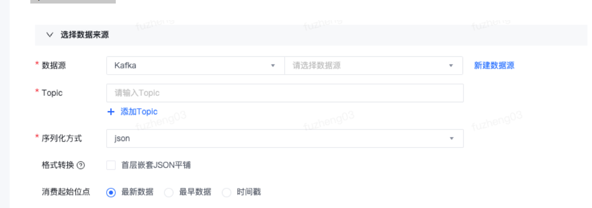

| 配置项 | 说明 |
|--------|------|
| 数据源 | 仅可选择类型为Kafka的当前项目组下数据源 |
| Topic | 请输入Topic名称。如需读取多个Topic，请点击"+添加Topic"输入多个需读取的Topic名称 |
| 序列化方式 | 可选择json、canal-json、debezium-json、maxwell-json、ogg-json。1）如果选择json，解析Topic schema时仅解析首层字段。2）如果选择canal-json，解析Topic schema时除data字段外仅解析首层字段，data嵌套字段内则子字段作为来源Topic字段。3）如果选择debezium-json，解析Topic schema时除before/after字段外仅解析首层字段，以before/after嵌套字段内的子字段作为来源Topic字段 |
| 格式转换 | 序列化格式为json时，支持格式转换。如勾选首层嵌套JSON平铺，会将首层中类型为row或map的嵌套字段解析为row类型并分解为单层结构，字段名称为"首层字段名称.次层字段名称" |
| 消费起始位点 | 支持从最新数据、最早数据、指定时间戳开始读取。如从指定时间戳开始读取，请按"yyyy-MM-dd HH:mm:ss.SSS"格式填写，其中".SSS"可不填 |
| 注意事项 | 如勾选首层嵌套JSON平铺，除解析出的"首层字段名称.次层字段名称"的列名外，首层和次层的字段名称不允许再包含"."。如果首层或次层名称包含"."，例如，首层字段名称：a.bc，此处字段名称：d.ef，则字段映射时请使用自定义表达式：\`a.bc\`.\`d.ef\` as 列名 表示该字段 |

**2、MySQL Reader、Oracle Reader、PostgreSQL、TeleDB Reader、SQLServer Reader、TelePG Reader**

MySQL、Oracle、PostgreSQL、TeleDB、SQLServer、TelePG的配置类似，故此处以TeleDB为例进行详细介绍。

**① 多表（Topic）同步**

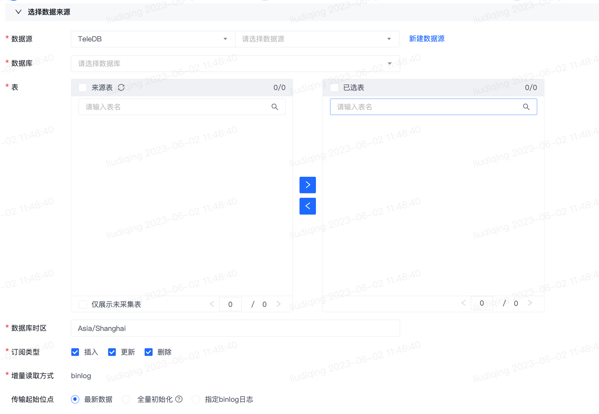

| 配置项 | 说明 |
|--------|------|
| 数据源 | 仅可选择当前项目组下该数据源类型的数据源 |
| 数据库 | 请选择数据库，支持模糊搜索库名 |
| 表 | 请勾选需要读取的表并点击">"加入右侧的已选表，可选取多张表。注意：如某张来源表已被项目-集群内的其余实时同步任务采集，则表名后会展示"已采集"的标签，鼠标停留在标签时会提示已采集该表的任务名称。如仅需展示未采集表，可在穿梭框下方勾选"仅展示未采集表" |
| 数据库时区 | 请选择数据库的时区，支持模糊搜索。默认值为Asia/Shanghai |
| 订阅类型 | 订阅类型包含：插入（Insert）、更新（Upsert）、删除（Delete），意指binlog的数据库变更类型，可多选，建议全选 |
| 增量读取方式 | 由该数据库类型决定 |
| 消费起始位点 | 支持从最新数据、全量初始化、指定binlog日志开始读取。如选取全量初始化，则会先同步来源表的历史全量数据再实时同步增量更新数据，块大小和批量条数可根据需求自行调优。全量初始化默认开启并发读取，如果来源表存在主键则以主键作为切分键并发读取，如果来源表不存在主键则默认并发度为1 |

**② 分库分表同步**

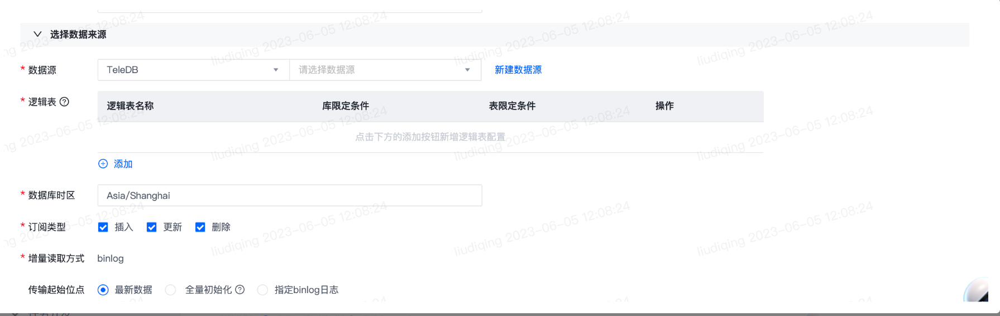

| 配置项 | 说明 |
|--------|------|
| 数据源 | 仅可选择当前项目组下该数据源类型的数据源。1）如需读取跨实例的分库分表，请将逐个实例登记为物理数据源，并登记逻辑数据源关联分库分表对应的所有物理数据源，此处选择逻辑数据源即可。2）如需读取同一实例下的分库分表，请将实例登记为物理数据源，此处选择物理数据源即可 |
| 逻辑表 | 对于分库分表，表结构一致的分库分表对应于1个逻辑表。请在此处依次逻辑表名称、分库分表的库名正则表达式和表名正则表达式。点击查看解析结果，可查看符合正则匹配结果的前10张表，用于确认表达式填写是否准确无误 |
| 数据库时区 | 请选择数据库的时区，支持模糊搜索。默认值为Asia/Shanghai |
| 订阅类型 | 订阅类型包含：插入（Insert）、更新（Upsert）、删除（Delete），意指binlog的数据库变更类型，可多选，建议全选 |
| 增量读取方式 | 由该数据库类型决定 |
| 消费起始位点 | 支持从最新数据、全量初始化、指定binlog日志开始读取。如选取全量初始化，则会先同步来源表的历史全量数据再实时同步增量更新数据，块大小和批量条数可根据需求自行调优。全量初始化默认开启并发读取，如果来源表存在主键则以主键作为切分键并发读取，如果来源表不存在主键则默认并发度为1 |

点击"下一步"进行数据去向配置。

### 7.2.3 选择数据去向

**1、Hive、Iceberg、Arctic、MySQL、Oracle、SQLServer、StarRocks、Kudu Writer**

去向为Hive、Iceberg、Arctic、MySQL、Oracle、SQLServer、StarRocks、Kudu时，配置相似，仅当去向为Hive时额外支持任务过程中创建Hive表。故此处以Iceberg为例进行详细介绍。

| 配置项 | 说明 |
|--------|------|
| 数据源 | 数据源类型：Iceberg。数据源名称：仅当当前集群存在绑定的Iceberg数据源时，此处可选择Iceberg数据源。数据源名称格式为：项目-集群 Iceberg数据源，可选择当前项目-当前集群的Iceberg数据源和在安全中心存在库表公开给当前项目的其余项目-当前集群的Iceberg数据源 |
| 设置来源表与去向表映射 | 请选择各来源表对应的去向Iceberg库表。如任务类型为分库分表同步时，此处选择各来源逻辑表对应的去向Iceberg库表。批量设置源表和去向表映射：注意：任务类型为多表（Topic）同步、去向为Hive和MySQL时，请勿将多张来源表写入同一去向表，否则任务运行会报错！1）批量选择去向库：选中的数据库将批量填充"设置来源Topic和去向表映射"处的去向库名。2）选择表名规则：来源表名和去向表名转换规则和去向表名规则可任选其一或组合使用 |
| 写入分区 | 如写入表为分区表，需配置写入分区。支持根据数据写入时间分区、根据字段内容动态分区和根据数据生成时间分区。1）分区方式为根据数据生成时间分区或根据数据写入时间分区时，支持填写内置变量：yyyy、MM、dd、HH、mm、ss。2）分区方式为根据字段内容动态分区时，支持选择来源表字段，会将源端对应字段所在数据行写入到表对应的分区中。3）请保证所有去向表的分区结构保持一致，否则任务可能运行失败 |
| 写入规则 | 支持的写入规则为：insert into（追加）、upsert（主键和分区键均冲突，覆盖原记录）。注意：使用upsert要求Iceberg表同时满足两个条件：1、版本是V2，2、有主键或分区键，否则任务会报错。注意事项：Oracle字段名称格式限制：仅支持大小写字母、数字、下划线、中划线、$ |

**2、Kafka Writer**

| 配置项 | 说明 |
|--------|------|
| 数据源 | 数据源类型：Kafka。数据源名称：仅可选择当前项目组下该数据源类型的数据源 |
| 设置来源表（Topic）与去向Topic映射 | 请选择各来源表（Topic）对应的去向Topic。批量设置源表（Topic）和去向Topic映射：1）选择Topic名称规则：来源表名和去向Topic名转换规则和去向Topic名称规则可任选其一或组合使用。2）可使用内置变量命名去向Topic名 |
| 同步主键 | 来源为除Kafka外数据源类型时，需要设置同步主键。1）同步时会使用同步主键值作为Kafka记录的key，确保同主键的变更有序写入Kafka的同一分区。2）如来源表有主键，建议使用来源表字段作为同步主键；如来源表无主键，建议使用其他非主键的一个或几个字段的联合，代替主键作为Kafka记录的key，选取多个字段联合作为同步主键，字段拼接时字段间以;分隔。3）如同步主键为空，则同步时Kafka记录的key为空。如果要确保表的变更有序写入Kafka，则选择写入的Kafka Topic必须是单分区 |
| 序列化方式 | 1）支持的序列化格式为json、canal-json、debezium-json、maxwell-json、ogg-json。2）来源为Kafka、去向为Kafka时，去向的序列化格式要求与来源的序列化格式保持一致 |
| update变更对应一条记录 | 1）序列化格式为canal-json、debezium-json、maxwell-json、ogg-json时，支持此功能。2）勾选后，源端数据库一条记录的一次update变更，变更前和变更后的数据将保存在一条记录中。3）如未勾选，源端数据库一条记录的一次update变更，将保存在两条记录中，分别保存变更前和变更后的数据 |

完成数据去向配置后，点击"下一步"进行字段映射配置。

### 7.2.4 字段映射

除来源为Kafka且去向为Kafka外，其余数据来源和去向的组合均需配置字段映射。

字段映射支持使用的内置变量如下：

- 来源为MySQL，去向为Hive、Iceberg、Kudu、Arctic：`${op}`、`${op_ts}`
- 来源为TeleDB，去向为Hive、Iceberg、Kudu、Arctic：`${op}`、`${op_ts}`
- 来源为Oracle、去向为Hive、Iceberg、Kudu、Arctic：增量读取方式为logminer，支持填写`${op}`、`${op_ts}`、`${scn}`；增量读取方式为ogg，支持填写`${op}`、`${op_ts}`
- 来源为SQLServer，去向为Hive、Iceberg、Kudu、Arctic：`${op}`、`${op_ts}`、`${change_lsn}`
- 来源为TelePG，去向为Hive、Iceberg、Kudu、Arctic：`${op}`、`${op_ts}`、`${lsn}`
- 来源为Kafka且序列化格式非json、去向为Hive、Iceberg、Kudu、Arctic：`${op}`。此外，当序列化格式为ogg-json时，支持`${pos}`、`${op_ts}`、`${current_ts}`、`${source table}`

内置变量填写方式：来源表字段选择为自定义表达式，并按照`${变量名称}`格式输入内置变量。

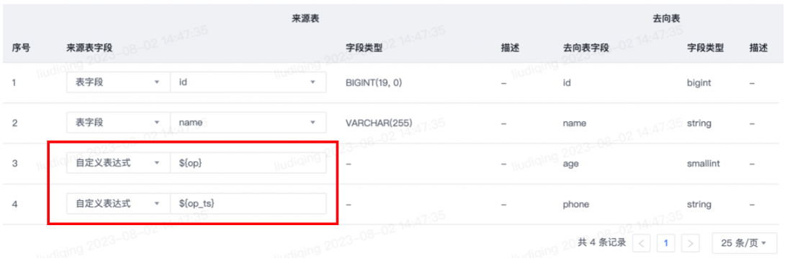

在映射配置中分为全局映射配置和单个来源表（Topic）-去向表（Topic）映射配置。

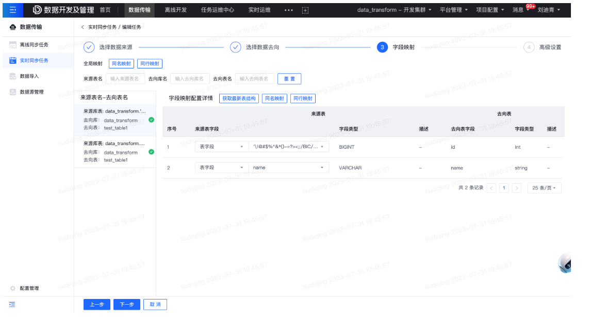

| 配置项 | 说明 |
|--------|------|
| 字段映射全局映射 | 点击"同名映射"或"同行映射"，则所有Topic-表映射的字段映射均按照此规则去配置字段映射。同名映射：根据去向表字段名称匹配同名的来源Topic字段名称，若无法匹配则来源Topic字段置为自定义表达式。同行映射：根据去向表字段序号匹配序号相同的来源Topic字段名称，若无法匹配则来源Topic字段置为自定义表达式 |
| 来源Topic-去向表 | 支持根据来源Topic、去向库名、去向表名搜索符合搜索条件的Topic-表映射。在页面左侧切换Topic-表映射时，可针对选中的Topic-表映射配置字段映射 |

对于单个Topic映射配置支持的操作：

| 操作 | 说明 |
|------|------|
| 获取最新表结构 | （1）数据来源a.新增字段及字段顺序调整：不改变已有的字段映射列表，下拉选项中增加新增字段b.删除字段：如果被删除的字段原已在列表中被选中，则清空来源表字段选择框的值c.字段类型或描述变更：更新"类型"列该字段的字段类型或字段描述（2）数据去向a.字段顺序调整：字段映射列表中按变更后的去向表字段顺序展示，并保留映射的来源表字段信息b.新增字段：字段映射列表中新增行，行序号为去向表中该字段的列序号c.删除字段：删除字段映射列表中的对应行d.字段类型变更：更新"字段类型"列该字段对应的值e.字段描述变更：更新"描述"列该字段的字段描述（3）消息通知框整体提醒 |
| 一键解析Topic字段 | 进入字段映射模块时默认会解析各Topic的字段名称和字段类型，点击"一键映射Topic字段"会重新解析一次最新的Topic字段名称和字段类型 |
| 同名映射 | 根据去向表字段名称匹配同名的来源Topic字段名称，若无法匹配则来源Topic字段置为自定义表达式 |
| 同行映射 | 根据去向表字段序号匹配序号相同的来源Topic字段名称，若无法匹配则来源Topic字段置为自定义表达式 |
| 设置自定义表达式字段类型 | 如果存在自定义表达式引用来源Topic字段且字段映射未指定类型时，请点击"设置自定义表达式字段类型"按钮设置引用字段的类型，否则任务会运行失败 |
| 来源Topic字段 | 支持选择Topic字段或自定义表达式。选中Topic字段时，支持输入或选择Topic字段名称，如果来源Topic为空，此处支持手动填写字段名称；如果来源Topic非空，此处默认会自动解析Topic首层字段名称。选中自定义表达式时，请按照格式填写："表达式" as 列名，支持填写常量、Flink函数、内置变量current_timestamp（表示数据写入时间） |
| 字段类型 | 系统支持推断Topic字段的字段类型。选中某个Topic字段时，会展示该字段的推断类型，如与字段实际类型存在差异，可手动调整切换字段类型 |

**关于字段类型，规则如下：**

| 来源类型 | 映射类型 |
|----------|----------|
| string | string |
| int、bigint、tinyint、smallint | bigint |
| float、double、decimal | decimal |
| boolean | boolean |
| row、map | row |
| array | array |
| time、timestamp、date、byte、varbinary | string |

此外，点击复制图标可将来源Topic字段类型批量映射为去向Hive表字段类型。

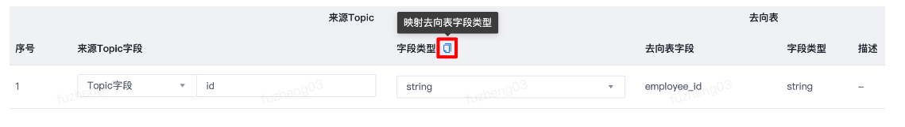

**其映射规则如下：**

| 来源类型 | 映射类型 |
|----------|----------|
| int | int |
| tinyint | tinyint |
| smallint | smallint |
| bigint | bigint |
| float | float |
| double | double |
| decimal(38,18) | decimal(p,s) |
| timestamp | timestamp |
| date | date |
| 不映射字段类型 | char(n) |
| string | varchar(n) |
| string | string |
| boolean | boolean |
| varbinary | binary |
| map | map |
| array | array |
| 不映射字段类型 | struct |
| 不映射字段类型 | union |

说明：数据来源的序列化格式为canal-json、debezium-json、json的时候，支持SQL、ISO_8601、RFC3339三种timestamp格式。一个任务只支持一类timestamp格式，默认为SQL，可通过自定义参数调整：`json.timestamp-format.standard= SQL\ISO_8601\RFC3339`。

完成字段映射配置后，点击"下一步"进入高级配置页面。

### 7.2.5 高级设置

该页面支持参数的填写。参数名称填写格式：`source/target.参数名称`，source.表示数据来源端参数，target.表示数据去向端参数。示例：`source.json.timestamp-format.standard`。

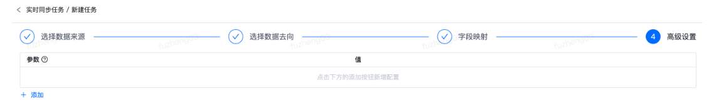

| 数据来源 | 参数 | 说明 |
|----------|------|------|
| Kafka | `source.json.timestamp-format.standard` | 任务支持的timestamp格式。同一任务仅支持一类timestamp格式，默认值为SQL，可填写值为：SQL、ISO_8601、RFC3339 |
| MySQL | `source.fields.convert-tinyint-one-boolean.enabled` | 用于控制MySQL表字段类型为tinyint时写入去向的字段类型。默认值为true，即按照boolean类型写入数据去向；值为false时，会按照tinyint类型写入数据去向 |

### 7.2.6 配置完成

配置完成后，点击"保存"按钮即可完成任务配置。