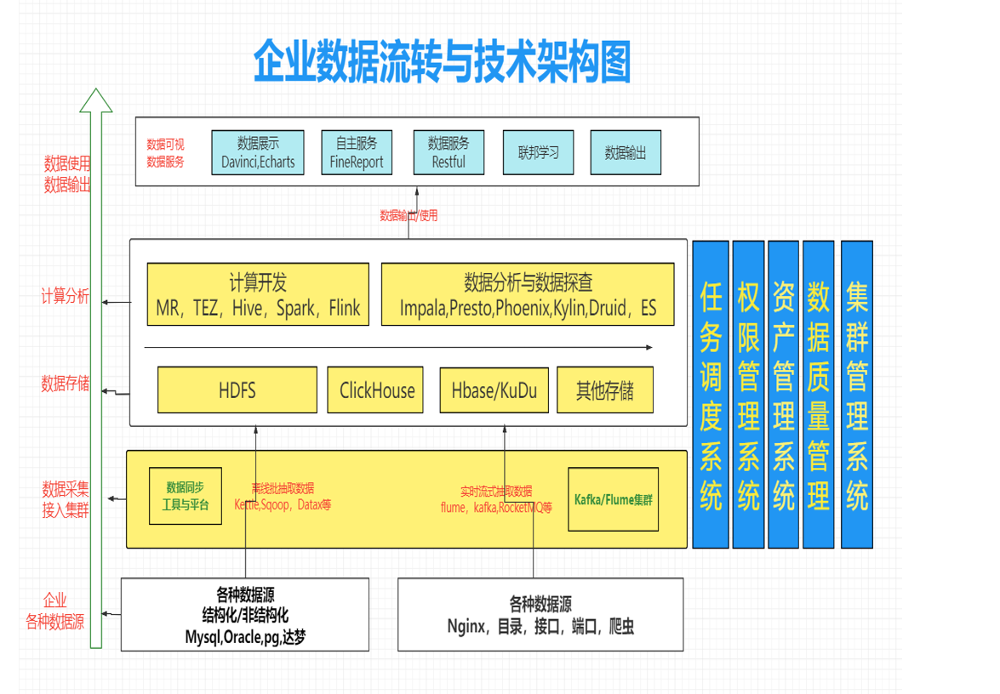
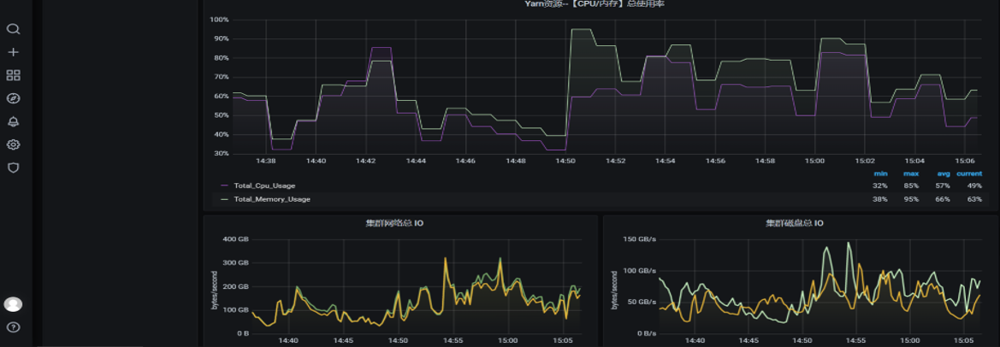
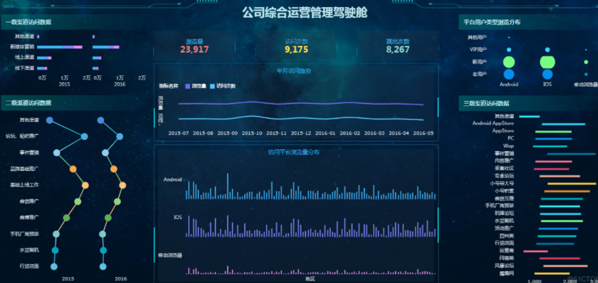
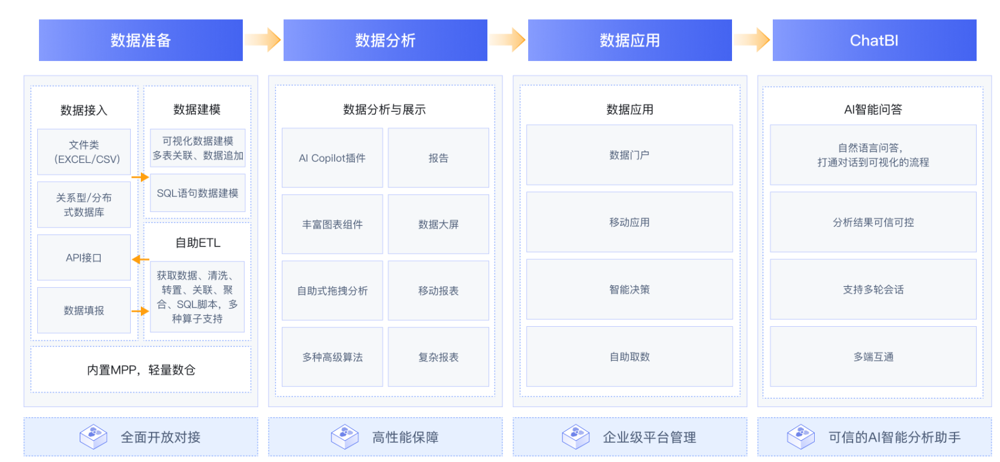
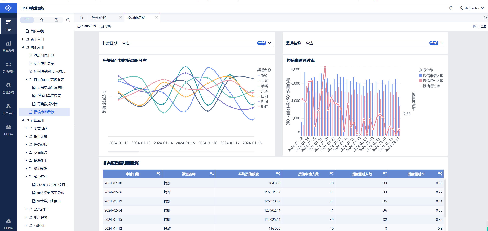
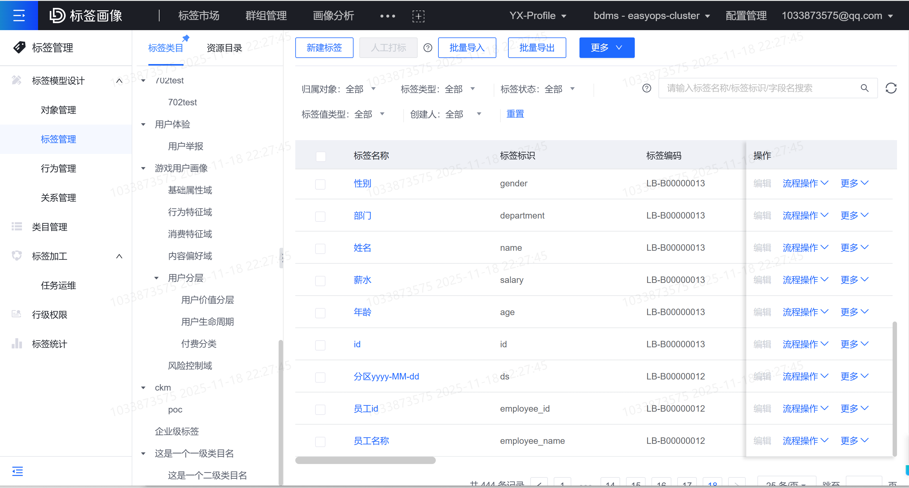
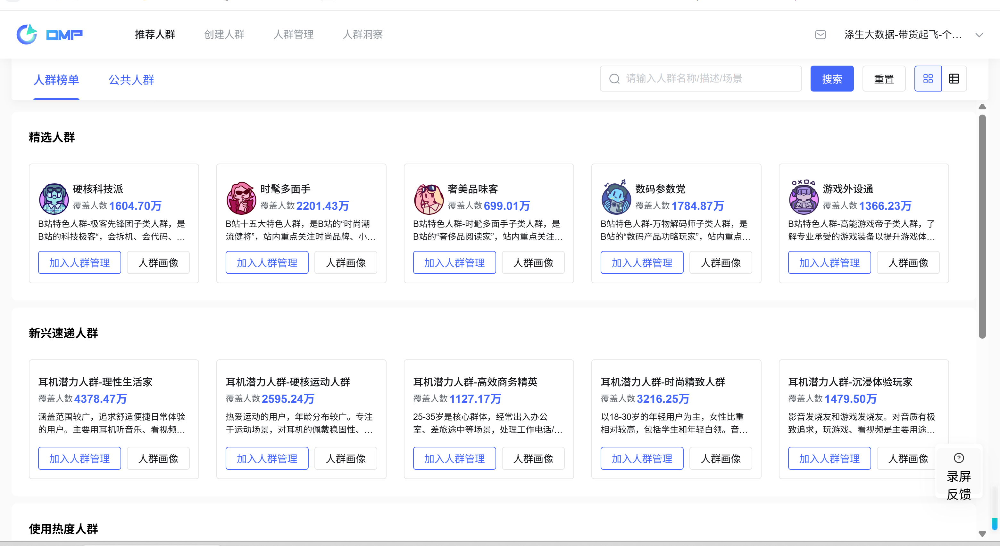
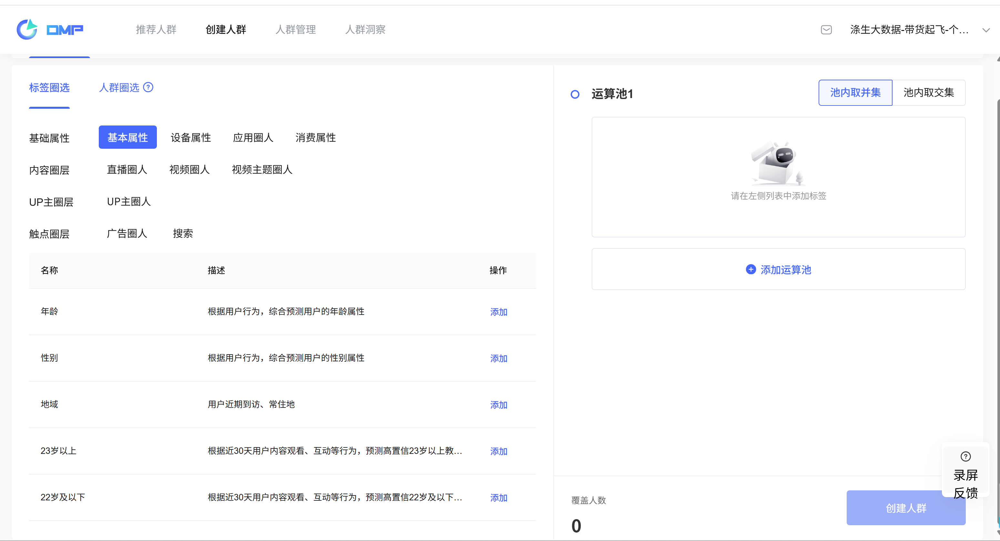
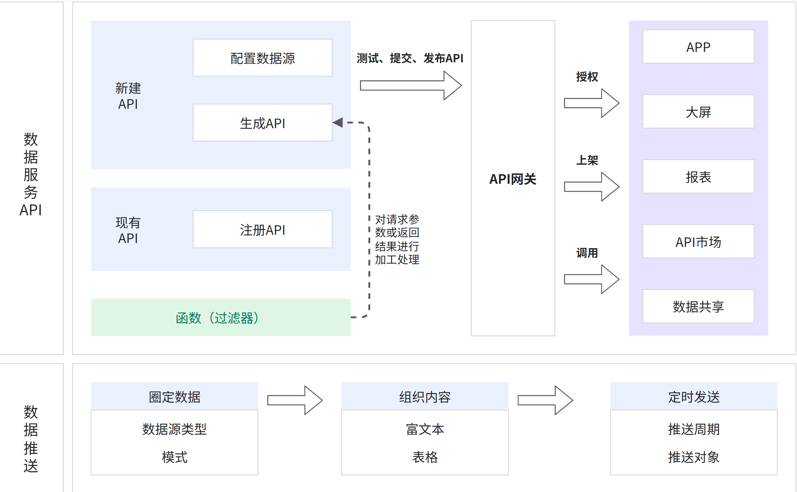
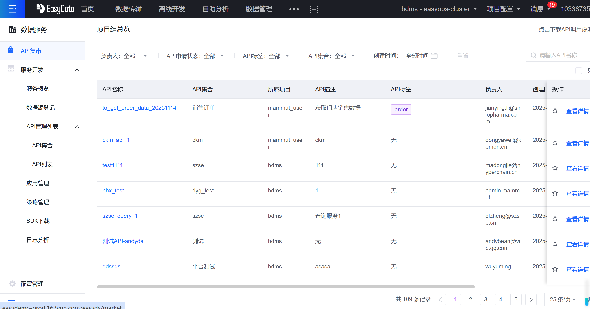

# 7.大数据架构之数据应用组件

## 1.数据可视化组件

常见的数据展示工具：Supperset、Metabase、Davinci、Grafana、Echarts、自建平台。

## 2.BI自主分析工具

主流的有 FineReport、PowerBI、Tableau、Cognos、SupperSet、观远BI、永洪BI等。

**Superset**：是一款由Airbnb开源的、目前由Apache孵化的，基于Flask-appbuilder搭建的"现代化的企业级BI（商业智能）Web应用程序"，它通过创建和分享dashboard，为数据分析提供了轻量级的数据查询和可视化方案。Superset是一款自助式的BI工具，可利用于探索式的日常数据分析中，它能够对接常用的大数据分析工具、能够连接主流数据库或直接上传CSV数据文件，内含多类型展示图表样式，使用者通过自定义图表或dashboard可以直观地发现、分析、预警数据中所隐藏的问题，及时应对业务中的风险或发现增长点。

**Tableau**：是目前国外比较流行的一款数据分析BI软件，允许从多个数据源访问数据，包括带分隔符的文本文件、Excel 文件、SQL 数据库、Oracle 数据库和多维数据库等。Tableau提供了非常友好的可视化界面，使用者不需要 IT 背景，也不需要统计知识，只通过拖放和点击(点选)的方式就可以创建出精美、交互式仪表盘。帮助迅速发现数据中的异常点，对异常点进行明细钻取，还可以实现异常点的深入分析，定位异常原因。它的缺点就是没有很好的数据收集、平台管控等功能。

**FineBI/Report**：报表软件是帆软公司一款纯Java编写的、集数据展示(报表)和数据录入(表单)功能于一身的企业级web报表工具，它"专业、简捷、灵活"的特点和无码理念，仅需简单的拖拽操作便可以设计复杂的中国式报表，搭建数据决策分析系统，但是它是付费的软件。

**Sugar BI**：是智能 BI及数据可视化工具。Sugar BI 基于百度 Echarts 提供丰富的图表组件，无需SQL、全流程智能化操作，让用户不写一行代码，分钟级即可完成自助 BI 报表分析和可视化大屏。提升数据分析效率，帮助企业精准快速决策。

**Quick BI**：是阿里巴巴旗下的一个全面的商业智能平台，它提供了一整套的数据分析解决方案。Quick BI的优点在于它功能全面，涵盖了数据查询、数据分析、数据报告、仪表板和数据共享等多个方面，几乎可以满足中小企业的所有数据需求。

**Power BI**：是微软推出的一款数据分析BI软件，它可连接数百个数据源、简化数据准备并提供即席分析。生成美观的报表并进行发布，供组织在 Web 和移动设备上使用。每个人都可创建个性化仪表板，获取针对其业务的全方位独特见解。在企业内实现扩展，内置管理和安全性。简单来说就是可以从各种数据源中提取数据，并对数据进行整理分析，然后生成精美的图表，并且可以在电脑端和移动端与他人共享的一个数据分析BI软件。

**网易有数bi**：网易开发一站式bi报表分析平台，简单易用，但是收费。 <https://sf.163.com/product/bi>

目前市面上很多BI软件采取的都是OLAP分析模式。OLAP也被称为多维分析，它的目标是满足决策支持或者满足在多维环境下特定的查询和报表需求，其技术核心是"维"这个概念，"维"一般包含着层次关系。具体来说就是OLAP能够对数据采取切片、切块、钻取、旋转等各种分析动作，以求剖析数据，让使用者能从多个角度、多侧面地观察数据库中的数据，从而深入理解包含在数据中的信息。

## 3.数据导入各个业务系统

比如企业对外数据输出，用户画像，DMP系统，风控系统，征信系统，营销系统。不同企业对数据的使用方式是不同的。

## 4.数据传输平台或者API数据服务

比如数据往业务库等推送，Sqoop，datax等组件结合调度使用。比如，用户通过API调用，和内网的打通，API配置。

