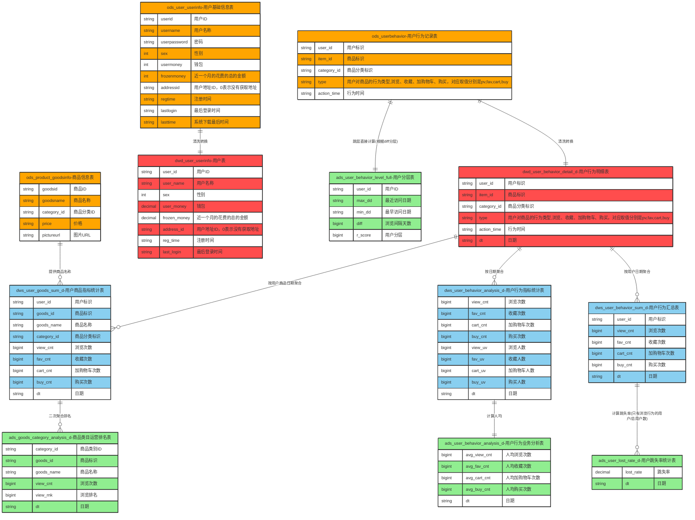
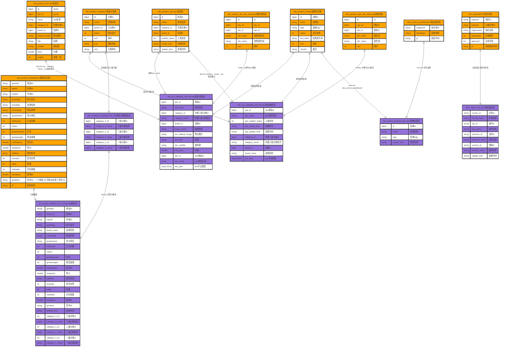

```mermaid
%%{init: {'theme': 'base', 'themeVariables': { 'primaryColor': '#ffffff' }}}%%
erDiagram
    %% 定义颜色类
    classDef ods fill:#FFA500,stroke:#333,stroke-width:2px;
    classDef dwd fill:#FF4D4D,stroke:#333,stroke-width:2px;
    classDef dws fill:#89CFF0,stroke:#333,stroke-width:2px;
    classDef ads fill:#90EE90,stroke:#333,stroke-width:2px;

    %% ========== ODS层 ==========
    ods_user_userinfo-用户基础信息表:::ods {
        string userid "用户ID"
        string username "用户名称"
        string userpassword "密码"
        int sex "性别"
        int usermoney "钱包"
        int frozenmoney "近一个月的花费的总的金额"
        string addressid "用户地址ID，0表示没有获取地址"
        string regtime "注册时间"
        string lastlogin "最后登录时间"
        string lasttime "系统下载最后时间"
    }

    ods_userbehavior-用户行为记录表:::ods {
        string user_id "用户标识"
        string item_id "商品标识"
        string category_id "商品分类标识"
        string type "用户对商品的行为类型,浏览、收藏、加购物车、购买，对应取值分别是pv,fav,cart,buy"
        string action_time "行为时间"
    }

    ods_product_goodsinfo-商品信息表:::ods {
        string goodsid "商品ID"
        string goodsname "商品名称"
        string category_id "商品分类ID"
        string price "价格"
        string pictureurl "图片URL"
    }

    %% ========== DWD层 ==========
    dwd_user_userinfo-用户表:::dwd {
        string user_id "用户ID"
        string user_name "用户名称"
        int sex "性别"
        decimal user_money "钱包"
        decimal frozen_money "近一个月的花费的总的金额"
        string address_id "用户地址ID，0表示没有获取地址"
        string reg_time "注册时间"
        string last_login "最后登录时间"
    }

    dwd_user_behavior_detail_d-用户行为明细表:::dwd {
        string user_id "用户标识"
        string item_id "商品标识"
        string category_id "商品分类标识"
        string type "用户对商品的行为类型,浏览、收藏、加购物车、购买，对应取值分别是pv,fav,cart,buy"
        string action_time "行为时间"
        string dt "日期"
    }

    %% ========== DWS层 ==========
    dws_user_behavior_sum_d-用户行为汇总表:::dws {
        string user_id "用户标识"
        bigint view_cnt "浏览次数"
        bigint fav_cnt "收藏次数"
        bigint cart_cnt "加购物车次数"
        bigint buy_cnt "购买次数"
        string dt "日期"
    }

    dws_user_behavior_analysis_d-用户行为指标统计表:::dws {
        bigint view_cnt "浏览次数"
        bigint fav_cnt "收藏次数"
        bigint cart_cnt "加购物车次数"
        bigint buy_cnt "购买次数"
        bigint view_uv "浏览人数"
        bigint fav_uv "收藏人数"
        bigint cart_uv "加购物车人数"
        bigint buy_uv "购买人数"
        string dt "日期"
    }

    dws_user_goods_sum_d-用户商品指标统计表:::dws {
        string user_id "用户标识"
        string goods_id "商品标识"
        string goods_name "商品名称"
        string category_id "商品分类标识"
        bigint view_cnt "浏览次数"
        bigint fav_cnt "收藏次数"
        bigint cart_cnt "加购物车次数"
        bigint buy_cnt "购买次数"
        string dt "日期"
    }

    %% ========== ADS层 ==========
    ads_user_behavior_analysis_d-用户行为业务分析表:::ads {
        bigint avg_view_cnt "人均浏览次数"
        bigint avg_fav_cnt "人均收藏次数"
        bigint avg_cart_cnt "人均加购物车次数"
        bigint avg_buy_cnt "人均购买次数"
        string dt "日期"
    }

    ads_user_lost_rate_d-用户跳失率统计表:::ads {
        decimal lost_rate "跳失率"
        string dt "日期"
    }

    ads_goods_category_analysis_d-商品类目运营排名表:::ads {
        string category_id "商品类别ID"
        string goods_id "商品标识"
        string goods_name "商品名称"
        bigint view_cnt "浏览次数"
        bigint view_rnk "浏览排名"
        string dt "日期"
    }

    ads_user_behavior_level_full-用户分层表:::ads {
        string user_id "用户ID"
        string max_dd "最近访问日期"
        string min_dd "最早访问日期"
        bigint diff "浏览间隔天数"
        bigint r_score "用户分层"
    }

    %% ========== 关系定义 ==========
    ods_user_userinfo-用户基础信息表 ||--|| dwd_user_userinfo-用户表 : "清洗转换"
    ods_userbehavior-用户行为记录表 ||--|| dwd_user_behavior_detail_d-用户行为明细表 : "清洗转换"
    dwd_user_behavior_detail_d-用户行为明细表 ||--o{ dws_user_behavior_sum_d-用户行为汇总表 : "按用户日期聚合"
    dwd_user_behavior_detail_d-用户行为明细表 ||--o{ dws_user_behavior_analysis_d-用户行为指标统计表 : "按日期聚合"
    dwd_user_behavior_detail_d-用户行为明细表 ||--o{ dws_user_goods_sum_d-用户商品指标统计表 : "按用户商品日期聚合"
    ods_product_goodsinfo-商品信息表 ||--o{ dws_user_goods_sum_d-用户商品指标统计表 : "提供商品名称"
    dws_user_behavior_analysis_d-用户行为指标统计表 ||--|| ads_user_behavior_analysis_d-用户行为业务分析表 : "计算人均"
    dws_user_behavior_sum_d-用户行为汇总表 ||--o{ ads_user_lost_rate_d-用户跳失率统计表 : "计算跳失率(只有浏览行为的用户/总用户数)"
    dws_user_goods_sum_d-用户商品指标统计表 ||--o{ ads_goods_category_analysis_d-商品类目运营排名表 : "二次聚合排名"
    ods_userbehavior-用户行为记录表 ||--|| ads_user_behavior_level_full-用户分层表 : "跳层直接计算(根据diff分层)"
```

```mermaid
%%{init: {'theme': 'base', 'themeVariables': { 'primaryColor': '#ffffff' }}}%%
erDiagram
    %% 定义颜色类
    classDef ods fill:#FFA500,stroke:#333,stroke-width:2px;
    classDef dim fill:#9370DB,stroke:#333,stroke-width:2px;

    %% ========== ODS层 ==========
    ods_product_spu-spu信息表:::ods {
        bigint id "商品id"
        string name "商品名称"
        bigint category_id "所属分类id"
        bigint brand_id "品牌id"
        int publish_status "上架状态"
        string create_time "创建时间"
        string update_time "更新时间"
    }

    ods_product_spu_attr_value-spu属性值表:::ods {
        bigint id "id"
        bigint spu_id "商品id"
        bigint attr_id "属性id"
        string attr_name "属性名"
        string attr_value "属性值"
        int sort "顺序"
    }

    ods_product_sku-sku信息表:::ods {
        bigint id "skuId"
        bigint spu_id "spuId"
        string name "sku名称"
        bigint catagory_id "所属分类id"
        bigint brand_id "品牌id"
        string default_image "默认图片"
        string title "标题"
        string subtitle "副标题"
        double price "价格"
        int weight "重量（克）"
    }

    ods_product_sku_attr_value-sku销售属性表:::ods {
        bigint id "id"
        bigint sku_id "sku_id"
        bigint attr_id "attr_id"
        string attr_name "销售属性名"
        string attr_value "销售属性值"
        int sort "顺序"
    }

    ods_product_brand-品牌信息表:::ods {
        bigint id "品牌id"
        string name "品牌名"
        string logo "品牌logo"
        int status "显示状态"
        string first_letter "检索首字母"
        int sort "排序"
        string remark "备注"
    }

    ods_product_category-商品分类表:::ods {
        bigint id "分类id"
        string name "分类名称"
        bigint parent_id "父分类id"
        int status "是否显示"
        int sort "排序"
        string icon "图标地址"
        string unit "计量单位"
    }

    ods_regioninfo-行政区划表:::ods {
        string regionid "地区ID"
        string parentid "父级区域ID"
        string regionname "地区名称"
        int regiontype "区域类别"
        int agencyid "无用字段"
        string pt "系统更新时间"
    }

    ods_product_goodsbrand-商品品牌表:::ods {
        string supplierid "供应商ID"
        string brandtype "品牌类型"
        string pt "更新时间"
    }

    ods_product_goodsinfo2-商品信息表2:::ods {
        string goodsid "商品ID"
        string typeid "品类ID"
        string markid "专场ID"
        string goodstag "档口名字"
        string brandtag "品牌名称"
        string customtag "商品详情"
        string goodsname "竞价排名"
        int clickcount "点击次数"
        int clickcr "-"
        int goodsnumber "货号"
        int goodsweight "商品重量"
        double marketprice "进货价"
        double shopprice "售价"
        string addtime "建档时间"
        int isonsale "是否在售"
        int sales "销量"
        int realsales "实际销量"
        double extraprice "促销价"
        string goodsno "货号ID，一个商品 ID 可能对应多个货号 ID"
        string dt "更新时间"
    }

    %% ========== DIM层 ==========
    dim_sku_detailed_info_full-sku商品维度表:::dim {
        bigint sku_id "商品id"
        string sku_name "商品名称"
        bigint catagory_id "所属三级分类id"
        string catagory_name "所属三级分类名字"
        bigint brand_id "品牌id"
        string brand_name "品牌名称"
        string sku_default_image "默认图片"
        string sku_title "标题"
        string sku_subtitle "副标题"
        double sku_price "价格"
        bigint spu_id "spu商品id"
        string spu_name "spu商品名称"
        array-struct sku_attrs "sku平台属性"
    }

    dim_spu_detailed_info_full-spu商品维度表:::dim {
        bigint spu_id "spu商品id"
        string spu_name "spu商品名称"
        int spu_publish_status "上架状态"
        string spu_create_time "创建时间"
        string spu_update_time "更新时间"
        bigint category_id "所属三级分类id"
        string category_name "所属三级分类名字"
        bigint brand_id "品牌id"
        string brand_name "品牌名称"
        array-struct spu_attrs "spu平台属性"
    }

    dim_brand_detailed_info_full-品牌维度表:::dim {
        bigint id "品牌id"
        string name "品牌名称"
        string logo "品牌logo"
        string update_time "更新时间"
    }

    dim_category_detailed_info_full-商品分类维度表:::dim {
        bigint category_3_id "三级分类id"
        string category_3_name "三级分类名称"
        bigint category_2_id "二级分类id"
        string category_2_name "二级分类名称"
        bigint category_1_id "一级分类id"
        string category_1_name "一级分类名称"
    }

    dim_goods_detailed_info_full-goods维度表:::dim {
        string goodsid "商品ID"
        string brand_id "品类ID"
        string markid "专场ID"
        string goodstag "档口名字"
        string brand_name "品牌名称"
        string customtag "商品详情"
        string goodsname "竞价排名"
        int clickcount "点击次数"
        int clickcr "-"
        int goodsnumber "货号"
        int goodsweight "商品重量"
        double marketprice "进货价"
        double shopprice "售价"
        string addtime "建档时间"
        int isonsale "是否在售"
        int sales "销量"
        int realsales "实际销量"
        double extraprice "促销价"
        string goodsno "货号ID"
        string update_time "更新时间"
        int category_3_id "三级分类id"
        string category_3_name "三级分类名称"
        int category_2_id "二级分类id"
        string category_2_name "二级分类名称"
        int category_1_id "一级分类id"
        string category_1_name "一级分类名称"
    }

    dim_region_info_full-地区维度表:::dim {
        string county_id "区县id"
        string county_name "区县名称"
        string city_id "城市id"
        string city_name "城市名称"
        string province_id "省份id"
        string province_name "省份名称"
        string country_id "国家id"
        string country_name "国家名称"
        string update_time "更新时间"
    }

    %% ========== 数据流转关系 ==========
    ods_product_sku-sku信息表 ||--|| dim_sku_detailed_info_full-sku商品维度表 : "left join spu、category、brand、sku属性聚合"
    ods_product_spu-spu信息表 ||--|| dim_sku_detailed_info_full-sku商品维度表 : "提供spu_name"
    ods_product_brand-品牌信息表 ||--|| dim_sku_detailed_info_full-sku商品维度表 : "提供品牌名称"
    ods_product_sku_attr_value-sku销售属性表 ||--|| dim_sku_detailed_info_full-sku商品维度表 : "collect_set聚合sku属性"

    ods_product_spu-spu信息表 ||--|| dim_spu_detailed_info_full-spu商品维度表 : "left join category、brand、spu属性聚合"
    ods_product_category-商品分类表 ||--|| dim_spu_detailed_info_full-spu商品维度表 : "提供分类名称"
    ods_product_brand-品牌信息表 ||--|| dim_spu_detailed_info_full-spu商品维度表 : "提供品牌名称"
    ods_product_spu_attr_value-spu属性值表 ||--|| dim_spu_detailed_info_full-spu商品维度表 : "collect_set聚合spu属性"

    ods_product_brand-品牌信息表 ||--|| dim_brand_detailed_info_full-品牌维度表 : "union all ods_product_goodsbrand"
    ods_product_goodsbrand-商品品牌表 ||--|| dim_brand_detailed_info_full-品牌维度表 : "union all 补充品牌"

    ods_product_category-商品分类表 ||--|| dim_category_detailed_info_full-商品分类维度表 : "自连接生成三级分类"

    dim_category_detailed_info_full-商品分类维度表 ||--|| dim_goods_detailed_info_full-goods维度表 : "left join 匹配分类名"
    ods_product_goodsinfo2-商品信息表2 ||--|| dim_goods_detailed_info_full-goods维度表 : "主数据源"

    ods_regioninfo-行政区划表 ||--|| dim_region_info_full-地区维度表 : "自连接生成省市区县"
```