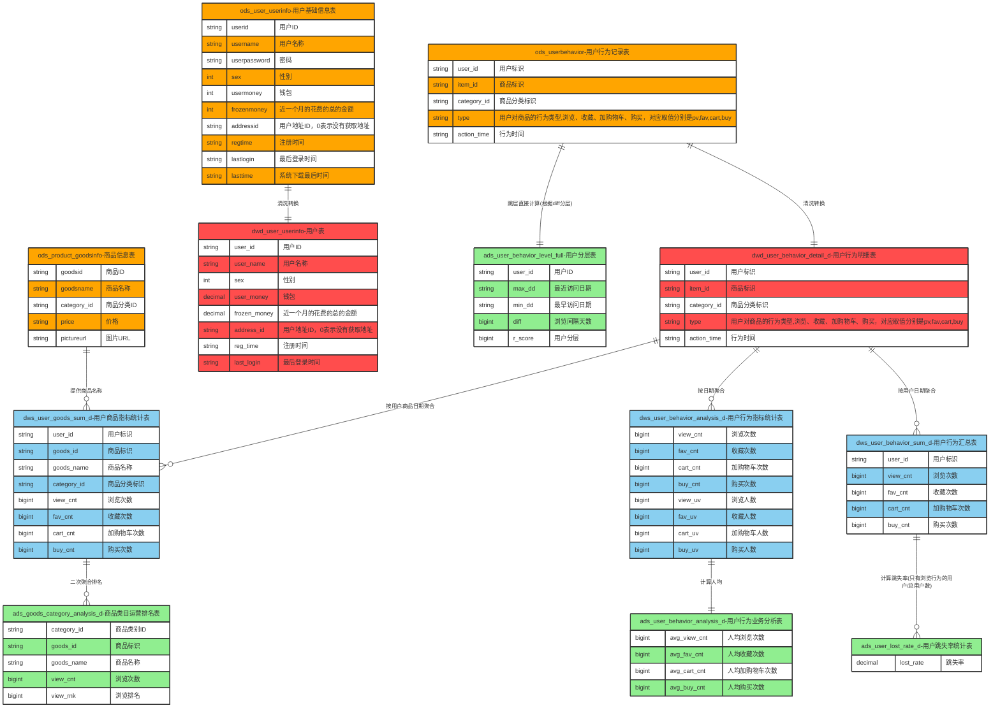
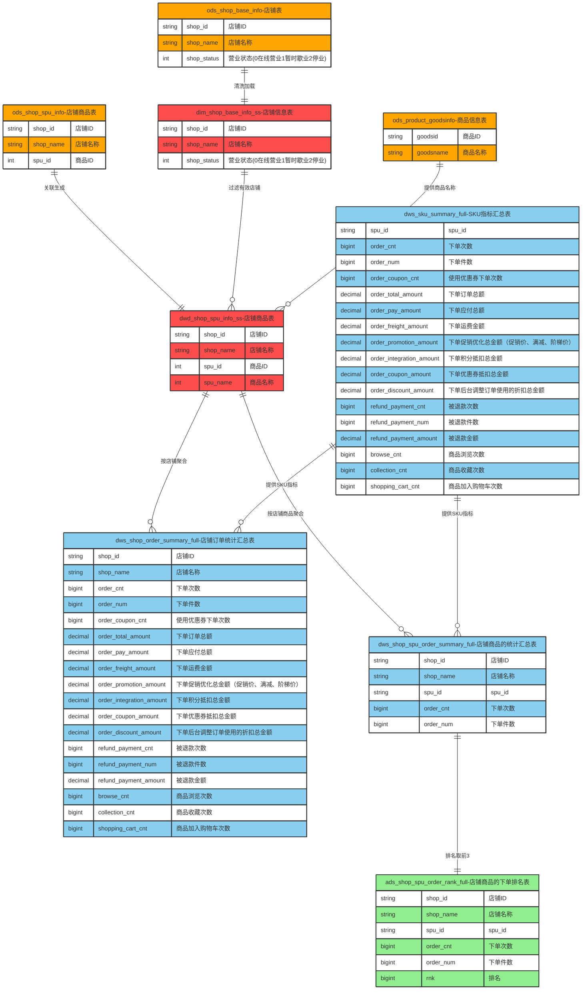

```mermaid
%%{init: {'theme': 'base', 'themeVariables': { 'primaryColor': '#ffffff' }}}%%
erDiagram
    %% 定义颜色类
    classDef ods fill:#FFA500,stroke:#333,stroke-width:2px;
    classDef dim fill:#9370DB,stroke:#333,stroke-width:2px;

    %% ========== ODS层 ==========
    ods_product_spu-spu信息表:::ods {
        bigint id "商品id"
        string name "商品名称"
        bigint category_id "所属分类id"
        bigint brand_id "品牌id"
        int publish_status "上架状态"
        string create_time "创建时间"
        string update_time "更新时间"
    }

    ods_product_spu_attr_value-spu属性值表:::ods {
        bigint id "id"
        bigint spu_id "商品id"
        bigint attr_id "属性id"
        string attr_name "属性名"
        string attr_value "属性值"
        int sort "顺序"
    }

    ods_product_sku-sku信息表:::ods {
        bigint id "skuId"
        bigint spu_id "spuId"
        string name "sku名称"
        bigint catagory_id "所属分类id"
        bigint brand_id "品牌id"
        string default_image "默认图片"
        string title "标题"
        string subtitle "副标题"
        double price "价格"
        int weight "重量（克）"
    }

    ods_product_sku_attr_value-sku销售属性表:::ods {
        bigint id "id"
        bigint sku_id "sku_id"
        bigint attr_id "attr_id"
        string attr_name "销售属性名"
        string attr_value "销售属性值"
        int sort "顺序"
    }

    ods_product_brand-品牌信息表:::ods {
        bigint id "品牌id"
        string name "品牌名"
        string logo "品牌logo"
        int status "显示状态"
        string first_letter "检索首字母"
        int sort "排序"
        string remark "备注"
    }

    ods_product_category-商品分类表:::ods {
        bigint id "分类id"
        string name "分类名称"
        bigint parent_id "父分类id"
        int status "是否显示"
        int sort "排序"
        string icon "图标地址"
        string unit "计量单位"
    }

    ods_regioninfo-行政区划表:::ods {
        string regionid "地区ID"
        string parentid "父级区域ID"
        string regionname "地区名称"
        int regiontype "区域类别"
        int agencyid "无用字段"
        string pt "系统更新时间"
    }

    ods_product_goodsbrand-商品品牌表:::ods {
        string supplierid "供应商ID"
        string brandtype "品牌类型"
        string pt "更新时间"
    }

    ods_product_goodsinfo2-商品信息表2:::ods {
        string goodsid "商品ID"
        string typeid "品类ID"
        string markid "专场ID"
        string goodstag "档口名字"
        string brandtag "品牌名称"
        string customtag "商品详情"
        string goodsname "竞价排名"
        int clickcount "点击次数"
        int clickcr "-"
        int goodsnumber "货号"
        int goodsweight "商品重量"
        double marketprice "进货价"
        double shopprice "售价"
        string addtime "建档时间"
        int isonsale "是否在售"
        int sales "销量"
        int realsales "实际销量"
        double extraprice "促销价"
        string goodsno "货号ID，一个商品 ID 可能对应多个货号 ID"
        string dt "更新时间"
    }

    %% ========== DIM层 ==========
    dim_sku_detailed_info_full-sku商品维度表:::dim {
        bigint sku_id "商品id"
        string sku_name "商品名称"
        bigint catagory_id "所属三级分类id"
        string catagory_name "所属三级分类名字"
        bigint brand_id "品牌id"
        string brand_name "品牌名称"
        string sku_default_image "默认图片"
        string sku_title "标题"
        string sku_subtitle "副标题"
        double sku_price "价格"
        bigint spu_id "spu商品id"
        string spu_name "spu商品名称"
        array-struct sku_attrs "sku平台属性"
    }

    dim_spu_detailed_info_full-spu商品维度表:::dim {
        bigint spu_id "spu商品id"
        string spu_name "spu商品名称"
        int spu_publish_status "上架状态"
        string spu_create_time "创建时间"
        string spu_update_time "更新时间"
        bigint category_id "所属三级分类id"
        string category_name "所属三级分类名字"
        bigint brand_id "品牌id"
        string brand_name "品牌名称"
        array-struct spu_attrs "spu平台属性"
    }

    dim_brand_detailed_info_full-品牌维度表:::dim {
        bigint id "品牌id"
        string name "品牌名称"
        string logo "品牌logo"
        string update_time "更新时间"
    }

    dim_category_detailed_info_full-商品分类维度表:::dim {
        bigint category_3_id "三级分类id"
        string category_3_name "三级分类名称"
        bigint category_2_id "二级分类id"
        string category_2_name "二级分类名称"
        bigint category_1_id "一级分类id"
        string category_1_name "一级分类名称"
    }

    dim_goods_detailed_info_full-goods维度表:::dim {
        string goodsid "商品ID"
        string brand_id "品类ID"
        string markid "专场ID"
        string goodstag "档口名字"
        string brand_name "品牌名称"
        string customtag "商品详情"
        string goodsname "竞价排名"
        int clickcount "点击次数"
        int clickcr "-"
        int goodsnumber "货号"
        int goodsweight "商品重量"
        double marketprice "进货价"
        double shopprice "售价"
        string addtime "建档时间"
        int isonsale "是否在售"
        int sales "销量"
        int realsales "实际销量"
        double extraprice "促销价"
        string goodsno "货号ID"
        string update_time "更新时间"
        int category_3_id "三级分类id"
        string category_3_name "三级分类名称"
        int category_2_id "二级分类id"
        string category_2_name "二级分类名称"
        int category_1_id "一级分类id"
        string category_1_name "一级分类名称"
    }

    dim_region_info_full-地区维度表:::dim {
        string county_id "区县id"
        string county_name "区县名称"
        string city_id "城市id"
        string city_name "城市名称"
        string province_id "省份id"
        string province_name "省份名称"
        string country_id "国家id"
        string country_name "国家名称"
        string update_time "更新时间"
    }

%% ========== 数据流转关系 ==========
%% -------- 流向 dim_sku_detailed_info_full --------
ods_product_sku-sku信息表 ||--|| dim_sku_detailed_info_full-sku商品维度表 : "left join spu、category、brand、sku属性聚合"
ods_product_spu-spu信息表 ||--|| dim_sku_detailed_info_full-sku商品维度表 : "提供spu_name"
ods_product_brand-品牌信息表 ||--|| dim_sku_detailed_info_full-sku商品维度表 : "提供品牌名称"
ods_product_category-商品分类表 ||--|| dim_sku_detailed_info_full-sku商品维度表 : "提供分类名称"
ods_product_sku_attr_value-sku销售属性表 ||--|| dim_sku_detailed_info_full-sku商品维度表 : "collect_set聚合sku属性"

%% -------- 流向 dim_spu_detailed_info_full --------
ods_product_spu-spu信息表 ||--|| dim_spu_detailed_info_full-spu商品维度表 : "left join category、brand、spu属性聚合"
ods_product_category-商品分类表 ||--|| dim_spu_detailed_info_full-spu商品维度表 : "提供分类名称"
ods_product_brand-品牌信息表 ||--|| dim_spu_detailed_info_full-spu商品维度表 : "提供品牌名称"
ods_product_spu_attr_value-spu属性值表 ||--|| dim_spu_detailed_info_full-spu商品维度表 : "collect_set聚合spu属性"

%% -------- 流向 dim_brand_detailed_info_full --------
ods_product_brand-品牌信息表 ||--|| dim_brand_detailed_info_full-品牌维度表 : "union all ods_product_goodsbrand"
ods_product_goodsbrand-商品品牌表 ||--|| dim_brand_detailed_info_full-品牌维度表 : "union all 补充品牌"

%% -------- 流向 dim_category_detailed_info_full --------
ods_product_category-商品分类表 ||--|| dim_category_detailed_info_full-商品分类维度表 : "自连接生成三级分类"

%% -------- 流向 dim_goods_detailed_info_full --------
dim_category_detailed_info_full-商品分类维度表 ||--|| dim_goods_detailed_info_full-goods维度表 : "left join 匹配分类名"
ods_product_goodsinfo2-商品信息表2 ||--|| dim_goods_detailed_info_full-goods维度表 : "主数据源"

%% -------- 流向 dim_region_info_full --------
ods_regioninfo-行政区划表 ||--|| dim_region_info_full-地区维度表 : "自连接生成省市区县"
    
```

```mermaid
%%{init: {'theme': 'base', 'themeVariables': { 'primaryColor': '#ffffff' }}}%%
erDiagram
    %% 定义颜色类
    classDef ods fill:#FFA500,stroke:#333,stroke-width:2px;
    classDef dwd fill:#FF4D4D,stroke:#333,stroke-width:2px;
    classDef dws fill:#89CFF0,stroke:#333,stroke-width:2px;
    classDef ads fill:#90EE90,stroke:#333,stroke-width:2px;

    %% ========== ODS层 ==========
    ods_trade_order_item-订单项信息表:::ods {
        bigint id "id"
        bigint order_id "order_id"
        string order_sn "order_sn"
        bigint spu_id "spu_id"
        string spu_name "spu_name"
        string spu_pic "spu_pic"
        string spu_brand "品牌"
        bigint category_id "商品分类id"
        bigint sku_id "商品sku编号"
        string sku_name "商品sku名字"
        string sku_pic "商品sku图片"
        double sku_price "商品sku价格"
        int sku_quantity "商品购买的数量"
        string sku_attrs_vals "商品销售属性组合（JSON）"
        double promotion_amount "商品促销分解金额"
        double coupon_amount "优惠券优惠分解金额"
        double integration_amount "积分优惠分解金额"
        double real_amount "该商品经过优惠后的分解金额"
        int gift_integration "赠送积分"
        int gift_growth "赠送成长值"
    }

    ods_trade_order2-订单表:::ods {
        bigint id "id"
        bigint user_id "member_id"
        string order_sn "订单号"
        bigint coupon_id "使用的优惠券"
        string create_time "创建时间"
        string username "用户名"
        double total_amount "订单总额"
        double pay_amount "应付总额"
        double freight_amount "运费金额"
        double promotion_amount "促销优化金额（促销价、满减、阶梯价）"
        double integration_amount "积分抵扣金额"
        double coupon_amount "优惠券抵扣金额"
        double discount_amount "后台调整订单使用的折扣金额"
        int pay_type "支付方式【1->支付宝；2->微信；3->银联； 4->货到付款；】"
        int source_type "订单来源[0->PC订单；1->app订单]"
        int status "订单状态【0->待付款；1->待发货；2->已发货；3->已完成；4->已关闭；5->无效订单】"
        string delivery_company "物流公司(配送方式)"
        string delivery_sn "物流单号"
        int auto_confirm_day "自动确认时间（天）"
        int integration "可以获得的积分"
        int growth "可以获得的成长值"
        int bill_type "发票类型[0->不开发票；1->电子发票；2->纸质发票]"
        string bill_header "发票抬头"
        string bill_content "发票内容"
        string bill_receiver_phone "收票人电话"
        string bill_receiver_email "收票人邮箱"
        string receiver_name "收货人姓名"
        string receiver_phone "收货人电话"
        string receiver_post_code "收货人邮编"
        string receiver_province "省份/直辖市"
        string receiver_city "城市"
        string receiver_region "区"
        string receiver_address "详细地址"
        int confirm_status "确认收货状态[0->未确认；1->已确认]"
        int delete_status "删除状态【0->未删除；1->已删除】"
        int use_integration "下单时使用的积分"
        string payment_time "支付时间"
        string delivery_time "发货时间"
        string receive_time "确认收货时间"
        string comment_time "评价时间"
        string modify_time "修改时间"
        string remark "订单备注"
    }

    ods_trade_refund_info-退款信息表:::ods {
        bigint id "id"
        bigint order_return_id "退款的订单"
        double refund "退款金额"
        string refund_sn "退款交易流水号"
        int refund_status "退款状态"
        int refund_channel "退款渠道[1-支付宝，2-微信，3-银联，4-汇款]"
        string refund_content ""
    }

    %% ========== DWD层 ==========
    dwd_trade_order_item_detail_d-订单项明细事实表:::dwd {
        bigint order_id "订单id"
        string order_sn "订单编号"
        string user_id "user_id"
        bigint spu_id "spu_id"
        string spu_name "spu_name"
        string spu_pic "spu_pic"
        string spu_brand "品牌"
        bigint category_id "商品分类id"
        bigint sku_id "商品sku编号"
        string sku_name "商品sku名字"
        string sku_pic "商品sku图片"
        double sku_price "商品sku价格"
        int sku_quantity "商品购买的数量"
        string color_id "颜色ID"
        string size_id "尺码ID"
        bigint coupon_id "使用的优惠券"
        string create_time "创建时间"
        double total_amount "订单总额"
        double pay_amount "应付总额"
        double freight_amount "运费金额"
        double promotion_amount "促销优化金额（促销价、满减、阶梯价）"
        double integration_amount "积分抵扣金额"
        double coupon_amount "优惠券抵扣金额"
        double discount_amount "后台调整订单使用的折扣金额"
        string receiver_province "省份/直辖市"
        string receiver_city "城市"
        string receiver_region "区"
        string receiver_address "详细地址"
    }

    dwd_trade_order_info_detail_d-订单信息明细事实表:::dwd {
        bigint order_id "订单id"
        bigint user_id "member_id"
        string order_sn "订单号"
        bigint coupon_id "使用的优惠券"
        string create_time "创建时间"
        string username "用户名"
        double total_amount "订单总额"
        double pay_amount "应付总额"
        double freight_amount "运费金额"
        double promotion_amount "促销优化金额（促销价、满减、阶梯价）"
        double integration_amount "积分抵扣金额"
        double coupon_amount "优惠券抵扣金额"
        double discount_amount "后台调整订单使用的折扣金额"
        int pay_type "支付方式【1->支付宝；2->微信；3->银联； 4->货到付款；】"
        int source_type "订单来源[0->PC订单；1->app订单]"
        int status "订单状态【0->待付款；1->待发货；2->已发货；3->已完成；4->已关闭；5->无效订单】"
        string delivery_company "物流公司(配送方式)"
        string delivery_sn "物流单号"
        int auto_confirm_day "自动确认时间（天）"
        int integration "可以获得的积分"
        int growth "可以获得的成长值"
        string receiver_name "收货人姓名"
        string receiver_phone "收货人电话"
        string receiver_post_code "收货人邮编"
        string receiver_province "省份/直辖市"
        string receiver_city "城市"
        string receiver_region "区"
        string receiver_address "详细地址"
        int confirm_status "确认收货状态[0->未确认；1->已确认]"
        int delete_status "删除状态【0->未删除；1->已删除】"
        int use_integration "下单时使用的积分"
        string payment_time "支付时间"
        string delivery_time "发货时间"
        string receive_time "确认收货时间"
        string comment_time "评价时间"
        string modify_time "修改时间"
        int is_refund "是否为退款订单"
        double refund "退款金额"
        string refund_sn "退款交易流水号"
        int refund_status "退款状态"
        int refund_channel "退款渠道[1-支付宝，2-微信，3-银联，4-汇款]"
    }

    dwd_trade_order_refund_info_d-订单退款明细事实表:::dwd {
        bigint id "id"
        bigint order_return_id "退款的订单"
        double refund "退款金额"
        string refund_sn "退款交易流水号"
        int refund_status "退款状态"
        int refund_channel "退款渠道[1-支付宝，2-微信，3-银联，4-汇款]"
        string refund_content ""
        string receiver_province "省份/直辖市"
        string receiver_city "城市"
        string receiver_region "区"
        bigint user_id "member_id"
        string username "用户名"
    }

    dwd_user_behavior_detail_d-用户行为明细表:::dwd {
        bigint user_id "用户ID"
        int type "用户行为类型"
        bigint item_id "商品ID"
        string dt "日期"
    }

    %% ========== DWS层 ==========
    dws_spu_summary_d-商品统计汇总表:::dws {
        bigint spu_id "spu_id"
        bigint order_cnt "下单次数"
        bigint order_num "下单件数"
        bigint order_coupon_cnt "使用优惠券下单次数"
        decimal order_total_amount "下单订单总额"
        decimal order_pay_amount "下单应付总额"
        decimal order_freight_amount "下单运费金额"
        decimal order_promotion_amount "下单促销优化总金额（促销价、满减、阶梯价）"
        decimal order_integration_amount "下单积分抵扣总金额"
        decimal order_coupon_amount "下单优惠券抵扣总金额"
        decimal order_discount_amount "下单后台调整订单使用的折扣总金额"
        bigint refund_payment_cnt "被退款次数"
        bigint refund_payment_num "被退款件数"
        decimal refund_payment_amount "被退款金额"
        bigint browse_cnt "商品浏览次数"
        bigint collection_cnt "商品收藏次数"
        bigint shopping_cart_cnt "商品加入购物车次数"
    }

    dws_user_summary_d-用户行为汇总表:::dws {
        bigint user_id "member_id"
        bigint browse_cnt "商品浏览次数"
        bigint collection_cnt "商品收藏次数"
        bigint shopping_cart_cnt "商品加入购物车次数"
        bigint purchase_cnt "商品购买次数"
        bigint order_cnt "下单次数"
        bigint order_coupon_cnt "使用优惠券下单次数"
        decimal order_total_amount "下单订单总额"
        decimal order_pay_amount "下单应付总额"
        decimal order_freight_amount "下单运费金额"
        decimal order_promotion_amount "下单促销优化总金额（促销价、满减、阶梯价）"
        decimal order_integration_amount "下单积分抵扣总金额"
        decimal order_coupon_amount "下单优惠券抵扣总金额"
        decimal order_discount_amount "下单后台调整订单使用的折扣总金额"
        bigint refund_payment_cnt "被退款次数"
        bigint refund_payment_num "被退款件数"
        decimal refund_payment_amount "被退款金额"
    }

    dws_region_summary_d-地区汇总表:::dws {
        string province "省份/直辖市"
        string city "城市"
        string region "区"
        bigint order_cnt "下单次数"
        bigint order_num "下单件数"
        bigint order_coupon_cnt "使用优惠券下单次数"
        decimal order_total_amount "下单订单总额"
        decimal order_pay_amount "下单应付总额"
        decimal order_freight_amount "下单运费金额"
        decimal order_promotion_amount "下单促销优化总金额（促销价、满减、阶梯价）"
        decimal order_integration_amount "下单积分抵扣总金额"
        decimal order_coupon_amount "下单优惠券抵扣总金额"
        decimal order_discount_amount "下单后台调整订单使用的折扣总金额"
        bigint refund_payment_cnt "被退款次数"
        bigint refund_payment_num "被退款件数"
        decimal refund_payment_amount "被退款金额"
        bigint browse_cnt "商品浏览次数"
        bigint collection_cnt "商品收藏次数"
        bigint shopping_cart_cnt "商品加入购物车次数"
        bigint purchase_cnt "商品购买次数"
    }

    %% ========== ADS层 ==========
    ads_order_sum_full-订单汇总统计表:::ads {
        int recent_days "最近N天"
        bigint order_cnt "下单次数"
        decimal order_total_amount "下单订单总额"
        bigint order_user_cnt "下单用户数"
    }

    ads_province_order_sum_full-各地区订单统计:::ads {
        int recent_days "最近N天"
        string province "省份/直辖市"
        bigint order_cnt "下单次数"
        decimal order_total_amount "下单订单总额"
        bigint order_user_cnt "下单用户数"
    }

    %% ========== 关系定义 ==========
    ods_trade_order_item-订单项信息表 ||--o{ dwd_trade_order_item_detail_d-订单项明细事实表 : "关联订单信息"
    ods_trade_order2-订单表 ||--o{ dwd_trade_order_item_detail_d-订单项明细事实表 : "关联订单信息"
    ods_trade_order2-订单表 ||--|| dwd_trade_order_info_detail_d-订单信息明细事实表 : "左关联退款信息"
    ods_trade_refund_info-退款信息表 ||--o{ dwd_trade_order_info_detail_d-订单信息明细事实表 : "左关联退款信息"
    ods_trade_refund_info-退款信息表 ||--|| dwd_trade_order_refund_info_d-订单退款明细事实表 : "左关联订单信息"
    ods_trade_order2-订单表 ||--o{ dwd_trade_order_refund_info_d-订单退款明细事实表 : "左关联订单信息"
    dwd_trade_order_item_detail_d-订单项明细事实表 ||--o{ dws_spu_summary_d-商品统计汇总表 : "订单聚合"
    dwd_trade_order_refund_info_d-订单退款明细事实表 ||--o{ dws_spu_summary_d-商品统计汇总表 : "退款聚合"
    dwd_user_behavior_detail_d-用户行为明细表 ||--o{ dws_spu_summary_d-商品统计汇总表 : "行为聚合"
    dwd_user_behavior_detail_d-用户行为明细表 ||--o{ dws_user_summary_d-用户行为汇总表 : "行为聚合"
    dwd_trade_order_item_detail_d-订单项明细事实表 ||--o{ dws_user_summary_d-用户行为汇总表 : "订单聚合"
    dwd_trade_order_refund_info_d-订单退款明细事实表 ||--o{ dws_user_summary_d-用户行为汇总表 : "退款聚合"
    dwd_trade_order_refund_info_d-订单退款明细事实表 ||--o{ dws_region_summary_d-地区汇总表 : "退款地区聚合"
    dwd_trade_order_item_detail_d-订单项明细事实表 ||--o{ dws_region_summary_d-地区汇总表 : "订单地区聚合"
    dwd_trade_order_info_detail_d-订单信息明细事实表 ||--o{ dws_region_summary_d-地区汇总表 : "提供用户地址"
    dwd_user_behavior_detail_d-用户行为明细表 ||--o{ dws_region_summary_d-地区汇总表 : "行为关联地址"
    dws_spu_summary_d-商品统计汇总表 ||--o{ ads_order_sum_full-订单汇总统计表 : "多日汇总"
    dws_region_summary_d-地区汇总表 ||--o{ ads_province_order_sum_full-各地区订单统计 : "多日汇总"
```

```meimaid
%%{init: {'theme': 'base', 'themeVariables': { 'primaryColor': '#ffffff' }}}%%
erDiagram
    %% 定义颜色类
    classDef ods fill:#FFA500,stroke:#333,stroke-width:2px;
    classDef dim fill:#9B59B6,stroke:#333,stroke-width:2px;
    classDef dwd fill:#FF4D4D,stroke:#333,stroke-width:2px;
    classDef dws fill:#89CFF0,stroke:#333,stroke-width:2px;
    classDef ads fill:#90EE90,stroke:#333,stroke-width:2px;

    %% ========== ODS层 ==========
    ods_market_coupon-优惠券信息表:::ods {
        bigint id "id"
        int coupon_type "优惠券类型[0->全场赠券；1->会员赠券；2->购物赠券；3->注册赠券]"
        string coupon_img "优惠券图片"
        string coupon_name "优惠券名字"
        int num "数量"
        double amount "金额"
        int per_limit "每人限领张数"
        double min_point "使用门槛"
        string start_time "开始时间"
        string end_time "结束时间"
        int use_type "使用类型[0->全场通用；1->指定分类；2->指定商品]"
        string note "备注"
        int publish_count "发行数量"
        int use_count "已使用数量"
        int receive_count "领取数量"
        string enable_start_time "可以领取的开始日期"
        string enable_end_time "可以领取的结束日期"
        string code "优惠码"
        int member_level "可以领取的会员等级[0->不限等级，其他-对应等级]"
        int publish "发布状态[0-未发布，1-已发布]"
    }

    ods_market_coupon_spu_category-优惠券分类关联:::ods {
        bigint id "id"
        bigint coupon_id "优惠券id"
        bigint category_id "产品分类id"
        string category_name "产品分类名称"
    }

    ods_market_coupon_spu-优惠券商品关联表:::ods {
        bigint id "id"
        bigint coupon_id "优惠券id"
        bigint spu_id "商品id"
        string spu_name "商品名称"
    }

    %% ========== DIM层 ==========
    dim_market_coupon_info_full-优惠券基础信息表:::dim {
        bigint coupon_id "id"
        int coupon_type "优惠卷类型[0->全场赠券；1->会员赠券；2->购物赠券；3->注册赠券]"
        string coupon_img "优惠券图片"
        string coupon_name "优惠卷名字"
        int num "数量"
        double amount "金额"
        int per_limit "每人限领张数"
        double min_point "使用门槛"
        string start_time "开始时间"
        string end_time "结束时间"
        int use_type "使用类型[0->全场通用；1->指定分类；2->指定商品]"
        string note "备注"
        int publish_count "发行数量"
        int use_count "已使用数量"
        int receive_count "领取数量"
        string enable_start_time "可以领取的开始日期"
        string enable_end_time "可以领取的结束日期"
        string code "优惠码"
        int member_level "可以领取的会员等级[0->不限等级，其他-对应等级]"
        int publish "发布状态[0-未发布，1-已发布]"
        bigint category_id "产品分类id"
        string category_name "产品分类名称"
    }

    %% ========== DWD层 ==========
    dwd_market_coupon_spu_d-优惠券与产品关联关系表:::dwd {
        bigint id "id"
        bigint coupon_id "优惠券id"
        bigint coupon_name "优惠券名称"
        bigint spu_id "商品id"
        string spu_name "商品名称"
    }

    dwd_trade_order_info_detail_d-交易订单明细表:::dwd {
        bigint order_id "订单id"
        bigint coupon_id "优惠券id"
        double coupon_amount "优惠券抵扣金额"
        int is_refund "是否退单"
        string receiver_province "省份/直辖市"
        string receiver_city "城市"
    }

    %% ========== DWS层 ==========
    dws_market_coupon_order_d-优惠券使用情况统计表:::dws {
        int coupon_type "优惠卷类型[0->全场赠券；1->会员赠券；2->购物赠券；3->注册赠券]"
        bigint coupon_id "优惠券id"
        string coupon_name "优惠券名称"
        string receiver_province "省份/直辖市"
        string receiver_city "城市"
        double coupon_amount "优惠券抵扣金额"
        bigint coupon_order_cnt "用券订单数"
        bigint coupon_refund_cnt "用券退单数"
    }

    %% ========== ADS层 ==========
    ads_market_coupon_analysis_d-优惠券使用情况统计表:::ads {
        int coupon_type "优惠卷类型[0->全场赠券；1->会员赠券；2->购物赠券；3->注册赠券]"
        bigint coupon_id "优惠券id"
        string coupon_name "优惠券名称"
        string receiver_province "省份/直辖市"
        string receiver_city "城市"
        bigint coupon_order_cnt "用券订单数"
        bigint rank "用券订单量排名"
    }

    ads_market_coupon_city_d-优惠券在各个城市的使用情况统计表:::ads {
        string receiver_province "省份/直辖市"
        string receiver_city "城市"
        bigint coupon_order_cnt "用券订单数"
        bigint rank "用券订单量排名"
    }

    %% ========== 关系定义 ==========
    ods_market_coupon-优惠券信息表 ||--o{ dim_market_coupon_info_full-优惠券基础信息表 : "left join 优惠券分类关联，融合分类信息"
    ods_market_coupon_spu_category-优惠券分类关联 ||--o{ dim_market_coupon_info_full-优惠券基础信息表 : "提供分类ID和名称"
    ods_market_coupon_spu-优惠券商品关联表 ||--o{ dwd_market_coupon_spu_d-优惠券与产品关联关系表 : "生成每日快照"
    dim_market_coupon_info_full-优惠券基础信息表 ||--o{ dwd_market_coupon_spu_d-优惠券与产品关联关系表 : "提供优惠券名称"
    dim_market_coupon_info_full-优惠券基础信息表 ||--o{ dws_market_coupon_order_d-优惠券使用情况统计表 : "join 订单明细聚合用券指标"
    dwd_trade_order_info_detail_d-交易订单明细表 ||--o{ dws_market_coupon_order_d-优惠券使用情况统计表 : "提供订单级用券信息"
    dws_market_coupon_order_d-优惠券使用情况统计表 ||--o{ ads_market_coupon_analysis_d-优惠券使用情况统计表 : "窗口排名取前3(按券类型+省份+城市)"
    dws_market_coupon_order_d-优惠券使用情况统计表 ||--o{ ads_market_coupon_city_d-优惠券在各个城市的使用情况统计表 : "按省份城市聚合后排名取前3"
```