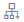
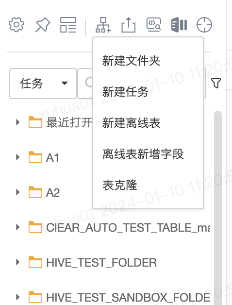
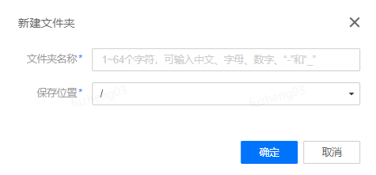
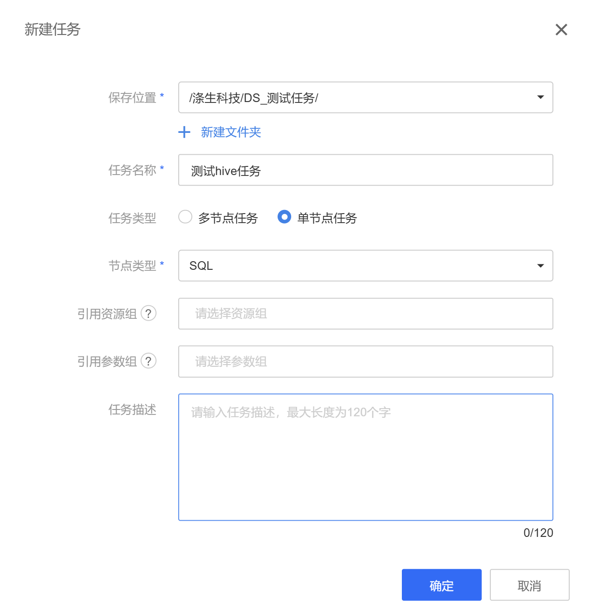
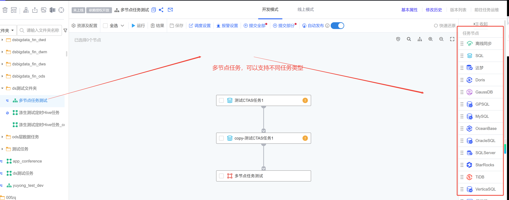
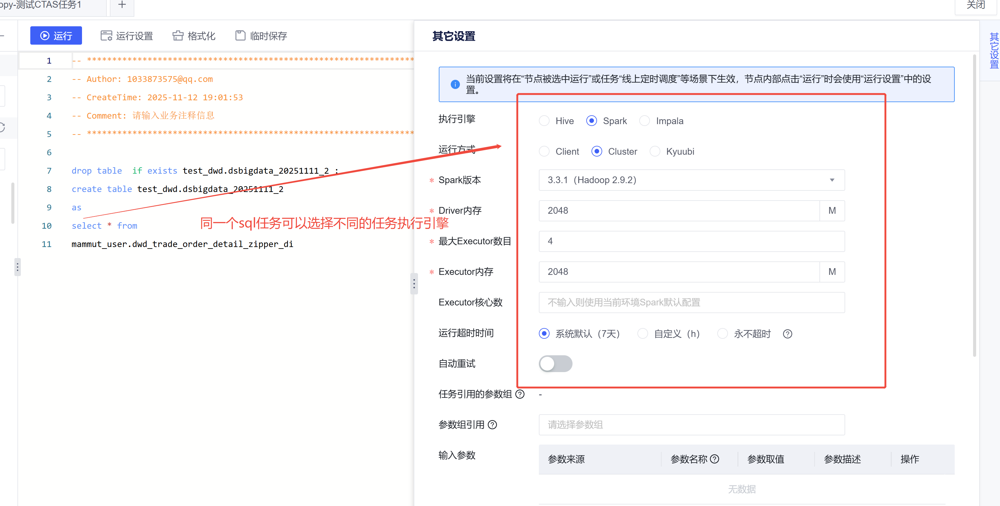
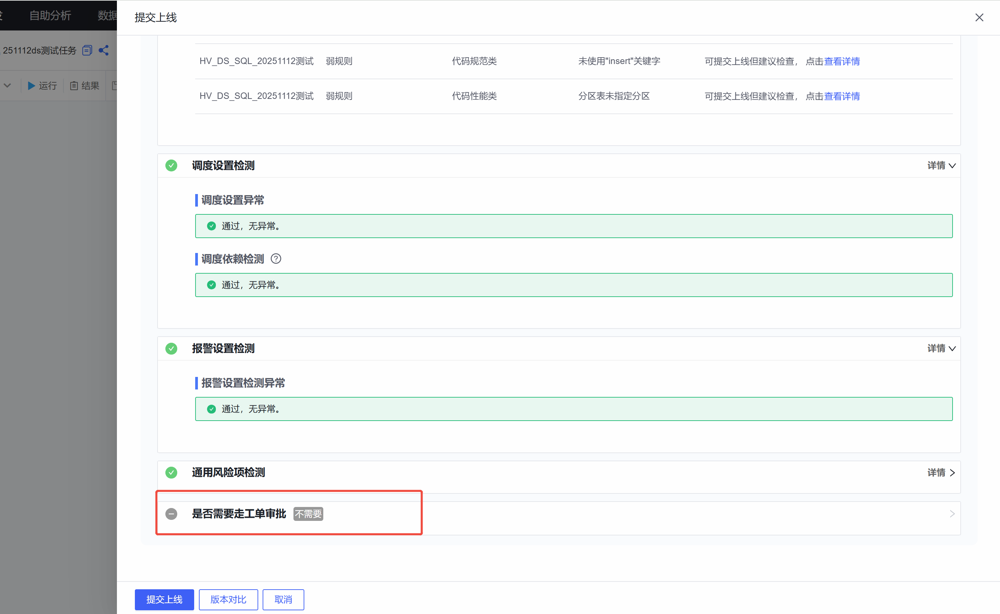

# 1.新建文件夹（任务管理）

**在**离线开发**模式下进行任务开发，项目管理人员需要预先进行顶层文件夹的组织划分，比如一级按照表分层（比如不同层不同文件夹管理任务）、二级按照主题域（不同主题域数据域不同文件夹管理），或者增加一些个人目录等。普通用户，也需要在管理员的建议下，合理地构建文件夹。**

1.单击**辅助功能区**的图标选择**新建文件夹**；

2.在弹出的对话框中，填写**文件夹名称**以及**保存位置**。

针对已有文件夹的场景，也可以在文件夹上右键，选择新建文件夹，此时会自动填充保存的位置。

# 2.新建任务-不同的任务类型

**在**辅助功能区**，找到新建任务图标，或者在左侧树状任务列表的文件夹上右键，找到**新建任务**，即可进行任务的新建。**

| 参数名称 | 说明 |
| --- | --- |
| 任务名称 | 请输入任务名称，最大长度120个字符 |
| 任务类型 | 1. 多节点任务，表示一个任务中支持拖入多个节点,右边会有不同的任务类型选择，一般默认都可以选择这个多节点任务； 2. 单节点任务，表示一个任务中仅存在一个特定类型的节点； 3. 任务组，在商业化中，不对外开放。 |
| 保存位置 | 保存任务至某一文件夹下。 |
| 引用资源组 | 在 公共资源 模块中，有权限的人员可配置项目组内的资源组，比如一些通用的Jar包等，此处可进行引用。 |
| 引用参数组 | 在 公共资源 模块中，有权限的人员可配置项目组内的参数组，比如一些常用的常量，此处可进行引用。 |
| 默认外部数据源 | 离线开发支持配置开启VerticaSQL、MySQL、OracleSQL、GPSQL、达梦、GaussDB等节点（需要运维人员开启），支持直接连接对应数据源执行。每类节点可以选择平台所登记的具体数据源，并基于该数据源进行sql操作。多任务节点支持一个任务中添加多个不同类型的节点。因此，在新建任务时，可对这些数据源设置默认数据源，进而在任务中新引入节点时，会默认配置上对应的数据源。对于已有任务，也支持在任务的“资源姐配置”中修改默认数据源 |

****

**任务新建完成后，默认会进入任务的开发模式：**

****

**同一段sql可以用不同的执行引擎调度**

****

# 3.任务开发模型→线上模式提交

**调度配置，给开发模式的任务进行调度配置：**

****

**调度配置完提交到线上模式，上线，上线前程序会做系列的校验**

****

**管理人员可以对不同任务流的任务配置提交上线审批，这样任务修改上线都需要审批的；**

****
