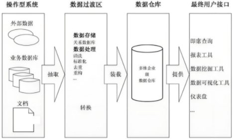
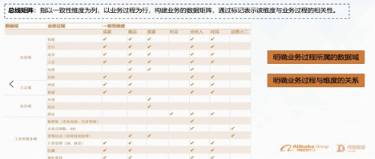
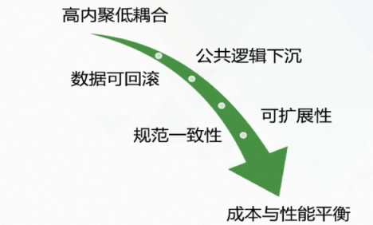
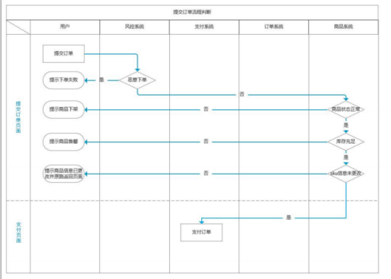
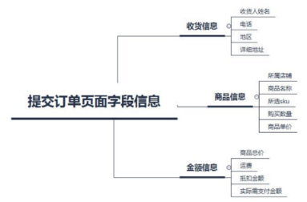
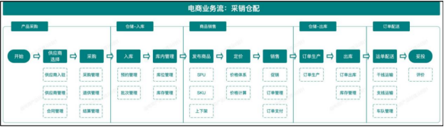
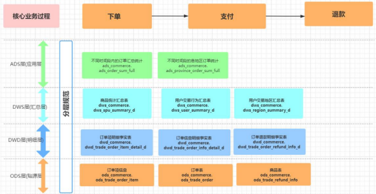
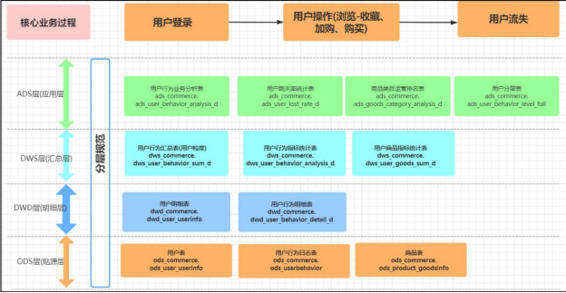

# 李秀锦-数仓建模试卷

1.该课程的知识点常以问答题的形式出现在面试过程中，因此本测试题可视为面试、笔试题库，以简答题为主。
2.为了测试大家的真实水平，给出学习建议与辅导，请大家务必按照真实面试要求回答。注意不要抄课件，尽量用自己记住的内容作答，注意答题的条理性。
3.题目作答时间150分钟，试卷总分150分。

## 一、基础类简答题：（每题3分，总计3\*21=63分）

**1.请说出数据仓库的四个特点并用自己的话加以解释说明。**

面向主题性：就是面向分析主题去组织数据，而不是按照应用程序或者业务流程组织数据，例如，一个公司要分析产品销售数据，就可以建立一个专注于销售的数据主题，使用这个数据主题，就可以回答类似于“去年哪款产品是最畅销的”这样的问题。
集成性：集成来自不同系统和数据源的数据，将其统一的存储和管理，消除数据冗余和不一致性。业务系统是产生数据的地方，经常会有增删改的操作，但数据仓库只集成数据，一般不会增删改。
相对稳定性：数据仓库的数据是稳定的、可靠的，不会频繁变化，主要供企业决策分析使用，属于OLAP型数据库， 所涉及的数据操作主要是数据加载、查询。-- Hive 的表层语法（SQL）虽支持 Update/Delete，但底层物理存储本质仍为“新文件替换旧文件”或“追加补丁合并”，绝对不是像 MySQL 那样在硬盘上原地擦写数据块。
反映历史变化：OLTP型数据库主要关心当前某一个时间段内的数据，而数据仓库中的数据通常包含历史信息，系统记录企业从过去某一时点(如开始应用数据仓库的时点)到目前的各个阶段的信息，通过这些信息，可以对企业的发展历程和未来趋势做出定量分析和预测。

**2.请说明为什么我们需要建设数据仓库（至少回答5点）。**

数据仓库一般采用列式存储，自带索引性能加成，支持分析大批量数据
分析查询不想影响在线事务
能记录历史数据
能对不同来源的数据进行整合、交叉分析
数仓基于分析主题建模，能更有效完成分析需求

**3.请讲一下常见的数据仓库架构有哪些？**

离线数据仓库架构：Inmon、Kimball、混合型
离线+实时数据仓库架构：Lambda、HSAP
考虑‌非结构化数据：数据湖、湖仓一体（一般是湖上建仓）

**4.请讲一下Kimball数据仓库架构包括哪些模块？**

操作型系统（不同的数据源）- > 数据过渡区 -> 数据仓库 -> 最终用户接口

**5.请讲一下Inmon、Kimball两种数仓架构的特点，并阐述一下他们有什么区别？**

Inmon:从流程上看是自上向下的，即从上游业务系统的数据着手, 进而构建出整个企业共享的数据仓库, 在这个数据仓库下延伸出不同主题的数据集市(业务数据库->ods->
dim,dwd,dws（3NF模型）-> dm)
·‌适用场景‌：大型企业需要高度集成的全局数据视图 , 比如金融、电信、医疗、制造业(汽车行业)和政府行业。
Kimball:从流程上看是自下向上的，是指从最下游的业务数据分析需求开始，先想清楚要解决什么问题，解决这些问题需要知道哪些业务流程、索要分析的数据的维度和指标度量需求，再去上游数据源捞取需要的数据。(业务数据库->ods->
dim,dwd,dws（3NF模型）-> ads)
·‌适用场景‌：快速响应业务分析需求（如销售分析、用户行为分析), 比如互联网行业(电商、游戏)。
区别：设计过程，层级架构（数据集市也与lnmon中的不同。这里的数据集市是一个逻辑概念，只是多维数据仓库中的主题域划分，并没有自己的物理存储，也可以说是虚拟的数据集市），适用场景

**6.请讲一下你们公司当前数据建设的情况、所处的阶段、存在什么样的问题。(可以按照课程里面的东西进行说明，选小型公司、中型公司、大型公司其中一个用自己的话阐述)**

小型公司-简单报表阶段：直接从操作型数据库里抽取数据，然后简单处理一下，生成固定的格式；
好处：系统结构应该比较简单，开发成本低，适合小规模的需求
存在问题：数据处理可能比较分散，每个部门自己弄自己的报表，缺乏统一的管理和整合，容易造成数据冗余和不一致
中型公司-数据集市阶段：针对特定部门或业务需求的小型数据仓库
好处：数据集市通常面向某个主题，能更快地响应特定部门的分析需求
存在问题：各个数据集市之间数据不一致，因为每个部门可能使用不同的数据源和ETL流程，导致数据孤岛的问题
大型公司-数据仓库阶段：相对成熟，已经建立了一个集中的、企业级的数据仓库，整合来自各个业务系统的数据
好处：模型完备，支持更复杂的分析，能够支持跨部门的分析，帮助企业进行更全面的决策
存在问题：构建数据仓库的成本和时间都比较高，需要统一的数据治理和规范，可能还会涉及到ETL流程的优化、数据质量的管理等

**7.请介绍你知道几种数据模型以及其特点。**

关系数据模型/范式模型：
符合3NF特点。‌高度规范化‌：数据被分解为多个关联表，减少冗余。‌示例‌：订单系统中，“订单表”与“客户表”通过 CustomerID 外键关联。‌复杂查询‌：需要多表连接（JOIN）才能完成业务分析。
星型模型：
‌结构‌：一个中心事实表连接多个维度表, 维度表非规范化（冗余数据）。
优点如下:
简化查询。查询数据时，星型模型的连接逻辑比较简单，而从高度规范化的事实表查询数据时，往往需要更多的表连接。
简化业务报表逻辑。与高度规范化的模式相比，由于查询更简单，因此星型模型简化了普通的业务报表(如每月报表)逻辑。
获得查询性能。星型模型可以提升只读报表类应用的性能。
快速聚合。基于星型模型的简单查询能够提高聚合操作的性能。
各类BI工具广泛支持该架构，便于向立方体提供数据。星型模型被广泛用于高效地建立0LAP立方体，几乎所有的0LAP系统都提供ROLAP模型(关系型0LAP)，它可以直接将星型模型中的数据当作数据源，而不用单独建立立方体结构。
主要缺点:
数据冗余
比如: 维度表包含大量描述性属性，且通常未规范化（如存储重复的城市名、州名等）。
‌示例‌: 在dim_store表中，每个含"California"的店铺都存储完整的州名，而非仅存储州ID。
‌灵活性不足‌
‌新增业务属性需修改维度表结构, 导致业务需求变化时模型适应性差。
对复杂业务逻辑建模能力有限
星型模型强制将业务过程简化为“一个事实表+多个维度表”，但实际业务中可能存在多事实表关联（如券核销表需与领取表关联分析）,需要引入星座模型来设计;
雪花模型：
结构：也是由一张事实表和多张维度表所组成。所谓的“雪花化”就是将星型模型中的维度表进行规范化处理。当所有的维度表完成规范化后，就形成了以事实表为中心的雪花型结构
优点：·
在Schema中新增一个维度将变得更加容易;
规范化的维度属性节省存储空间。
缺点
维度属性规范化增加了查询的连接操作和复杂度‌
星座模型
‌结构‌：多个事实表共享公共维度表，可以看做星型模式的汇集，形成“多事实表+共享维度”的复杂结构
‌查询效率‌：中等（需处理多个事实表和共享维度）
‌冗余度‌：维度表可能冗余，但共享维度减少重复建设
‌复杂度‌：高，适合企业级多业务过程整合

**8.请介绍一下第一、二、三范式。**

第一范式：每个属性(字段)的值必须是原子的(不可再分)。
第二范式：要同时满足下面两个条件: 满足第一范式，非主属性必须完全依赖于候选键，不能存在部分依赖。
例如，员工表的候选键是{id,moblie,deptNo}，而deptName依赖于(deptNo)，同样name仅依赖于{id}，因此不是2NF的。为了满足第二范式的条件，需要将这个表拆分成employee、dept、employee_dept、employee_mobile四个表
第三范式：要同时满足下面两个条件:满足第二范式；没有传递依赖。
例如，员工表的province、city、district依赖于zip，而zip依赖于(id)，换句话说，province、city、district传递依赖于(id)，违反了3NF规则。为了满足第三范式的条件，可以将这个表拆分成enployee和zip两个表

**9.列举一下你使用过的逆范式化设计，并说明这样做的目的？**

常用逆范式化设计：①事实表宽表冗余，比如在用户购买商品这一事实中，将商品/用户属性直接加入事实表；
②层级展平，把多级维度合并为单表；
目的：减少多表JOIN，以空间换时间

**10.请说明一下维度建模的过程。**

Kimball四步法
选业务过程：确定要分析的业务事件（如下单）。
声明粒度：明确事实表每行记录的细节层级（如“订单粒度”）
确定维度：围绕业务过程，定义“谁、何时、何地”等描述性环境（如时间、用户、商品、门店维度）。
确定事实：确定可量化的度量指标（如某次订单的金额、数量、折扣）。

**11.请举例说明一下星型模型、雪花模型、星座模型，并说明它们各自的优缺点。**

举例：
1. 星型模型（下单）
事实表：下单事实表（含订单ID、金额、数量）。
维度表：扁平化单表——用户维度、商品维度、时间维度、门店维度。
2. 雪花模型（下单）
事实表：下单事实表。
维度表：将星型中的大维度进一步规范化拆解。例如商品维度拆为商品基础表 + 品类层级表（一级/二级/三级）；门店维度拆为门店表 + 城市表 + 省份表。
3. 星座模型（下单 + 支付）
事实表：包含下单事实表和支付事实表两张事实表。
共享维度：两张表共用用户维度、商品维度。
各自的特点见第7问

**12.请说明一下你了解哪几种事实表？说说它们各自的特点和应用场景。（需要说出三种）**

事务事实表：记录的事务层面的事实，用于跟踪业务过程的行为，并支持几种描述行为的事实，保存的是最原子的数据，也称“原子事实表”。记录特定的事件，每条记录对应一个明确的时间戳（如订单创建时间）
周期快照事实表：以具有规律性的、可预见的时间间隔来记录事实，如余额、库存、层级、温度等，时间间隔如每天、每月、每年等等。类似定期监控的作用，主要看状态度量
累积快照事实表：被用来跟踪实体的一系列业务过程的进展情况，它通常具有多个日期字段，用于研究业务过程中的里程碑过程的时间间隔。比如订单过程：下单时间->支付时间->确认收货时间
聚集事实表: 某些维度的指标汇总，比如按天、周或月汇总销售数据。时间维度可能是周或月，日期粒度对应这些周期。比如dws层的汇总表
无事实事实表: 记录的是与业务不直接相关的事件或关系，但没有度量数据。比如日志类事件表，维度表里的属性关系表

**13.维度设计过程中什么情况下需要进行维度整合？什么情况下需要进行维度拆分？（需要举场景案例）**

需整合场景：
来源分散、存在编码/命名差异时。如整合淘宝、支付宝等多源会员，通过复合主键构建单一一致性维度。
需拆分场景：
水平拆分：维度分类属性差异大或业务关联度低时。如淘系商品与飞猪商品，属性不同且业务独立，拆分为独立维表。
垂直拆分：属性产出时间/热度不同时。主表存稳定、产出早的属性（01:30产出），扩展表存变化快、产出晚的属性（03:00产出），以保证核心模型稳定（案例：商品主表与扩展表）。

**14.如何处理缓慢变化维度？（需要举场景案例）**

随着时间可能会缓慢变化的维度，就是 缓慢变化维、也就是 SCD（Slowly Changing Dimensions）
维度表处理缓慢变化维度（SCD）主要有以下五种方式：
原样保留或重写：直接覆盖为最新值，不保留历史。适用于纠正错误数据或无分析价值的属性（如头像URL）。
新增维度行（带代理键）：变化时插入新行，通过代理键（SK）关联事实表，历史事实关联旧SK，新事实关联新SK，保留完整历史。
新增属性列：增加“前/后”状态字段（如previous_category/current_category），仅保留最近一次变更，适合极低频变化且需同时对比新旧值的场景。
快照存储：每日保留全量分区数据，查询特定日期关联对应分区，牺牲存储换取灵活性，适用于周期内变动频繁的维度。

历史拉链表（核心，无代理键）：为记录每条数据的生命周期历史，一旦这条数据生命周期结束，会重新开始一条新记录，拉链表记录着所有数据的从开始到当前所有变化的信息，是互联网企业的首选方案。

**15.请描述一下数仓建模的基本流程。**

数仓建模（设计阶段）简要分三步：
概念模型：抽象核心业务实体（如买家、卖家），划分主题边界，输出业务流程图。
逻辑模型：定义表结构与关联，确定星型/雪花建模方案，设计缓慢变化维（SCD）处理策略。
物理模型：编写ETL加工逻辑，完成ODS→DWD→DWS分层落地，并配置调度与质量监控。

**16.在数据处理的各个阶段，你使用过哪些工具。**

采集/同步过程：离线批处理Kettle、Apache Sqoop 、DataX 
实时流处理：Flume、消息队列Kafka组件、Flink CDC
存储：HDFS、Hbase 、ElasticSearch、ClickHouse、Doris
计算：map-reduce、spark、flink
（补充hive是HDFS文件的结构化视图，既不是存储引擎也不是计算引擎）
应用：Echarts、PowerBI
调度过程：小海豚，网易的easydata，用python写的airflow

**17.数据质量包括哪些方面？（需要答全4点）**

完整性：数据记录和信息是否存在缺失（如记录丢失或关键字段为空）。
准确性：数据记录的信息是否准确，是否存在异常或错误（如金额为负值、时间不符逻辑）。
一致性：同一份数据在不同系统或层级必须保持统一（如用户ID类型、长度全局一致）。
及时性：数据能否在规定时间内产出（如T+1准时送达，甚至秒级实时）。

**18.请简要说明你日常的数仓开发工作涉及哪些流程节点（与哪些人交互、会做哪些工作）。**

需求与探查阶段（与业务方/数据产品交互）：参与PRD评审，理解业务逻辑与指标口径
开发与建模阶段（与同事交互）：进行数据集成，编写ETL代码；涉及核心模型时发起评审，确保高内聚低耦合与复用性。
测试与评审阶段（与同事交互）：完成自测后进行代码评审，检查数据一致性、完整性及指标逻辑，发现问题及时修正。
发布与调度阶段（与运维交互）：在调度平台配置依赖与参数，完成试运行验证后发布上线。
运维与保障阶段（与运维交互）：配置DQC监控规则，保障SLA时效；处理任务失败、延迟等异常，必要时挂载基线保障高优任务。
同步与交付阶段（与业务方/数据产品交互）：输出结果（通知你的下游来取数据或对内报表），完成数据最终消费交付。

**19.什么是DQC？举例说明它的核心作用有哪些？**

DQC(Data Quality Check)，数据质量检查，用于监控和保障数据符合预期标准。
核心作用（结合你提供的配置说明）包括：
规则校验：配置空值、波动、重复值等质量规则，对指定分区数据进行自动化校验。
阻塞生产（强规则）：当检测到严重质量问题（红色异常）时，自动将关联的调度节点置为失败，阻断下游任务，防止“脏数据”污染扩散。
分级告警（弱规则）：检测到轻度异常时，不阻断链路，但通过邮件、短信、钉钉/企微机器人、电话等方式通知责任人。
调度触发联动：支持关联生产调度任务，比如任务运行完成后自动触发DQC检测。

**20.什么是SLA？请说明它的应用场景。**

SLA（Service Level Agreement）即服务等级协议。
其应用场景主要包含以下两种：
数据产出及时性约定（面向业务方）：与业务方约定最晚出数时间（如每日9：00前）。通过设定任务优先级、挂载基线来保障高等级任务资源，并配置超时报警，确保数据准时交付。
数据链路稳定性约定（面向上游）：与上游业务库负责人签署协议。要求上游表结构或数据变更时必须提前通知并评估影响，避免因源端变动导致下游数仓延迟或大面积数据异常。

**21.你们公司怎么做数据任务监控的，有没有什么机制或者工具来保障？**

在dolphinscheduler小海豚上进行 ：任务调度+ DQC质量监控 + 告警订阅

## 二、进阶类简答题：（每题4分，总计4\*9=36分）

**22.什么是onedata?**

OneData即是阿里巴巴内部进行数据整合及管理的方法体系和工具

**23.请用自己的话说明一下什么是总线矩阵，它的核心点在哪里？**

**24.怎么做维度设计？**

1.高内聚低耦合：主要从以下俩个角度考虑：业务特性：将业务相近或者相关的数据、粒度相同数据设计为一个逻辑或者物理模型；访问特性：将高概率同时访问的数据放一起，将低概率同时访问的数据分开存储
2.可扩展性：建立核心模型与扩展模型体系，核心模型包括的字段支持常用的核心业务，扩展模型包括的字段支持个性化或少量应用的需要
3.公共逻辑下沉：越是底层公用的处理逻辑越应该在数据调度依赖的底层进行封装与实现，不要让公用的处理逻辑暴露给应用实现，不要让公共逻辑多处同时存在。比如指标的逻辑放在公共层模型中,不能把指标底层计算逻辑给到BI、业务人员 
4.数据可回滚：任务失败重新运行，结果跟原来成功的结果相同
1. 规范一致性：命名规范需遵循OneData命名规范，表命名需清晰、一致，
具有相同含义的字段在不同表中的命名必须相同
6.成本与性能平衡：适当的数据冗余可换取查询和刷新性能，但不宜过度冗余与数据复制

**25.请解释一下为什么要做数据仓库的分层设计？**
（来源13章2.2.1）
第一，数据结构更明确。分层之后，每一层都有其作用域，这样我们在使用表的时候，能更方便地理解，提高工作效率。
第二，数据血缘追踪，便于管理。数据团队产出的是一个个能直接使用的业务表，这些表的来源有很多，假如某一个来源表出问题了，但有了分层，数据血缘关系更清晰，它能够帮助我们快速准确地定位到问题，并清楚问题的影响范围。
第三，复杂问题简单化。分层之后，一个复杂的任务被分解成多个步骤来完成，每一层只处理单一的步骤，比较简单和容易理解。而且便于维护数据的准确性，当数据出现问题之后，可以不用修复所有的数据，只需要从有问题的步骤开始修复即可。
第四，表共用，减少了重复计算。由于数据仓库的分层设计，通过开发一些共用的中间层数据表，进而减少了重复计算，节省了计算资源。
第五，屏蔽原始数据的异常和业务变更的影响。比如，当业务发生变更（如对日志增加了一个新的字段）时只会影响最底层的数据仓库表结构，不会影响上层的数据业务层（如数据集市层），应用方对底层的数据异常无感知，从而降低了应用方因数据异常和业务变更带来的风险。

**26.谈谈你对ods层、dwd、dws、ads的理解。你们公司的数仓是怎么做分层的？**

ODS层（贴源层）：原样接入业务数据，仅做简单清洗，保留历史。
DWD层（明细层）：按维度建模拆分为事实+维度，粒度最细，单业务过程，标准化口径。
DIM层（维度层）：统一维度属性（用户、商品、日期等），保障全公司口径一致。
DWS层（汇总层）：按天/周预聚合通用指标，以空间换时间，避免重复计算。
ADS层（应用层）：面向具体报表/接口定制，专表专用，快速响应业务。
我们公司也是这么做分层的~~

**27.你们公司对于指标怎么进行管理的？请分享一下在做维度设计、指标设计过程中的一些经验。**

用的网易EasyData，核心是围绕规范定义、分级管理和全生命周期管控来展开
经验总结：
统一命名与归属：制定严格命名规范（派生指标继承原子指标并添加时间周期后缀），每个指标需归属业务过程、数据域并指定负责人。
先定义后开发：编码前在管理平台完成指标定义、口径确认与评审，确保"书同文"。
复用优先：优先使用已有原子指标和维度属性组合派生指标，避免重复建设。
分级管理：按T1（战略）、T2（策略）、T3（执行）三级管理核心指标，资源向高优先级倾斜。
全生命周期管控：对指标进行版本管理，覆盖定义→生产→消费→维护→下线全过程，通过平台强制规范（如EasyData）确保依赖模型、度量、维度的关联。
治理与一致性：利用指标血缘、DQC质量监控主动发现问题，保证"用户"等维度属性全局口径统一，避免报表口径冲突。

**28.请说说数仓主题的划分原则。**

（无论这里说的是数据域还是主题域）·
本质就是MECE原则（Mutually Exclusive Collectively Exhaustive，相互独立，完全穷尽）在数据组织上的落地：
相互独立（Mutually Exclusive）：对应“低耦合”。交易域只放下单、支付相关；物流域只放发货、签收相关。两者边界清晰，一个业务过程（如支付）不会同时归属两个域，保证改一处不影响另一处。
完全穷尽（Collectively Exhaustive）：对应“完整性”。划分出来的所有数据域必须覆盖公司全部核心业务链条，不能有“无家可归”的表。

**29.请说说数据模型设计过程中需要遵循哪些基本原则？**

业务驱动（高内聚）：以业务过程（如下单、支付）为中心组织数据，而非按源系统归属。
粒度声明先行：设计事实表前必须声明粒度（如“订单子单粒度”），锁定分析深度。
一致性维度（总线架构）：全局只维护一套公共维度表（DIM），所有事实表复用，确保口径统一。
高内聚、低耦合：主题间依赖少（低耦合），相关属性尽量收拢在同一张表（高内聚），减少下游JOIN。
平衡性能与成本：优先采用星型模型（维度扁平化，单层JOIN，互联网主流），存储敏感场景可考虑雪花模型（规范化拆分，但多表JOIN查询性能下降，需权衡）。适度维度退化与预计算（DWS），以空间换时间换取查询效率。
稳定可扩展（SCD）：面对属性变化，使用拉链表等SCD策略，保证历史可追溯、新属性可扩展。
命名规范易用：表名、字段名统一规范（如派生指标加_1d后缀），看名知意。

完整覆盖（MECE）：顶层数据域划分遵循相互独立、完全穷尽，不留数据孤岛。

**30.请举例说说数仓层次调用的过程中需要遵循哪些基本的规范？**
（来源：6.4 数据仓库中的各类规范）
总体遵循的层次调用原则如下：
ODS层数据不能直接被应用层ADS任务引用。如果中间层没有沉淀的ODS层数据，则通过创建DWD视图访问，保障保持视图的可维护性与可管理性。
DWD应严格遵守层次依赖，理论上只可引用ODS、DIM和部分DWD数据，不可引用处于下游层次的ADS等数据，以避免出现“反向引用”的情况。
DWS应严格遵守层次依赖，理论上只可引用DIM、DWD数据，不可引用处于下游层次的ADS等数据，以避免出现“反向引用”的情况。
CDM层任务的深度不宜过大（建议不超过10层）。
一个计算刷新任务只允许一个输出表，特殊情况除外。
CDM汇总层优先调用CDM明细层，可累加指标计算。CDM汇总层尽量优先调用已经产出的粗粒度汇总层，避免大量汇总层数据直接从海量的明细数据层中计算得出。
CDM明细层累积快照事实表优先调用CDM事务型事实表，保持数据的一致性产出。
有针对性地建设CDM公共汇总层，避免应用层过度引用和依赖CDM层明细数据。
补充回忆：CDM代表“Common Data Model”（通用数据模型）。它实际上是DWD（明细）和DWS（汇总/服务）的总称，统称为中间层（公共层）

## 三、项目类简答题：（第31题10分；第32题6分；33-39题每题5分，共5\*7=35分）

**31.请介绍一下电商中常见的用户指标、流量指标、搜索指标、商品指标、订单交易指标，营销指标。【每类指标至少回答4个，每个0.5分，合计0.5\*4\*5=10分】**

用户：基本属性如年龄、性别，交易行为如历史成交订单数、历史成交订单金额，
生命周期如新用户、老用户
流量：PV(页面曝光、点击次数），UV（页面曝光、点击用户人数），人均曝光=页面曝光 PV/页面曝光 UV；
人均点击=页面点击 PV/页面点击 UV。（包括 APP 的访问、首页、各活动
页、商详页以及各页面内元素的点击）
搜索：PV(搜索曝光、点击次数），UV（搜索曝光、点击用户人数），搜索 UV 使用率=搜索点击 UV/搜索曝光 UV，搜索 PV 使用率=搜索点击 PV/搜索曝光 PV。（包括搜索、搜索无结果、搜索有结果）
商品：基本情况如库存数量、销售数量，商品上新率=商品上新数量 /商品数量，
商品动销率=商品有销售数量 /商品数量，
商品滞销率=商品无销售数量 /商品数量，
商品倾销率=商品无库存数量 /商品数量；
销售情况如下单人数，下单金额；
利润情况如自营商品毛利=成交金额-采购成本-仓储成本-物流成本+返利，
pop 商品（即入驻店铺销售商品）毛利=成交金额\*扣点比例-平台促销费用
订单：成交件单价=成交金额/成交数量，
成交客单价=成交金额/成交人数，
成交人数转化率=成交人数/下单人数，
成交订单转化率=成交数量/下单数量。
营销：
领取率=领券数量/发行量；
用券率=用券数量/领券数量；
优惠券投入金额=用券支付单量\*优惠券面额；
优惠券 ROI=优惠券投入金额/用券支付金额。
活动 ROI=活动投入金额/活动支付金额；

**32.请简要描述一下什么是用户画像？用户画像通常包括哪些数据？【6分】**

用户画像就是人的数据标签。这些标签是基于用户的日常行为信 
息、兴趣爱好以及社会属性计算出来的模型。多个标签的组合就形成了用户画像

主要包括以下三种：
(1) 电商行为数据包含搜索、访问时长、加购、活跃度等行为数据。 
(2) 电商交易数据包含客单价、流失率、支付、客服等交易数据。 
(3) 用户基本数据包含性别、年龄、职业和职业地域等数据。

**33.请简述一下用户下订单路径，并且说明一下在各个环节涉及到哪些数据？**

1.提交订单->2.风控验证->3.验证商品状态->4.验证sku库存->5.验证sku信息是否修改（这里看下单前和当前的sku是否一致，防止用户在提交订单页面时商家对sku信息进行了修改）

**34.请讲一下电商业务架构的核心模块、并简述一下电商业务系统的核心流程。**

按照线下实体环节进一步抽象后，可以将自营电商业务划分为以下 4 个核心模块
分别是：
l 从供应商处采购产品(采）
l 采购产品入仓存储管理（仓）
l 商品上架到电商平台销售（销）
l 根据销售订单进行履约配送（配）

核心流程：
入驻&采购流程：入驻、开店、供应商发货、库存
销售流程：发布商品、定价、商家、活动页搭建
黄金流程（指在用户视角下购买商品时所经历的页面，或叫交易主流程）：生成订单、

预占库存、收银台、支付对账

订单寻源履约流程：订单拆分（拆分的场景主要有：生产维度（仓库不同、商家不同、配送方式不同···）、业务类型维度（实物订单、虚拟订单、生鲜订单···）等，
该系统的职责是按照不同的规则将父订单拆分成多个子订单进行生产。）、订单转移（不同的订单要执行不同的生产时机、不同的生产地点、不同的生产流程）、履约控制（负责控制订单生产的流程）、订单下传

**35.请说一下你在做交易数据过程中核心用到的数据表有哪些？**

**36.请用自己的话介绍一下电商项目的业务背景和技术背景，项目整体架构、项目中核心的业务过程、并对每个主题域的数据建设做简要说明。【重点回答】**

电商数据建设的业务场景分为三部分：
1. 为管理层提供公司运营数据、支持业务决策
2. 为业务运营人员提供数据支撑、可视化看板，优化日常运营策略
3. 为商家提供运营动作效果数据，支撑商家日常的店铺运营
技术背景 ：
参与人员：业务产品、产品运营、销售支持、数据分析师、数据产品、数仓开发
要建设的主题域：用户、商品、商户、交易、营销
整体架构按照线下实体环节进一步抽象后，可以将自营电商业务划分为以下 4 个核心模块
分别是：
l 从供应商处采购产品(采）
l 采购产品入仓存储管理（仓）
l 商品上架到电商平台销售（销）
l 根据销售订单进行履约配送（配）

核心业务流程：
入驻&采购流程：入驻、开店、供应商发货、库存
销售流程：发布商品、定价、商家、活动页搭建
黄金流程（指在用户视角下购买商品时所经历的页面，或叫交易主流程）：生成订单、

预占库存、收银台、支付对账

订单寻源履约流程：订单拆分（拆分的场景主要有：生产维度（仓库不同、商家不同、配送方式不同···）、业务类型维度（实物订单、虚拟订单、生鲜订单···）等，
该系统的职责是按照不同的规则将父订单拆分成多个子订单进行生产。）、订单转移（不同的订单要执行不同的生产时机、不同的生产地点、不同的生产流程）、履约控制（负责控制订单生产的流程）、订单下传

3.1 用户主题建设 
1.通过使用数仓建模的方式进行数据加工处理，分析某个时间段内发生的 100 万 
条用户消费行为，业务侧需要尝试从数据中提取出有价值的业务建议。 
2.平台增长业务团队需要统计用户在平台的操作行为路径，判断用户在各个节点 
的流失率情况，为用户运营提供参考。 
3.平台增长业务团队需要对用户进行分层分类管理，便于监测、提升用户活跃度。 
4.以平台增长业务团队当前对用户主题数据的需求为契机，完善底层和应用层的 
用户数据建设，满足在业务侧在不同场景下的用数需求。这里主要涉及 dws、ads层的建设。 
3.2 商品主题建设 
1.商家运营业务团队需要统计各个商品的流量情况，为平台的店铺提供日常运营 
数据。 
2.目前商品的相关数据都分散在多个系统里面，业务侧从商品维度进行分析时， 
需要从多处获取数据，而且信息统一和整合，不同的业务方获取的数据存在差异。 
3.下游业务需要从商品的各个维度去统计相关的指标时，无法获取完整、准确的 
数据，导致数据存在多套不同的统计结果。 
3.3 商户主题建设 
1.在电商平台的商家版 APP 中，平台会为商家搭建数据指标体系，科学地指导商 
家的经营发展方向以及提供经营状况概览。 
2.提升 B 端商家产品体验，通过数据呈现商家的运营动作效果，为业务产生增值 
收入。可提供增值服务，为平台创造营收，比如提供同类店铺的对比数据。 
3.4 交易主题建设 
1.公司领导层需要关注用户在平台的下单情况、营收情况，财务部分需要根据订 
单量和订单金额统计公司的财务状况。 
2.交易和支付业务团队需要关注订单的转化率、订单支付状态等数据。 
3.5 营销主题建设 
1.营销概况数据：商家系统内会嵌入营销数据，并进行可视化呈现形式： 
2.营销运营：运营团队的同事会关注优惠券类的营销活动的带来的效果，需要数 
据侧对优惠券数据进行统计。

**37.请结合用户主题域的数据建设情况，阐述一下维度建模的具体流程。**

Kimball四步法：
1.选业务过程：用户的操作：包括登录、浏览、收藏、加购物车、购买
2.声明粒度：针对DWD层事实表，用户基础信息明细表--每行代表一个用户的基本信息，包括性别、年龄、注册时间、最近登录时间等，用户行为明细表--每行代表用户的一个操作行为、操作的对象商品、操作时间
3.确定维度：针对用户的操作，找出描述性的环境：哪个用户、操作的对象商品是哪个、操作时间、操作行为的类型
4.确定事实（也是针对dwd层）：用户行为明细表--每一行数据，无论类型是浏览(pv)、收藏(fav)、加购(cart)还是购买(buy)，都代表着该行为发生了 1次。后续的DWS层和ADS层，分别通过这个隐形的“1”进行计数、去重，按商品、用户等分组聚合出次数、人数、人均次数、跳失率等所有指标。

**38.请结合商品主题域的数据建设情况，阐述一下你对维表建设的思路。**

商品维表建设是先建核心粒度表（sku商品维度表、spu商品维度表），再上卷出层级（商品三级分类维度表），横向拆出属性维度（横向品牌维度表），同时兼容异构数据源（商品Goods维度表），最后沉淀公共维度（地区维度表）

**39.请以交易主题域的数据建设为例，讲一下数仓分层是怎么做的，每一层分别有哪些数据表和字段**

### 1. ODS层（操作数据层，贴源层）
**定位**：原始业务数据原样接入，不做处理，表结构基本与业务系统保持一致。
| 中文表名 | 说明 | 主要字段（中文释义） |
|----------|------|----------------------|
| 订单表 | 存放用户下单的整体信息 | 订单号、用户ID、订单总额、应付金额、运费、促销优惠金额、积分抵扣金额、优惠券抵扣金额、订单状态、支付方式、收货人姓名、收货人电话、所在省份、所在城市、所在区、详细地址、创建时间、支付时间等 |
| 订单项信息表 | 记录订单中每个商品明细 | 订单号、商品SPU、商品分类ID、SKU编号、SKU名称、SKU单价、购买数量、销售属性组合（JSON）、促销分解金额、优惠券分解金额、积分分解金额、实付分解金额等 |
| 退款信息表 | 记录退款申请及流水 | 退款订单号、退款金额、退款流水号、退款状态、退款渠道（支付宝/微信/银联等） |
### 2. DWD层（明细数据层）
**定位**：对ODS数据进行清洗、整合，形成以业务过程为核心的明细事实表，通常会做成宽表，方便后续分析。
| 中文表名 | 生成逻辑 | 主要字段 |
|----------|----------|----------------------|
| 订单项明细事实表 | 订单项表关联订单表，补齐金额与地区信息 | 订单ID、用户ID、商品SPU、商品SKU、SKU单价、购买数量、各类优惠分解金额（促销、优惠券、积分、后台折扣）、省份、城市、区、详细地址、优惠券ID、创建时间等 |
| 订单信息明细事实表 | 订单表左关联退款信息，打上退款标记 | 订单号、用户ID、订单总额、应付金额、各类优惠总金额、订单状态、支付方式、收货地址（省/市/区/详细）、是否退款、退款金额、退款流水号、退款状态、退款渠道等 |
| 订单退款明细事实表 | 退款表左关联订单表，补充用户和地区 | 退款订单号、退款金额、退款流水号、退款状态、退款渠道、用户ID、用户名、省份、城市、区等 |
| 用户行为明细表 | 记录用户浏览、收藏、加购等行为 | 用户ID、行为类型（浏览/收藏/加购等）、商品ID、日期 |
### 3. DWS层（汇总数据层）
**定位**：基于DWD明细表，按主题维度（商品、用户、地区）进行轻度汇总，沉淀可复用的公共指标。

| 中文表名 | 统计维度 | 主要汇总指标 |
|----------|----------|--------------------------|
| 商品统计汇总表 | 按商品（SPU） | 下单次数、下单件数、使用优惠券下单次数、订单总额、应付金额、运费金额、促销优惠总金额、积分抵扣总金额、优惠券抵扣总金额、后台折扣总金额、被退款次数、被退款件数、退款金额、浏览次数、收藏次数、加入购物车次数 |
| 用户行为汇总表 | 按用户 | 浏览次数、收藏次数、加入购物车次数、购买次数、下单次数、使用优惠券下单次数、订单总额、应付金额、退款次数、退款件数、退款金额等 |
| 地区汇总表 | 按省份/城市/区 | 下单次数、下单件数、使用优惠券下单次数、订单总额、应付金额、运费金额、退款次数、退款件数、退款金额、浏览次数、收藏次数、加入购物车次数、购买次数 |
### 4. ADS层（应用数据层）
**定位**：面向具体业务场景和报表，通常带时间窗口，直接输出给数据产品。
| 中文表名 | 用途 | 主要字段 |
|----------|------|----------------------|
| 订单汇总统计表 | 整体交易看板 | 最近N天、下单次数、订单总额、下单用户数 |
| 各地区订单统计表 | 各省份交易分析 | 最近N天、省份、下单次数、订单总额、下单用户数 |
层级之间的关系：
### 分层递进与核心表

**ODS（贴源）**  
原样接入，三张表：  
- 订单表：订单号、用户ID、总额、应付、状态  
- 订单项信息表：订单号、SKU、单价、数量、优惠分解金额  
- 退款信息表：退款订单号、退款金额、退款流水号  

↓ *关联补全维度*  

**DWD（明细宽表）**  
通过表关联形成四张明细事实：  
- 订单项明细事实表：订单项 + 订单，补全用户、地区、金额  
- 订单信息明细事实表：订单左关联退款，增加退款标记和退款信息  
- 订单退款明细事实表：退款左关联订单，补全用户、地区  
- 用户行为明细表：浏览、收藏、加购行为  

↓ *按维度聚合，融合多事实*  

**DWS（每日汇总）**  
按商品/用户/地区聚合指标：  
- 商品统计汇总表：商品维度下，订单、退款、行为指标  
- 用户行为汇总表：用户维度下，行为、购买、退款指标  
- 地区汇总表：省市区维度下，订单、退款、行为指标  

↓ *多日上卷，面向场景*  

**ADS（应用报表）**  
- 订单汇总统计表：最近N天 全局 下单次数/总额/用户数  
- 各地区订单统计表：最近N天 各省份 下单次数/总额/用户数